TP_analysis
================
Micaela Chapuis
2025-06-30

## Load Libraries

``` r
library(tidyverse)
library(here)
library(seacarb)
library(lubridate)
library(hms)
library(car)
library(lubridateExtras)
library(lme4)
library(scales)
library(ggeffects)
library(sjPlot)
```

## Load in Data

``` r
chem <- read_csv(here("Data", "tidepool_chemistry.csv"))
params <- read_csv(here("Data", "tidepool_parameters.csv"))
pHSlope <- read_csv(here("Data", "pHSlope.csv"))
TA <- read_csv(here("Data", "total_alkalinity.csv"))
testdata <- read_csv(here("Test Sampling", "Data", "testdata.csv"))
pool_volumes <- read_csv(here("Data", "pool_volumes.csv"))
kb_wind <- read_csv(here("Data", "Climate", "KB_0551_20250101_20251108.csv"))
sb_wind <- read_csv(here("Data", "Climate", "SB_0531_20250101_20251108.csv"))
```

## Wind data

``` r
# apprend sb data to kb data +  select only the time, site and wind speed columns
wind <- bind_rows(kb_wind, sb_wind) %>% select("Timestamp", "Station ID", "Wind speed, scalar average (m/s)")
```

``` r
# make date, time and site their own columns
wind <- wind %>% mutate(date = date(wind$Timestamp), 
                        time = as_hms(wind$Timestamp), 
                        site = case_when(`Station ID` == "0531" ~ "Sandy Beach", 
                                         `Station ID` == "0551" ~ "Kaihalulu Beach")) %>% 
                 rename(wind_speed = `Wind speed, scalar average (m/s)`)
```

Function to Calculate FCO2 (Fugosity of CO2)

``` r
# Function for calculating FCO2, code by Nyssa (FCo2Calc in her code)
FCO2_Calc <- function(temp = 25, sal = 35, u = 0, CO2_water, CO2_air = 427, density = 1025){
  # calculate gas transfer velocity from Ho et al. 2006 parameterization
  k <- (0.266*u^2)/100 # m/hr
  
  # calculate solubility of CO2 from temp and salinity from seacarb (Weiss et al. 1974)
  s <- as.numeric(K0(S = sal, T = temp, P = 0, Patm = 1, warn = T))/1000  # mmol kg-1 uatm-1
  
  # calculate FCO2
  FOC2 <- (k * s * density * (CO2_water - CO2_air)) # in mmol m-2 hr-1
  
  return(FOC2)
}

# FCO2 = (k * s * density*(CO2 water - CO2 air))
# k is the gas transfer velocity (m/hr) --> calculated based on wind measurements using parameterization by Ho et al. 2006
# s is solubility of CO2 in seawater, calculated from in situ temperature and salinity
# CO2 in seawater is calculated above using seacarb
# CO2 in air assumed to be 427 ppm based on Mauna Loa Observatory estimates
```

## Data cleaning and joining

Make all pool numbers factors

``` r
chem$pool_number <- factor(chem$pool_number, levels = c(1,2,3,4,5,6,7,8,9,10,11,12,13,14,15,16,17,18,19,20,21,22,23,24,25,26,27,28,29,30,31,32, "ocean"))
params$pool_number <- factor(params$pool_number)
pool_volumes$pool_number <- factor(pool_volumes$pool_number)
```

Remove junk samples from TA Data

``` r
junks <- c("junk1", "junk2", "junk3")
TA <- TA %>% filter(!sample_ID %in% junks)
```

Join in TA data

``` r
data <- left_join(chem, TA, by = "sample_ID")
```

Add in pH calculated from tris, physical parameters, and pool volumes

``` r
data <- left_join(data, pHSlope)
```

    ## Joining with `by = join_by(sample_ID, date)`

``` r
data <- left_join(data, (params %>% select(site, pool_number, substrate, perimeter_m, surface_area_m2)), by = c("site", "pool_number"))
data <- left_join(data, pool_volumes)
```

    ## Joining with `by = join_by(pool_number)`

Selecting columns

``` r
data <- data %>% select(-observers, -notes, -Sample.Index)
```

Adding in “ocean” as substrate

``` r
data <- data %>% mutate(substrate = replace_na(substrate, "ocean"))
```

Removing Kaihalulu Data collected on 2025/06/08 due to rain

``` r
data <- data %>% filter(!date == "2025/06/08")
```

Append test data

``` r
data <- bind_rows(data, testdata)
```

Calculate DIC using seacarb

``` r
CO2 <- carb(flag = 8, # pH and ALK given
            data$pH, # first variable given
            data$TA/1000000, # value of second variable in mol/kg
            S = data$salinity_field, #which salinity should I use?? using field for consistency
            T = data$temp_pool, # temp
            Patm = 1, # surface atmo pressure in atm, default is 1 atm
            P = 0, # hydrostatic pressure in bar (surface = 0)
            Pt = 0, # concentration of total phosphate in mol/kg --> use 0 if NA
            Sit = 0, # concentration of total silicate in mol/kg --> use 0 if NA
            k1k2 = "x", # x is default
            kf = "x", # x is default
            ks = "d", # d is for Ks from Dickson 1990 (default)
            pHscale = "T", # total scale
            b = "u74", # total boron concentration, u74 is default
            gas = "potential",  # default (indicates it's references to 1 atm pressure and potential temp)
            warn = "y", # show warnings when T or S go beyond valid range for constants
            eos = "eos80") # to specify T and S
```

Convert units back to micromol

``` r
CO2 <- CO2 %>%
  mutate(ALK = ALK*1000000,
         CO2 = CO2*1000000,
         CO3 = CO3*1000000,
         DIC = DIC*1000000,
         HCO3 = HCO3*1000000) %>% # convert everything back to umol %>%
select(pH, DIC, pCO2 = pCO2insitu, CO2, CO3, HCO3, OmegaCalcite, OmegaAragonite) 
```

Re-Join with rest of data using pH as join column

``` r
data <- left_join(data, CO2)
```

    ## Joining with `by = join_by(pH)`

Get Mean Ocean Salinity Value for normalizing TA + DIC

``` r
ocn_data <- data %>% filter(substrate %in% "ocean")
avg_ocn_sal <- mean(ocn_data$salinity_pool, na.rm = TRUE)
```

Salinity Normalize TA + DIC and create TA/DIC cols

``` r
data <- data %>% mutate(TA_norm = TA*salinity_lab/avg_ocn_sal,
                        DIC_norm = DIC*salinity_lab/avg_ocn_sal,
                        TA_DIC = TA/DIC)
```

Subtract Volume Removed and convert to m^3

``` r
data <- data %>% mutate(pool_volume = (mean_volume - vol_removed_l)*0.001) # from the calculated pool volume, subtract the water that was removed each sampling point (400ml at each timepoint) to get actual volume at sampling time
```

Calculate delta pH, delta TA, delta DIC, delta temp, delta time

``` r
delta_calc <- data %>% 
  select(date, site, pool_number, substrate, time_point, temp_pool, sample_time, pH, TA_norm, DIC_norm)  %>%
  group_by(date, site, pool_number, substrate) %>%  # group by metadata
  arrange(time_point, .by_group = TRUE) %>%  # ensure correct order
  reframe(
    delta_pH = pH[time_point == 3] - pH[time_point == 1],   # (Time 3 - Time 1)
    
    delta_TA = (TA_norm[time_point == 3] - TA_norm[time_point == 1]),  # (Time 3 - Time 1)
    
    delta_DIC = (DIC_norm[time_point == 3] - DIC_norm[time_point == 1]), # (Time 3 - Time 1)

    delta_temp = (temp_pool[time_point == 3] - temp_pool[time_point == 1]),  # (Time 3 - Time 1)

    delta_time = (as.numeric(difftime(sample_time[time_point == 3], sample_time[time_point == 1], units = "mins")))  # Time 3 - Time 1
    
  ) %>% 
    distinct(date, site, pool_number, substrate, .keep_all = TRUE)  # Ensure only one row per pool
```

Normalize delta pH, TA, and DIC to by hour

``` r
delta_calc <- delta_calc %>% mutate(delta_pH_norm = (delta_pH/delta_time)*60,
                                    delta_TA_norm = (delta_TA/delta_time)*60,
                                    delta_DIC_norm = (delta_DIC/delta_time)*60)
```

### Wind Speed

Average Wind Speed Over Sample Period

``` r
# for each site, get the first and last sample time
sample_times <- data %>%
  group_by(site, date) %>%
  summarise(
    start_time = min(sample_time, na.rm = TRUE),
    end_time   = max(sample_time, na.rm = TRUE),
    .groups = "drop")
```

``` r
# for each site and date, calculate the average wind speed (in m/s) during the sample time
mean_wind <- wind %>%
  inner_join(sample_times, by = c("site", "date")) %>%
  filter(time >= start_time, time <= end_time) %>% # filter to only keep wind speeds during the time of sampling
  group_by(site, date) %>%
  summarise(mean_wind_speed = mean(wind_speed, na.rm = TRUE), .groups = "drop")
```

``` r
# join mean wind speeds to tidepool data
data <- data %>% left_join(mean_wind, by = c("site", "date"))
```

Calculate FCO2 from the wind data

``` r
data <- data %>% mutate(FCO2 = FCO2_Calc(temp = temp_pool, sal = salinity_pool, u = mean_wind_speed, CO2_water = pCO2))
```

### NEC

Calculate Delta TA and Delta DIC between two consecutive timepoints

``` r
#deltas <- data %>% 
#  filter(pool_number %in% c("ocean", 27, 30)) %>%
#  select(date, site, pool_number, substrate, day_night, surface_area_m2, pool_volume, time_point, temp_pool, sample_time, pH, TA_norm, DIC_norm)  %>%

#  group_by(date, site, pool_number, substrate, day_night, surface_area_m2) %>%  # group by metadata
  
#  arrange(time_point, .by_group = TRUE) %>%  # ensure correct order
  
#  reframe(
#    delta_TA1 = (TA_norm[time_point == 2] - TA_norm[time_point == 1]),  # (Time 1 - Time 2)
#    delta_TA2 = (TA_norm[time_point == 3] - TA_norm[time_point == 2]),
    
#    delta_DIC1 = (DIC_norm[time_point == 2] - DIC_norm[time_point == 1]), # (Time 2 - Time 1)
#   delta_DIC2 = (DIC_norm[time_point == 3] - DIC_norm[time_point == 2]),

#    delta_temp1 = (temp_pool[time_point == 2] - temp_pool[time_point == 1]),  # (Time 2 - Time 1)
#    delta_temp2 = (temp_pool[time_point == 3] - temp_pool[time_point == 2]),  

#    delta_time1 = (as.numeric(difftime(sample_time[time_point == 2], sample_time[time_point == 1], units = "hours"))),  # Time 2 - Time 1
#    delta_time2 = (as.numeric(difftime(sample_time[time_point == 3], sample_time[time_point == 2], units = "hours"))),
    
#    vol_avg1 = mean(c(pool_volume[time_point == 2], pool_volume[time_point ==1]), na.rm = TRUE), 
#    vol_avg2 = mean(c(pool_volume[time_point == 3], pool_volume[time_point ==2]), na.rm = TRUE)
    
#  ) %>% 
#    distinct(date, site, pool_number, substrate, day_night, surface_area_m2, .keep_all = TRUE) %>%  # Ensure only one row per pool per date
  
#    pivot_longer(
#      cols = matches("delta_|vol_avg"), # finds every column that stars with either "delta_" or "vol_avg"
#      names_to = c(".value", "interval"), # interval will be 1 or 2 (1 is from T1 to T2 and 2 is from T2 to T3), .value takes the name of whichever value we get the delta for
#      names_pattern = "(.*?)([12])$") # this renames all the columns to remove the 1s or 2s
```

``` r
deltas <- data %>%
  
  select(date, site, pool_number, substrate, surface_area_m2, mean_wind_speed, pool_volume, time_point, sample_time, temp_pool, pH, TA_norm, DIC_norm, FCO2) %>%
  
  group_by(date, site, pool_number, substrate, surface_area_m2) %>%
  
  arrange(time_point, .by_group = TRUE) %>%
  
  pivot_wider(
    names_from = time_point,
    values_from = c(pH, TA_norm, DIC_norm, temp_pool, sample_time, pool_volume, FCO2),
    names_glue = "{.value}{time_point}") %>%
  
  mutate(
    delta_pH1 = pH2 - pH1, # change in pH between two sampling points
    delta_pH2 = pH3 - pH2,
    mean_pH1 = mean(pH2, pH1, na.rm = TRUE), 
    mean_pH2 = mean(pH3, pH2, na.rm = TRUE),
    delta_TA1 = TA_norm2 - TA_norm1, # change in TA between two sampling points
    delta_TA2 = TA_norm3 - TA_norm2,
    delta_DIC1 = DIC_norm2 - DIC_norm1, # change in DIC between two sampling points
    delta_DIC2 = DIC_norm3 - DIC_norm2,
    delta_temp1 = temp_pool2 - temp_pool1, # change in temperature between two sampling points 
    delta_temp2 = temp_pool3 - temp_pool2,
    delta_time1 = as.numeric(difftime(sample_time2, sample_time1, units = "hours")), # time between two sampling points
    delta_time2 = as.numeric(difftime(sample_time3, sample_time2, units = "hours")),
    mean_FCO21 = mean(FCO22, FCO21, na.rm = TRUE), # calculate the average FCO2 between two sampling points
    mean_FCO22 = mean(FCO23, FCO22, na.rm = TRUE),
    mean_vol1 = rowMeans(cbind(pool_volume1, pool_volume2), na.rm = TRUE), # average volume between two sampling points
    mean_vol2 = rowMeans(cbind(pool_volume2, pool_volume3), na.rm = TRUE)) %>%
  
   pivot_longer(
      cols = matches("delta_|mean_"), # finds every column that stars with either "delta_" or "vol_avg"
      names_to = c(".value", "interval"), # interval will be 1 or 2 (1 is from T1 to T2 and 2 is from T2 to T3), .value takes the name of whichever value we get the delta for
      names_pattern = "(.*?)([12])$") %>%  # this renames all the columns to remove the 1s or 2s
  select(!(pH1:FCO23))
```

Calculate NEC

``` r
deltas <- deltas %>% 
  mutate(NEC = ((-1)*(delta_TA/2)*1025*(mean_vol/surface_area_m2)*(1/delta_time))/100)

# NEC = (-1) * (delta TA/2 * density * volume/surface area) * (1 / delta time) / 100

# delta TA/2 is difference in TA betwen two consecutive timepoints (in mmol/kg)
# density of seawater is 1023 kg/m3
# volume is volume of water in the pool at each time point (m3) (avg vol between the two timepoints)
# SA is bottom surface area of the tidepool (m2)
# t is time between sampling points (hr)
# divide that all by 100 to get mmols m2 hr and multiply by -1 so positive values show calcification
```

### NEP

Calculate NEP

``` r
deltas <- deltas %>% 
  mutate(NEP = (((-delta_DIC)*1025*(mean_vol/surface_area_m2)*(1/delta_time))/100) - NEC + mean_FCO2)

# NEP = ((delta DIC * density * volume/surface area) * (1 / delta time)) - NEC - FCO2

# delta DIC is the difference in salinity normalized DIC between consecutive timepoints (mmol/kg)
# using - delta DIC so positive values are net photosynthesis
# all other values are same as above
# NEC is subtracted to account for changes in DIC by the precipitation and dissolution of CaCO3
# FCO2 is subtracted to account for the air-sea flux of CO2 and is in mmol/m2 hr
# divided by 100 before subtracting NEC and FCO2 so mmols m2 hr  
# positive values are net photosynthesis 
#(the equation is - fugosity, but because it is time 2-1 it is plus here)
```

## Data Viz

``` r
# checking field salinity (with Orion) to lab salinity (with Orion) measurements
plot(data$salinity_pool, data$salinity_lab)
```

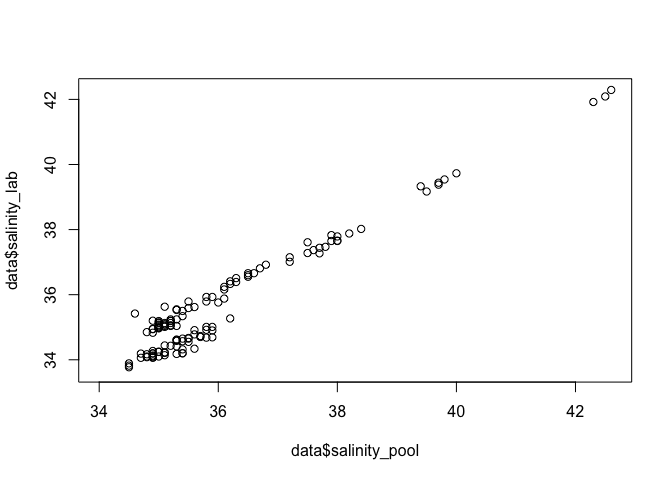<!-- -->

### Pool Temperature

``` r
data %>% filter(site %in% "Kaihalulu Beach") %>% ggplot(aes(x = sample_time, y = temp_pool, color = pool_number)) +
  facet_wrap(~site, scales = "free_x") + geom_line(linewidth = 0.8) + geom_point() + theme_minimal() + labs(title = "Pool Temperature") + theme(axis.text.x = element_text(angle = 30))
```

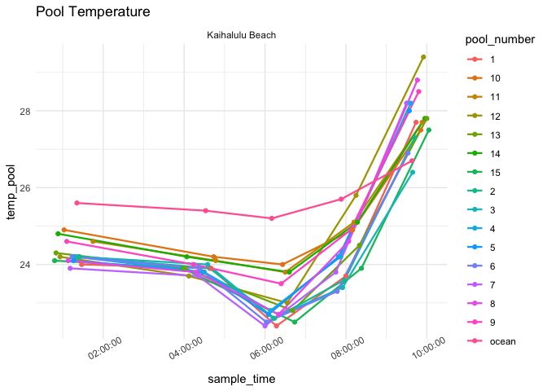<!-- -->

``` r
data %>% filter(site %in% "Sandy Beach") %>% ggplot(aes(x = sample_time, y = temp_pool, color = pool_number)) +
  facet_wrap(~site, scales = "free_x") + geom_line(linewidth = 0.8) + geom_point() + theme_minimal() + labs(title = "Pool Temperature") + theme(axis.text.x = element_text(angle = 30))
```

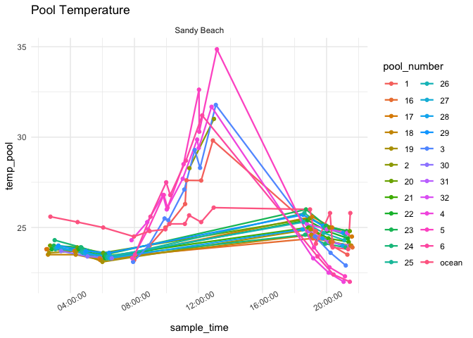<!-- -->

``` r
data %>% ggplot(aes(x = sample_time, y = temp_pool)) +
    facet_wrap(~substrate) + geom_smooth() + geom_point() + theme_minimal() + labs(title = "Pool Temp")  + theme(axis.text.x = element_text(angle = 30))
```

    ## `geom_smooth()` using method = 'loess' and formula = 'y ~ x'

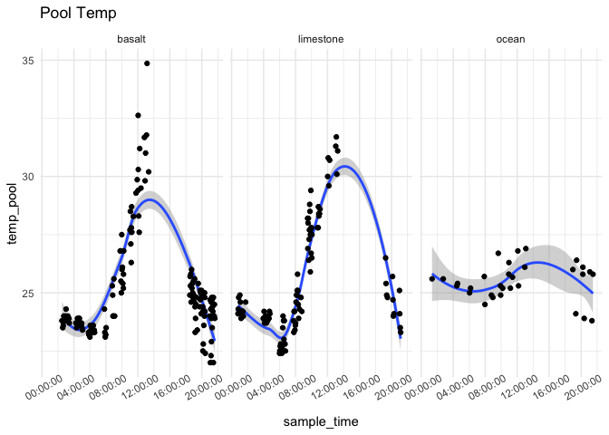<!-- -->

``` r
data %>% ggplot(aes(x = sample_time, y = temp_pool, color = substrate)) +
    facet_wrap(~substrate, 
               labeller = as_labeller(c(basalt = "Basalt", limestone = "Limestone", ocean = "Ocean"))) + 
  geom_smooth(method = "gam") + #, se=FALSE) + 
  geom_point() + theme_bw() +
  labs(x = "Sample Time", y = "Temperature (°C)")  + 
  guides(color = "none") +
  theme(axis.text.x = element_text(angle = 25)) 
```

    ## `geom_smooth()` using formula = 'y ~ s(x, bs = "cs")'

<!-- -->

### Pool Salinity

``` r
data %>% filter(site %in% "Kaihalulu Beach") %>% ggplot(aes(x = sample_time, y = salinity_pool, color = pool_number)) +   facet_wrap(~site, scales = "free_x") + geom_line(linewidth = 0.8) + geom_point() + theme_minimal() + labs(title = "Salinity (pool)")  + theme(axis.text.x = element_text(angle = 30))
```

<!-- -->

``` r
data %>% filter(site %in% "Sandy Beach") %>% ggplot(aes(x = sample_time, y = salinity_pool, color = pool_number)) +   facet_wrap(~site, scales = "free_x") + geom_line(linewidth = 0.8) + geom_point() + theme_minimal() + labs(title = "Salinity (pool)")  + theme(axis.text.x = element_text(angle = 30))
```

    ## Warning: Removed 55 rows containing missing values or values outside the scale range
    ## (`geom_line()`).

    ## Warning: Removed 66 rows containing missing values or values outside the scale range
    ## (`geom_point()`).

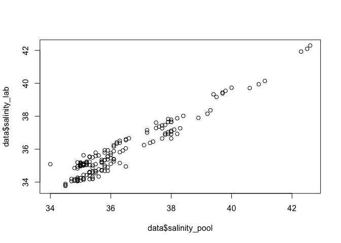<!-- -->

``` r
data %>% ggplot(aes(x = sample_time, y = salinity_field)) +
    facet_wrap(~substrate) + geom_smooth() + geom_point() + theme_minimal() + labs(title = "Salinity (Field)")  + theme(axis.text.x = element_text(angle = 30))
```

    ## `geom_smooth()` using method = 'loess' and formula = 'y ~ x'

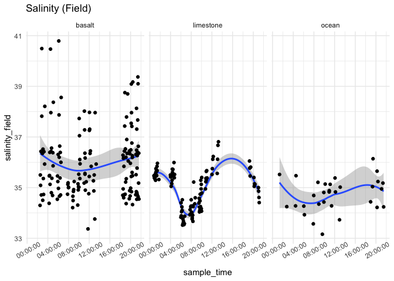<!-- -->

``` r
data %>% ggplot(aes(x = sample_time, y = salinity_field, color = substrate)) +
    facet_wrap(~substrate, 
               labeller = as_labeller(c(basalt = "Basalt", limestone = "Limestone", ocean = "Ocean"))) + 
  geom_smooth(method = "gam")+ #, se=FALSE) + 
  geom_point() + theme_bw() +
  labs(x = "Sample Time", y = "Salinity (psu)")  + 
  guides(color = "none") +
  theme(axis.text.x = element_text(angle = 25)) 
```

    ## `geom_smooth()` using formula = 'y ~ s(x, bs = "cs")'

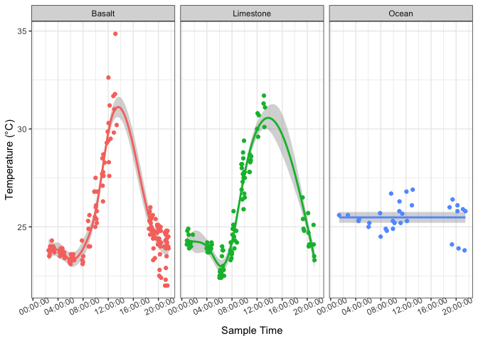<!-- -->

### pH

``` r
data %>% filter(site %in% "Kaihalulu Beach") %>% ggplot(aes(x = sample_time, y = pH, color = pool_number)) +
    facet_wrap(~site, scales = "free_x") + geom_line(linewidth = 0.8) + geom_point() + theme_minimal() + labs(title = "pH (tris)")  + theme(axis.text.x = element_text(angle = 30))
```

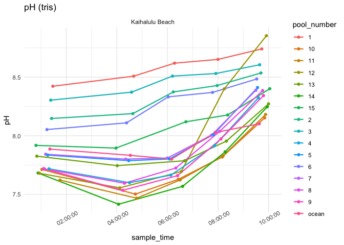<!-- -->

``` r
data %>% filter(site %in% "Sandy Beach") %>% ggplot(aes(x = sample_time, y = pH, color = pool_number)) +
    facet_wrap(~site, scales = "free_x") + geom_line(linewidth = 0.8) + geom_point() + theme_minimal() + labs(title = "pH (tris)")  + theme(axis.text.x = element_text(angle = 30))
```

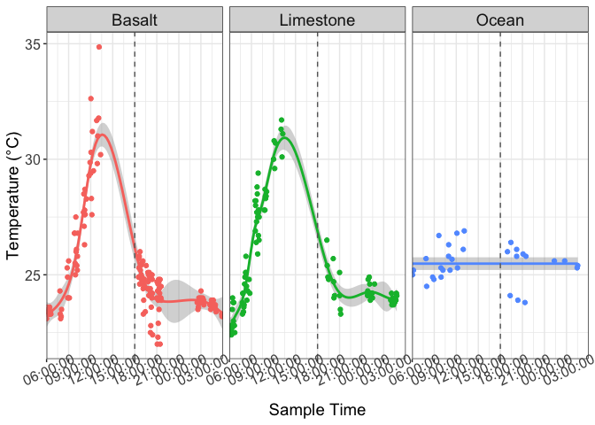<!-- -->

``` r
data %>% filter(site %in% "Kaihalulu Beach") %>% ggplot(aes(x = sample_time, y = pH_probe, color = pool_number)) +
    facet_wrap(~site, scales = "free_x") + geom_line(linewidth = 0.8) + geom_point() + theme_minimal() + labs(title = "pH (probe)")  + theme(axis.text.x = element_text(angle = 30))
```

<!-- -->

``` r
data %>% filter(site %in% "Sandy Beach") %>% ggplot(aes(x = sample_time, y = pH_probe, color = pool_number)) +
    facet_wrap(~site, scales = "free_x") + geom_line(linewidth = 0.8) + geom_point() + theme_minimal() + labs(title = "pH (probe)")  + theme(axis.text.x = element_text(angle = 30))
```

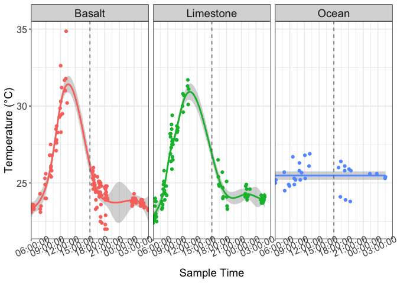<!-- -->

``` r
data %>% ggplot(aes(x = sample_time, y = pH)) +
    facet_wrap(~substrate) + geom_smooth() + geom_point() + theme_minimal() + labs(title = "pH")  + theme(axis.text.x = element_text(angle = 30))
```

    ## `geom_smooth()` using method = 'loess' and formula = 'y ~ x'

<!-- -->

``` r
data %>% ggplot(aes(x = sample_time, y = pH, color = site)) +
    facet_wrap(~substrate) + geom_smooth() + geom_point() + theme_minimal() + labs(title = "pH")  + theme(axis.text.x = element_text(angle = 30))
```

    ## `geom_smooth()` using method = 'loess' and formula = 'y ~ x'

    ## Warning in simpleLoess(y, x, w, span, degree = degree, parametric = parametric,
    ## : span too small.  fewer data values than degrees of freedom.

    ## Warning in simpleLoess(y, x, w, span, degree = degree, parametric = parametric,
    ## : pseudoinverse used at 4710.9

    ## Warning in simpleLoess(y, x, w, span, degree = degree, parametric = parametric,
    ## : neighborhood radius 17489

    ## Warning in simpleLoess(y, x, w, span, degree = degree, parametric = parametric,
    ## : reciprocal condition number 0

    ## Warning in simpleLoess(y, x, w, span, degree = degree, parametric = parametric,
    ## : There are other near singularities as well. 1.5949e+08

    ## Warning in predLoess(object$y, object$x, newx = if (is.null(newdata)) object$x
    ## else if (is.data.frame(newdata))
    ## as.matrix(model.frame(delete.response(terms(object)), : span too small.  fewer
    ## data values than degrees of freedom.

    ## Warning in predLoess(object$y, object$x, newx = if (is.null(newdata)) object$x
    ## else if (is.data.frame(newdata))
    ## as.matrix(model.frame(delete.response(terms(object)), : pseudoinverse used at
    ## 4710.9

    ## Warning in predLoess(object$y, object$x, newx = if (is.null(newdata)) object$x
    ## else if (is.data.frame(newdata))
    ## as.matrix(model.frame(delete.response(terms(object)), : neighborhood radius
    ## 17489

    ## Warning in predLoess(object$y, object$x, newx = if (is.null(newdata)) object$x
    ## else if (is.data.frame(newdata))
    ## as.matrix(model.frame(delete.response(terms(object)), : reciprocal condition
    ## number 0

    ## Warning in predLoess(object$y, object$x, newx = if (is.null(newdata)) object$x
    ## else if (is.data.frame(newdata))
    ## as.matrix(model.frame(delete.response(terms(object)), : There are other near
    ## singularities as well. 1.5949e+08

    ## Warning in max(ids, na.rm = TRUE): no non-missing arguments to max; returning
    ## -Inf

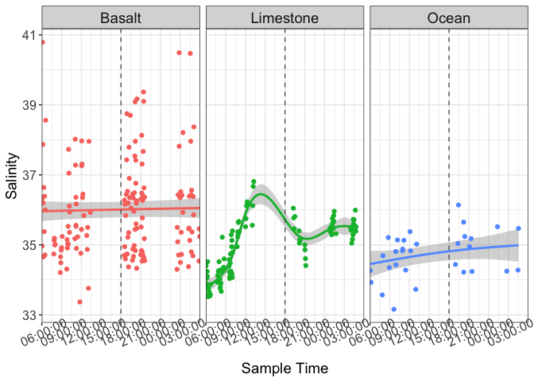<!-- -->

``` r
data %>% ggplot(aes(x = sample_time, y = pH, color = substrate)) +
    facet_wrap(~substrate, 
               labeller = as_labeller(c(basalt = "Basalt", limestone = "Limestone", ocean = "Ocean"))) + 
  geom_smooth(method = "gam") + #, se=FALSE) + 
  geom_point() + theme_bw() +
  labs(x = "Sample Time", y = "pH")  + 
  guides(color = "none") +
  theme(axis.text.x = element_text(angle = 25))
```

    ## `geom_smooth()` using formula = 'y ~ s(x, bs = "cs")'

<!-- -->

Shift times so 6:30 am is the new start time

``` r
start <- as.numeric(hms::as_hms("06:00:00"))
data <- data %>%
  mutate(
    time_sec   = as.numeric(sample_time),
    time_shift = (time_sec - start) %% (24 * 60 * 60)  # 0 at 06:00, increases to 05:59 next day
  )
```

Now for the vertical line for sunset

``` r
# 18:30 in seconds since midnight
line_time <- as.numeric(hms::as_hms("18:00:00"))

# Shifted position relative to 05:30
line_shift <- (line_time - start) %% (24 * 60 * 60)
```

``` r
data %>% ggplot(aes(x = time_shift, y = pH*temp_pool/25.2, color = substrate)) +
    facet_wrap(~substrate, 
               labeller = as_labeller(c(basalt = "Basalt", limestone = "Limestone", ocean = "Ocean"))) + 
  geom_smooth(method = "gam") + #method = "lm", se=FALSE) + 
  geom_point() + 
  theme_bw() +
  guides(color = "none") +
  theme(axis.text.x = element_text(angle = 25)) +
  geom_vline(xintercept = line_shift, linetype = "dashed", color = "gray40") + # vertical line at sunset
  labs(x = "Sample Time") +
   scale_x_continuous(
    limits = c(0, 24 * 60 * 60 - 1),      # full day: 06:30 -> 06:29 next day
    expand = c(0, 0),
    breaks = seq(0, 24 * 60 * 60 - 1, by = 3 * 3600),  # every 3 hours (avoid 86400 endpoint)
    labels = function(x) format(hms::as_hms((x + start) %% (24 * 60 * 60)), "%H:%M")
  )
```

    ## `geom_smooth()` using formula = 'y ~ s(x, bs = "cs")'

<!-- -->

``` r
data %>% ggplot(aes(x = time_shift, y = pH, color = substrate)) +
    facet_wrap(~substrate, 
               labeller = as_labeller(c(basalt = "Basalt", limestone = "Limestone", ocean = "Ocean"))) + 
  geom_smooth(method = "gam") + #method = "lm", se=FALSE) + 
  geom_point() + 
  theme_bw() +
  guides(color = "none") +
 # theme(axis.text.x = element_text(angle = 25)) +
  theme(strip.text = element_text(size = 14),
        axis.title = element_blank(),
        axis.text.y = element_text(size = 14),
        axis.text.x = element_blank(),
        panel.grid.major = element_blank(), 
        panel.grid.minor = element_blank(),
        axis.ticks.x = element_blank()) +
  geom_vline(xintercept = line_shift, linetype = "dashed", color = "gray9") + # vertical line at sunset
  scale_x_continuous(
    limits = c(0, 24 * 60 * 60 - 1),      # full day: 06:30 -> 06:29 next day
    expand = c(0, 0),
    breaks = seq(0, 24 * 60 * 60 - 1, by = 3 * 3600),  # every 3 hours (avoid 86400 endpoint)
    labels = function(x) format(hms::as_hms((x + start) %% (24 * 60 * 60)), "%H:%M")
  )
```

    ## `geom_smooth()` using formula = 'y ~ s(x, bs = "cs")'

<!-- -->

``` r
#ggsave(here("Output", "pH_over_time.png"), width = 6, height = 2)
```

### TA

``` r
data %>% filter(site %in% "Kaihalulu Beach") %>% ggplot(aes(x = sample_time, y = TA_norm, color = pool_number)) +   facet_wrap(~site, scales = "free_x") + geom_line(linewidth = 0.8) + geom_point() + theme_minimal() + labs(title = "TA normalized")  + theme(axis.text.x = element_text(angle = 30))
```

<!-- -->

``` r
data %>% filter(site %in% "Sandy Beach") %>% ggplot(aes(x = sample_time, y = TA_norm, color = pool_number)) +   facet_wrap(~site, scales = "free_x") + geom_line(linewidth = 0.8) + geom_point() + theme_minimal() + labs(title = "TA normalized")  + theme(axis.text.x = element_text(angle = 30))
```

    ## Warning: Removed 46 rows containing missing values or values outside the scale range
    ## (`geom_line()`).

    ## Warning: Removed 48 rows containing missing values or values outside the scale range
    ## (`geom_point()`).

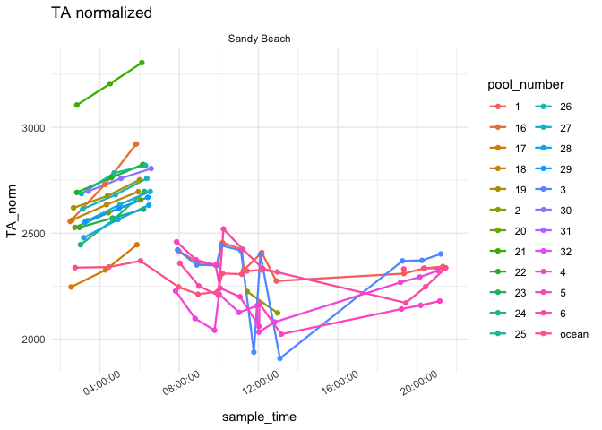<!-- -->

``` r
data %>% ggplot(aes(x = sample_time, y = TA_norm, color = site)) +
    facet_wrap(~substrate) +
  geom_smooth() + 
  geom_point() + 
  theme_minimal() + 
  labs(title = "TA Norm")  +
  theme(axis.text.x = element_text(angle = 30))
```

    ## `geom_smooth()` using method = 'loess' and formula = 'y ~ x'

    ## Warning: Removed 48 rows containing non-finite outside the scale range
    ## (`stat_smooth()`).

    ## Warning in simpleLoess(y, x, w, span, degree = degree, parametric = parametric,
    ## : span too small.  fewer data values than degrees of freedom.

    ## Warning in simpleLoess(y, x, w, span, degree = degree, parametric = parametric,
    ## : pseudoinverse used at 4710.9

    ## Warning in simpleLoess(y, x, w, span, degree = degree, parametric = parametric,
    ## : neighborhood radius 17489

    ## Warning in simpleLoess(y, x, w, span, degree = degree, parametric = parametric,
    ## : reciprocal condition number 0

    ## Warning in simpleLoess(y, x, w, span, degree = degree, parametric = parametric,
    ## : There are other near singularities as well. 1.5949e+08

    ## Warning in predLoess(object$y, object$x, newx = if (is.null(newdata)) object$x
    ## else if (is.data.frame(newdata))
    ## as.matrix(model.frame(delete.response(terms(object)), : span too small.  fewer
    ## data values than degrees of freedom.

    ## Warning in predLoess(object$y, object$x, newx = if (is.null(newdata)) object$x
    ## else if (is.data.frame(newdata))
    ## as.matrix(model.frame(delete.response(terms(object)), : pseudoinverse used at
    ## 4710.9

    ## Warning in predLoess(object$y, object$x, newx = if (is.null(newdata)) object$x
    ## else if (is.data.frame(newdata))
    ## as.matrix(model.frame(delete.response(terms(object)), : neighborhood radius
    ## 17489

    ## Warning in predLoess(object$y, object$x, newx = if (is.null(newdata)) object$x
    ## else if (is.data.frame(newdata))
    ## as.matrix(model.frame(delete.response(terms(object)), : reciprocal condition
    ## number 0

    ## Warning in predLoess(object$y, object$x, newx = if (is.null(newdata)) object$x
    ## else if (is.data.frame(newdata))
    ## as.matrix(model.frame(delete.response(terms(object)), : There are other near
    ## singularities as well. 1.5949e+08

    ## Warning in max(ids, na.rm = TRUE): no non-missing arguments to max; returning
    ## -Inf

    ## Warning: Removed 48 rows containing missing values or values outside the scale range
    ## (`geom_point()`).

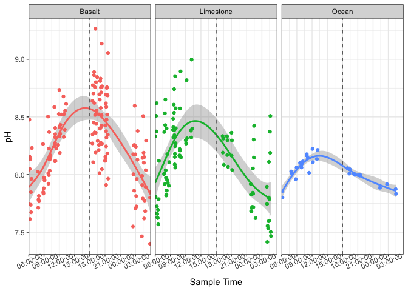<!-- -->

``` r
data %>% ggplot(aes(x = sample_time, y = TA_norm, color = substrate)) +
    facet_wrap(~substrate, 
               labeller = as_labeller(c(basalt = "Basalt", limestone = "Limestone", ocean = "Ocean"))) + 
  geom_smooth(method = "gam") + #, se=FALSE) + 
  geom_point() + theme_bw() +
  labs(x = "Sample Time", y = "Total Alkalinity")  + 
  guides(color = "none") +
  theme(axis.text.x = element_text(angle = 25)) 
```

    ## `geom_smooth()` using formula = 'y ~ s(x, bs = "cs")'

    ## Warning: Removed 48 rows containing non-finite outside the scale range
    ## (`stat_smooth()`).

    ## Warning: Removed 48 rows containing missing values or values outside the scale range
    ## (`geom_point()`).

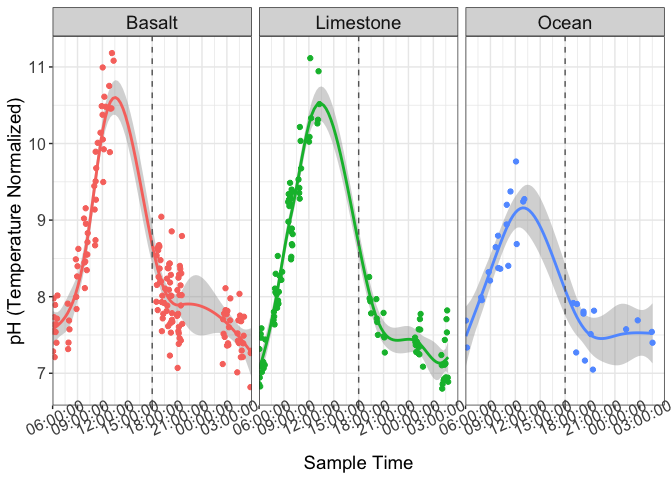<!-- -->

``` r
data %>% ggplot(aes(x = time_shift, y = TA_norm, color = substrate)) +
    facet_wrap(~substrate, 
               labeller = as_labeller(c(basalt = "Basalt", limestone = "Limestone", ocean = "Ocean"))) + 
  geom_smooth(method = "gam") + #method = "lm", se=FALSE) + 
  geom_point() + 
  theme_bw() +
  guides(color = "none") +
  theme(axis.text.x = element_text(angle = 25)) +
  geom_vline(xintercept = line_shift, linetype = "dashed", color = "gray40") + # vertical line at sunset
  labs(x = "Sample Time", y = "Total Alkalinty") +
   scale_x_continuous(
    limits = c(0, 24 * 60 * 60 - 1),      # full day: 06:30 -> 06:29 next day
    expand = c(0, 0),
    breaks = seq(0, 24 * 60 * 60 - 1, by = 3 * 3600),  # every 3 hours (avoid 86400 endpoint)
    labels = function(x) format(hms::as_hms((x + start) %% (24 * 60 * 60)), "%H:%M")
  )
```

    ## `geom_smooth()` using formula = 'y ~ s(x, bs = "cs")'

    ## Warning: Removed 48 rows containing non-finite outside the scale range
    ## (`stat_smooth()`).

    ## Warning: Removed 48 rows containing missing values or values outside the scale range
    ## (`geom_point()`).

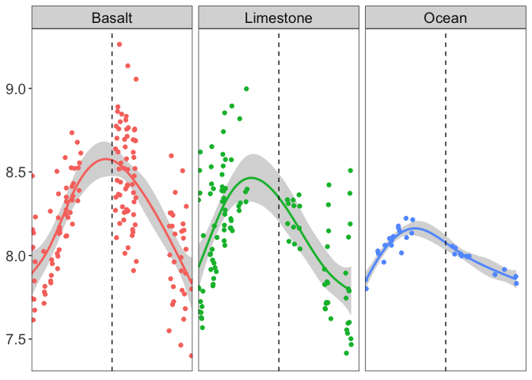<!-- -->

Non-normalized salinity

``` r
data %>% ggplot(aes(x = sample_time, y = TA, color = substrate)) +
    facet_wrap(~substrate, 
               labeller = as_labeller(c(basalt = "Basalt", limestone = "Limestone", ocean = "Ocean"))) + 
  geom_smooth(method = "lm", se=FALSE) + 
  geom_point() + theme_bw() +
  labs(x = "Sample Time", y = "Total Alkalinity Regular")  + 
  guides(color = "none") +
  theme(axis.text.x = element_text(angle = 25)) 
```

    ## `geom_smooth()` using formula = 'y ~ x'

    ## Warning: Removed 48 rows containing non-finite outside the scale range
    ## (`stat_smooth()`).

    ## Warning: Removed 48 rows containing missing values or values outside the scale range
    ## (`geom_point()`).

<!-- -->

### O2

``` r
data %>% filter(site %in% "Kaihalulu Beach") %>% ggplot(aes(x = sample_time, y = dissolved_oxygen, color = pool_number)) + facet_wrap(~site, scales = "free_x") + geom_line(linewidth = 0.8) + geom_point() + theme_minimal() + labs(title = "DO")  + theme(axis.text.x = element_text(angle = 30))
```

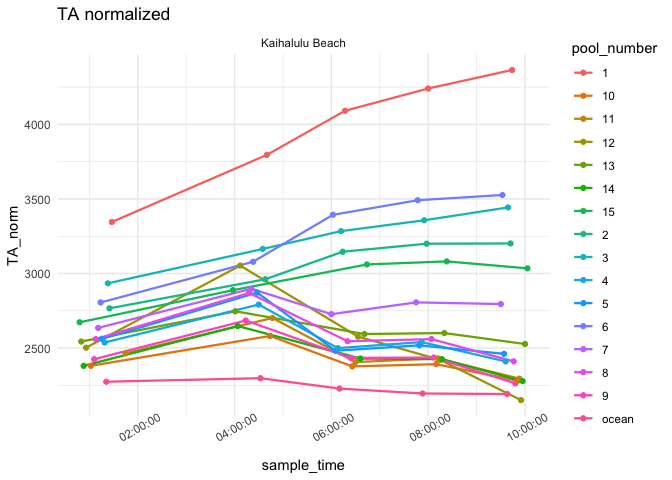<!-- -->

``` r
data %>% filter(site %in% "Sandy Beach") %>% ggplot(aes(x = sample_time, y = dissolved_oxygen, color = pool_number)) +   facet_wrap(~site, scales = "free_x") + geom_line(linewidth = 0.8) + geom_point() + theme_minimal() + labs(title = "DO")  + theme(axis.text.x = element_text(angle = 30))
```

    ## Warning: Removed 55 rows containing missing values or values outside the scale range
    ## (`geom_line()`).

    ## Warning: Removed 66 rows containing missing values or values outside the scale range
    ## (`geom_point()`).

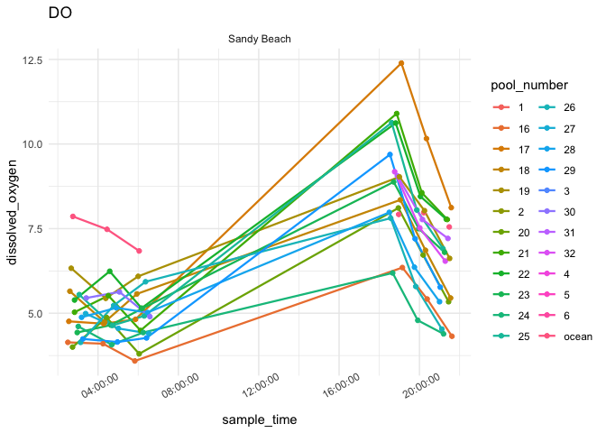<!-- -->

``` r
data %>% ggplot(aes(x = sample_time, y = dissolved_oxygen)) +
    facet_wrap(~substrate) +
  geom_smooth(method = "lm", se=FALSE) + 
  geom_point() + 
  theme_minimal() + 
  labs(title = "DO")  +
  theme(axis.text.x = element_text(angle = 30))
```

    ## `geom_smooth()` using formula = 'y ~ x'

    ## Warning: Removed 117 rows containing non-finite outside the scale range
    ## (`stat_smooth()`).

    ## Warning: Removed 117 rows containing missing values or values outside the scale range
    ## (`geom_point()`).

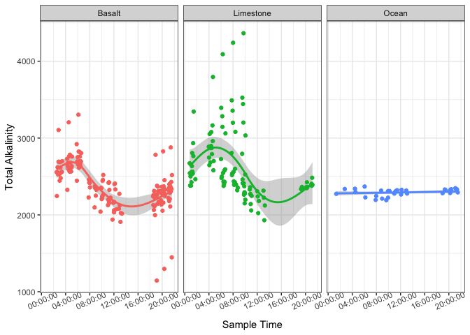<!-- -->

``` r
data %>% ggplot(aes(x = sample_time, y = dissolved_oxygen, color = site)) +
    facet_wrap(~substrate, 
               labeller = as_labeller(c(basalt = "Basalt", limestone = "Limestone", ocean = "Ocean"))) + 
  geom_smooth(method = "lm", se=FALSE) + 
  geom_point() + theme_bw() +
  labs(x = "Sample Time", y = "Dissolved Oxygen")  + 
  guides(color = "none") +
  theme(axis.text.x = element_text(angle = 25)) 
```

    ## `geom_smooth()` using formula = 'y ~ x'

    ## Warning: Removed 117 rows containing non-finite outside the scale range
    ## (`stat_smooth()`).

    ## Warning: Removed 117 rows containing missing values or values outside the scale range
    ## (`geom_point()`).

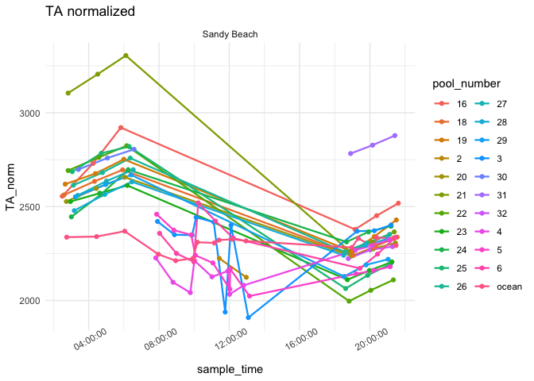<!-- -->

### Deltas

``` r
delta_calc %>% ggplot(aes(x = substrate, y = delta_pH, color = substrate)) + #, label = pool_number)) + 
  geom_boxplot(alpha = 0.7) + 
  geom_point() + 
 # geom_text(hjust=0, vjust=0) +
  theme_bw() + 
  scale_color_manual(values = c("gray20", "sienna2", "palegreen3", "dodgerblue3")) +
  guides(color = "none") +
  labs(x = "Substrate", y = "Delta pH") + 
  geom_hline(yintercept = 0, linetype = "dashed", color = "gray")
```

<!-- -->

``` r
delta_calc %>% ggplot(aes(x = substrate, y = delta_TA, color = substrate)) + #, label = pool_number)) + 
  geom_boxplot(alpha = 0.7) + 
  geom_point() + 
 # geom_text(hjust=0, vjust=0) +
  theme_bw() + 
  scale_color_manual(values = c("gray20", "sienna2", "palegreen3", "dodgerblue3")) +
  guides(color = "none") +
  labs(x = "Substrate", y = "Delta TA") + 
  geom_hline(yintercept = 0, linetype = "dashed", color = "gray")
```

    ## Warning: Removed 16 rows containing non-finite outside the scale range
    ## (`stat_boxplot()`).

    ## Warning: Removed 16 rows containing missing values or values outside the scale range
    ## (`geom_point()`).

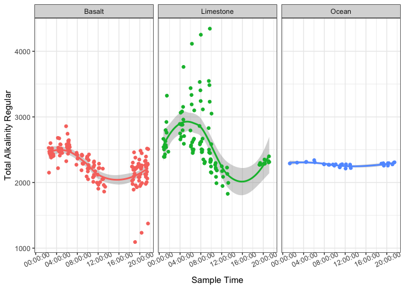<!-- -->

### Delta TA vs Delta pH

``` r
delta_calc %>% 
  ggplot(aes(x = delta_pH, y = delta_TA)) + 
  geom_point(size = 2, alpha = 0.7) + 
  geom_smooth(method = "lm", color = "sienna3") + 
  facet_wrap(~substrate, nrow = 3,
               labeller = as_labeller(c(basalt = "Basalt", limestone = "Limestone", ocean = "Ocean"))) +
  theme_bw() + 
  labs(x = expression(paste(Delta, " pH")), 
       y = expression(paste(Delta, " Total Alkalinity"))) +
  geom_hline(yintercept = 0, linetype = "dashed", color = "gray") +
  geom_vline(xintercept = 0, linetype = "dashed", color = "gray") +
  scale_y_reverse() + # so calcification increases up 
  theme(strip.text = element_text(size = 16),
        axis.title = element_text(size = 16),
        axis.text = element_text(size = 10),
        axis.text.x = element_text(hjust = 0.9, angle = 45))
```

    ## `geom_smooth()` using formula = 'y ~ x'

    ## Warning: Removed 16 rows containing non-finite outside the scale range
    ## (`stat_smooth()`).

    ## Warning: Removed 16 rows containing missing values or values outside the scale range
    ## (`geom_point()`).

<!-- -->

``` r
#ggsave(here("Output", "delta_TA_vs_delta_pH.png"), width = 4, height = 8)
```

``` r
delta_calc %>% 
  filter(!substrate %in% "ocean") %>%
  ggplot(aes(x = delta_pH_norm, y = delta_TA_norm, color = substrate)) + 
  geom_point(size = 2, alpha = 0.7) + 
  geom_smooth(method = "lm", aes(fill = substrate)) + 
  #facet_wrap(~substrate, nrow = 3,
 #              labeller = as_labeller(c(basalt = "Basalt", limestone = "Limestone"))) +
  theme_bw() + 
  labs(x = expression(paste(Delta, " pH")), 
       y = expression(paste(Delta, " Total Alkalinity")),
       color = "Substrate") +
  geom_hline(yintercept = 0, linetype = "dashed", color = "gray50") +
  geom_vline(xintercept = 0, linetype = "dashed", color = "gray50") +
  scale_y_reverse() + # so calcification increases up 
  theme(strip.text = element_text(size = 16),
        axis.title = element_text(size = 16),
        axis.text = element_text(size = 13),
        legend.position = "bottom",
        legend.text=element_text(size=16),
        legend.title = element_text(size = 16)
        ) +
  scale_colour_manual(labels = c("Basalt", "Limestone"), values = c("#5EABD6", "#e75b4a")) +
  scale_fill_manual(values = c("#5EABD6", "#e75b4a")) + 
  guides(fill="none", color = "none")
```

    ## `geom_smooth()` using formula = 'y ~ x'

    ## Warning: Removed 15 rows containing non-finite outside the scale range
    ## (`stat_smooth()`).

    ## Warning: Removed 15 rows containing missing values or values outside the scale range
    ## (`geom_point()`).

<!-- -->

``` r
ggsave(here("Output", "delta_TA_vs_delta_pH_onepanel.png"), width = 4, height = 4)
```

    ## `geom_smooth()` using formula = 'y ~ x'

    ## Warning: Removed 15 rows containing non-finite outside the scale range
    ## (`stat_smooth()`).
    ## Removed 15 rows containing missing values or values outside the scale range
    ## (`geom_point()`).

``` r
data %>% 
  filter(!substrate %in% "ocean") %>% 
  ggplot(aes(x = pH, y = TA_norm, color = factor(date), shape = day_night)) + 
  geom_point(size = 2, alpha = 0.7) + 
  geom_smooth(method = "lm") + 
  facet_wrap(~substrate, 
               labeller = as_labeller(c(basalt = "Basalt", limestone = "Limestone"))) +
  theme_bw() + 
  labs(x = "pH", y = "Total Alkalinity") 
```

    ## `geom_smooth()` using formula = 'y ~ x'

    ## Warning: Removed 45 rows containing non-finite outside the scale range
    ## (`stat_smooth()`).

    ## Warning: Removed 45 rows containing missing values or values outside the scale range
    ## (`geom_point()`).

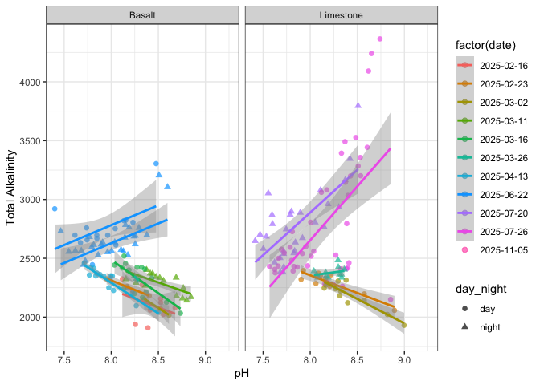<!-- -->

``` r
# committee meeting figure
delta_calc %>% 
  filter(substrate == "limestone" | substrate == "basalt") %>%
  ggplot(aes(x = delta_pH_norm, y = delta_TA_norm)) + 
  facet_wrap(~substrate, 
               labeller = as_labeller(c(basalt = "Basalt", limestone = "Limestone", ocean = "Ocean"))) +
  geom_point() + 
  geom_smooth(method = "lm") + 
  theme_bw() + 
  labs(x = "Delta pH/Hour", y = "Delta TA/Hour") 
```

    ## `geom_smooth()` using formula = 'y ~ x'

    ## Warning: Removed 15 rows containing non-finite outside the scale range
    ## (`stat_smooth()`).

    ## Warning: Removed 15 rows containing missing values or values outside the scale range
    ## (`geom_point()`).

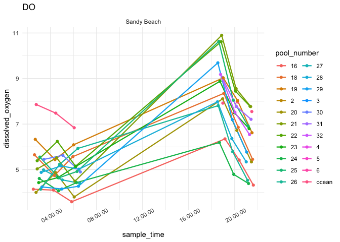<!-- -->

### Delta DIC vs Delta pH

``` r
delta_calc %>% 
  filter(!substrate %in% "ocean") %>%
  ggplot(aes(x = delta_DIC, y = delta_pH, color = substrate)) + 
  geom_point(size = 2, alpha = 0.7) + 
  geom_smooth(method = "lm", aes(fill = substrate)) +#, color = "palegreen4") + 
  #facet_wrap(~substrate, nrow = 3,
         #      labeller = as_labeller(c(basalt = "Basalt", limestone = "Limestone", ocean = "Ocean"))) +
  theme_bw() + 
  labs(y = expression(paste(Delta, " pH")), 
       x = expression(paste(Delta, " Dissolved Inorganic Carbon")),
       color = "Substrate") +
  geom_hline(yintercept = 0, linetype = "dashed", color = "gray50") +
  geom_vline(xintercept = 0, linetype = "dashed", color = "gray50") +
  scale_x_reverse() + # so production increases to the right
  theme(strip.text = element_text(size = 16),
        axis.title = element_text(size = 16),
        axis.text = element_text(size = 13)) +
  scale_colour_manual(labels = c("Basalt", "Limestone"), values = c("#5EABD6", "#e75b4a")) +
  scale_fill_manual(values = c("#5EABD6", "#e75b4a")) + 
  guides(fill="none", color = "none")
```

    ## `geom_smooth()` using formula = 'y ~ x'

    ## Warning: Removed 15 rows containing non-finite outside the scale range
    ## (`stat_smooth()`).

    ## Warning: Removed 15 rows containing missing values or values outside the scale range
    ## (`geom_point()`).

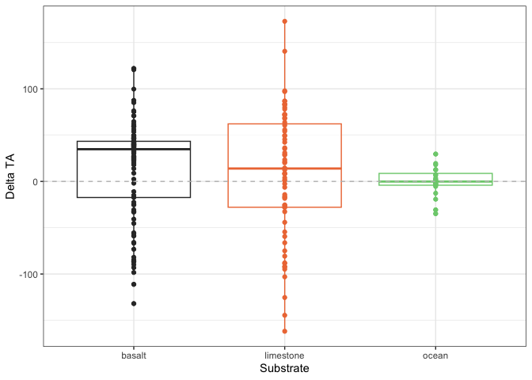<!-- -->

``` r
ggsave(here("Output", "delta_DIC_vs_delta_pH_onepanel.png"), width = 4, height = 4)
```

    ## `geom_smooth()` using formula = 'y ~ x'

    ## Warning: Removed 15 rows containing non-finite outside the scale range
    ## (`stat_smooth()`).
    ## Removed 15 rows containing missing values or values outside the scale range
    ## (`geom_point()`).

------------------------------------------------------------------------

Pool 1 salinity lab vs TA reg

``` r
data %>% 
  filter(!substrate %in% c("ocean", "basalt")) %>% 
  filter(pool_number == 1) %>%
  ggplot(aes(x = salinity_pool, y = TA)) + 
  geom_point(size = 2, alpha = 0.7) + 
  geom_smooth(method = "lm") + 
  facet_wrap(~substrate, 
               labeller = as_labeller(c(basalt = "Basalt", limestone = "Limestone"))) +
  theme_bw() + 
  labs(x = "Pool Salinity", y = "Reg Total Alkalinity") 
```

    ## `geom_smooth()` using formula = 'y ~ x'

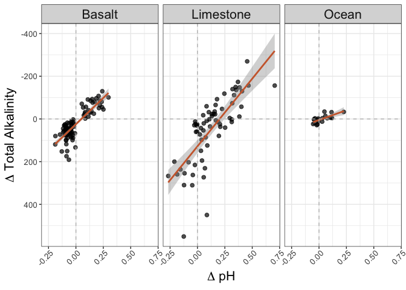<!-- -->

### Salinity vs temp

``` r
data %>% 
  ggplot(aes(x = temp_field, y = salinity_field)) + 
  geom_point(size = 2, alpha = 0.7) + 
  geom_smooth(method = "lm") + 
  facet_wrap(~substrate, scales = "free_x",
               labeller = as_labeller(c(basalt = "Basalt", limestone = "Limestone"))) +
  theme_bw() + 
  labs(x = "Temperature", y = "Field Salinity") 
```

    ## `geom_smooth()` using formula = 'y ~ x'

<!-- -->

### DO and pH

``` r
data %>% 
  #filter(!substrate %in% c("ocean")) %>% 
  ggplot(aes(x = pH, y = dissolved_oxygen)) + 
  geom_point(size = 2, alpha = 0.7) + 
  geom_smooth(method = "lm") + 
  facet_wrap(~substrate, 
               labeller = as_labeller(c(basalt = "Basalt", limestone = "Limestone"))) +
  theme_bw() + 
  labs(x = "pH", y = "Dissolved Oxygen") 
```

    ## `geom_smooth()` using formula = 'y ~ x'

    ## Warning: Removed 117 rows containing non-finite outside the scale range
    ## (`stat_smooth()`).

    ## Warning: Removed 117 rows containing missing values or values outside the scale range
    ## (`geom_point()`).

<!-- -->

### TA/DIC Plot

``` r
data %>%
  ggplot(aes(x = DIC, y = TA, color = substrate)) +
  geom_point(alpha = 0.8) +
  geom_smooth(method = "lm",se = FALSE) +
  facet_wrap(~substrate, scales = "free_x",
               labeller = as_labeller(c(basalt = "Basalt", limestone = "Limestone", ocean = "Ocean"))) +
  guides(color = "none") +
  labs(x = expression(paste("DIC (",mu,"mol kg"^-1,")")),
       y = expression(paste("TA (",mu,"mol kg"^-1,")"))) +
  theme_bw() 
```

    ## `geom_smooth()` using formula = 'y ~ x'

    ## Warning: Removed 48 rows containing non-finite outside the scale range
    ## (`stat_smooth()`).

    ## Warning: Removed 48 rows containing missing values or values outside the scale range
    ## (`geom_point()`).

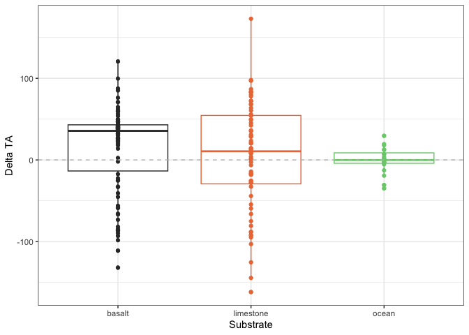<!-- -->

### NEC + NEP

``` r
deltas %>% ggplot(aes(x = delta_pH, y = NEC)) + 
  geom_point() + 
  geom_smooth(method = "lm") +
  #facet_wrap(~substrate) +
  geom_hline(yintercept = 0, linetype = "dashed", color = "gray50") +
  geom_vline(xintercept = 0, linetype = "dashed", color = "gray50") +
  theme_bw() 
```

    ## `geom_smooth()` using formula = 'y ~ x'

    ## Warning: Removed 246 rows containing non-finite outside the scale range
    ## (`stat_smooth()`).

    ## Warning: Removed 246 rows containing missing values or values outside the scale range
    ## (`geom_point()`).

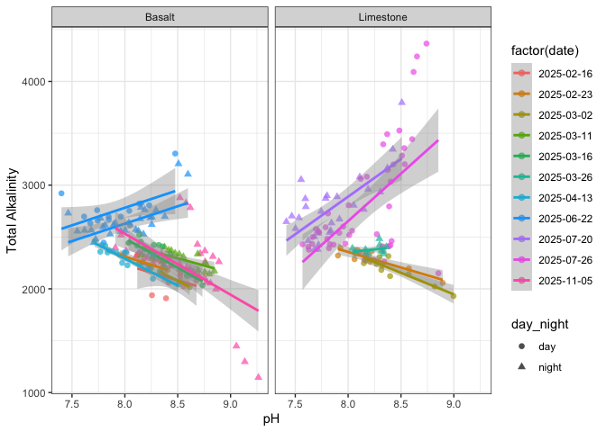<!-- -->

``` r
deltas %>% ggplot(aes(x = mean_pH, y = NEC)) + 
  geom_point() + 
  geom_smooth(method = "lm") +
  #facet_wrap(~substrate) +
  geom_hline(yintercept = 0, linetype = "dashed", color = "gray50") +
  theme_bw() 
```

    ## `geom_smooth()` using formula = 'y ~ x'

    ## Warning: Removed 246 rows containing non-finite outside the scale range
    ## (`stat_smooth()`).

    ## Warning: Removed 246 rows containing missing values or values outside the scale range
    ## (`geom_point()`).

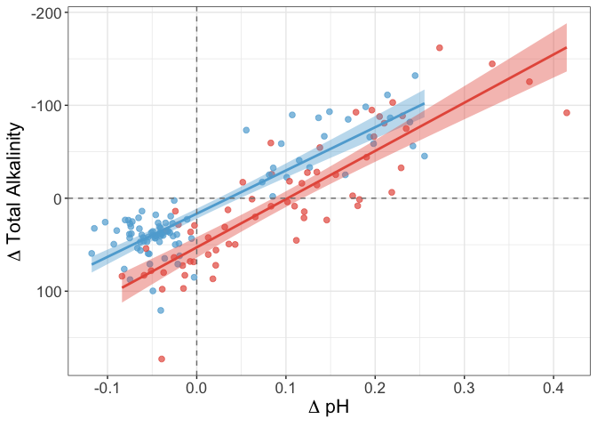<!-- -->

``` r
deltas %>% ggplot(aes(x = NEP, y = delta_pH)) + 
  geom_point() + 
  geom_smooth(method = "lm") +
  #facet_wrap(~substrate) +
  geom_hline(yintercept = 0, linetype = "dashed", color = "gray50") +
  geom_vline(xintercept = 0, linetype = "dashed", color = "gray50") +
  theme_bw()
```

    ## `geom_smooth()` using formula = 'y ~ x'

    ## Warning: Removed 246 rows containing non-finite outside the scale range
    ## (`stat_smooth()`).

    ## Warning: Removed 246 rows containing missing values or values outside the scale range
    ## (`geom_point()`).

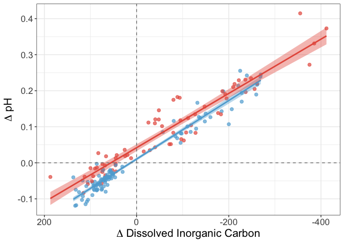<!-- -->

``` r
deltas %>% ggplot(aes(x = NEP, y = mean_pH)) + 
  geom_point() + 
  geom_smooth(method = "lm") +
  #facet_wrap(~substrate) +
  geom_vline(xintercept = 0, linetype = "dashed", color = "gray50") +
  theme_bw()
```

    ## `geom_smooth()` using formula = 'y ~ x'

    ## Warning: Removed 246 rows containing non-finite outside the scale range
    ## (`stat_smooth()`).

    ## Warning: Removed 246 rows containing missing values or values outside the scale range
    ## (`geom_point()`).

<!-- -->

``` r
deltas %>% ggplot(aes(x = NEP, y = NEC)) + 
  geom_point() + 
  geom_smooth(method = "lm") +
  #facet_wrap(~substrate) +
  geom_hline(yintercept = 0, linetype = "dashed", color = "gray50") +
  geom_vline(xintercept = 0, linetype = "dashed", color = "gray50") +
  theme_bw() 
```

    ## `geom_smooth()` using formula = 'y ~ x'

    ## Warning: Removed 246 rows containing non-finite outside the scale range
    ## (`stat_smooth()`).

    ## Warning: Removed 246 rows containing missing values or values outside the scale range
    ## (`geom_point()`).

<!-- -->
