TP_analysis
================
Micaela Chapuis
2025-06-30

## Load Libraries

``` r
library(tidyverse)
```

    ## ── Attaching core tidyverse packages ──────────────────────── tidyverse 2.0.0 ──
    ## ✔ dplyr     1.1.4     ✔ readr     2.1.5
    ## ✔ forcats   1.0.0     ✔ stringr   1.5.1
    ## ✔ ggplot2   3.5.1     ✔ tibble    3.2.1
    ## ✔ lubridate 1.9.4     ✔ tidyr     1.3.1
    ## ✔ purrr     1.0.2     
    ## ── Conflicts ────────────────────────────────────────── tidyverse_conflicts() ──
    ## ✖ dplyr::filter() masks stats::filter()
    ## ✖ dplyr::lag()    masks stats::lag()
    ## ℹ Use the conflicted package (<http://conflicted.r-lib.org/>) to force all conflicts to become errors

``` r
library(here)
```

    ## here() starts at /Users/micachapuis/GitHub/HawaiiTidepools

``` r
library(seacarb)
```

    ## Loading required package: oce
    ## Loading required package: gsw
    ## Loading required package: SolveSAPHE

``` r
library(lubridate)
library(car)
```

    ## Loading required package: carData
    ## 
    ## Attaching package: 'car'
    ## 
    ## The following object is masked from 'package:dplyr':
    ## 
    ##     recode
    ## 
    ## The following object is masked from 'package:purrr':
    ## 
    ##     some

``` r
library(lubridateExtras)
```

    ## 
    ## Attaching package: 'lubridateExtras'
    ## 
    ## The following object is masked from 'package:lubridate':
    ## 
    ##     hms

``` r
library(lme4)
```

    ## Loading required package: Matrix
    ## 
    ## Attaching package: 'Matrix'
    ## 
    ## The following objects are masked from 'package:tidyr':
    ## 
    ##     expand, pack, unpack

``` r
library(scales)
```

    ## 
    ## Attaching package: 'scales'
    ## 
    ## The following object is masked from 'package:oce':
    ## 
    ##     rescale
    ## 
    ## The following object is masked from 'package:purrr':
    ## 
    ##     discard
    ## 
    ## The following object is masked from 'package:readr':
    ## 
    ##     col_factor

``` r
library(ggeffects)
library(sjPlot)
```

## Load in Data

``` r
chem <- read_csv(here("Data", "tidepool_chemistry.csv"))
params <- read_csv(here("Data", "tidepool_parameters.csv"))
pHSlope <- read_csv(here("Data", "pHSlope.csv"))
TA <- read_csv(here("Data", "total_alkalinity.csv"))
```

## Data cleaning and joining

Make all pool numbers factors

``` r
chem$pool_number <- factor(chem$pool_number, levels = c(1,2,3,4,5,6,7,8,9,10,11,12,13,14,15,16,17,18,19,20,21,22,23,24,25,26,27,28,29,30, "ocean"))
params$pool_number <- factor(params$pool_number)
```

Remove junk samples from TA Data

``` r
junks <- c("junk1", "junk2", "junk3")
TA <- TA %>% filter(!sample_ID %in% junks)
```

Join in TA data

``` r
data <- left_join(chem, TA, by = "sample_ID")
```

Add in pH calculated from tris and physical parameters

``` r
data <- left_join(data, pHSlope)
```

    ## Joining with `by = join_by(date, sample_ID)`

``` r
data <- left_join(data, (params %>% select(site, pool_number, substrate, perimeter_m, surface_area_m2)), by = c("site", "pool_number"))
```

Selecting columns

``` r
data <- data %>% select(-observers, -notes, -Sample.Index)
```

Adding in “ocean” as substrate

``` r
data <- data %>% mutate(substrate = replace_na(substrate, "ocean"))
```

Salinity Normalize TA

``` r
data <- data %>% mutate(TA_norm = TA*salinity_lab/35)
```

Removing Kaihalulu Data collected on 2025/06/08 due to rain

``` r
data <- data %>% filter(!date == "2025/06/08")
```

Calculate delta pH and delta TA

``` r
delta_calc <- data %>% 
  select(date, site, pool_number, substrate, time_point, temp_pool, sample_time, pH, TA_norm)  %>%
  group_by(date, site, pool_number, substrate) %>%  # group by metadata
  arrange(time_point, .by_group = TRUE) %>%  # ensure correct order
  reframe(
    delta_pH = pH[time_point == 3] - pH[time_point == 1],   # (Time 3 - Time 1)
    
    delta_TA = (TA_norm[time_point == 3] - TA_norm[time_point == 1]),  # (Time 3 - Time 1)

    delta_temp = (temp_pool[time_point == 3] - temp_pool[time_point == 1]),  # (Time 3 - Time 1)

    delta_time = (as.numeric(difftime(sample_time[time_point == 3], sample_time[time_point == 1], units = "mins")))  # Time 3 - Time 1
    
  ) %>% 
    distinct(date, site, pool_number, substrate, .keep_all = TRUE)  # Ensure only one row per pool
```

Normalize delta pH and TA to by hour

``` r
delta_calc <- delta_calc %>% mutate(delta_pH_norm = (delta_pH/delta_time)*60,
                                    delta_TA_norm = (delta_TA/delta_time)*60)
```

## Data Viz

``` r
# checking field salinity (with Orion) to lab salinity (with Orion) measurements
plot(data$salinity_pool, data$salinity_lab)
```

<!-- -->

### Pool Temperature

``` r
data %>% filter(site %in% "Kaihalulu Beach") %>% ggplot(aes(x = sample_time, y = temp_pool, color = pool_number)) +
  facet_wrap(~site, scales = "free_x") + geom_line(linewidth = 0.8) + geom_point() + theme_minimal() + labs(title = "Pool Temperature") + theme(axis.text.x = element_text(angle = 30))
```

<!-- -->

``` r
data %>% filter(site %in% "Sandy Beach") %>% ggplot(aes(x = sample_time, y = temp_pool, color = pool_number)) +
  facet_wrap(~site, scales = "free_x") + geom_line(linewidth = 0.8) + geom_point() + theme_minimal() + labs(title = "Pool Temperature") + theme(axis.text.x = element_text(angle = 30))
```

<!-- -->

``` r
data %>% ggplot(aes(x = sample_time, y = temp_pool)) +
    facet_wrap(~substrate) + geom_smooth() + geom_point() + theme_minimal() + labs(title = "Pool Temp")  + theme(axis.text.x = element_text(angle = 30))
```

    ## `geom_smooth()` using method = 'loess' and formula = 'y ~ x'

    ## Warning in simpleLoess(y, x, w, span, degree = degree, parametric = parametric,
    ## : span too small.  fewer data values than degrees of freedom.

    ## Warning in simpleLoess(y, x, w, span, degree = degree, parametric = parametric,
    ## : pseudoinverse used at 4775.4

    ## Warning in simpleLoess(y, x, w, span, degree = degree, parametric = parametric,
    ## : neighborhood radius 11245

    ## Warning in simpleLoess(y, x, w, span, degree = degree, parametric = parametric,
    ## : reciprocal condition number 0

    ## Warning in simpleLoess(y, x, w, span, degree = degree, parametric = parametric,
    ## : There are other near singularities as well. 3.4159e+07

    ## Warning in simpleLoess(y, x, w, span, degree = degree, parametric = parametric,
    ## : Chernobyl! trL>n 5
    ## Warning in simpleLoess(y, x, w, span, degree = degree, parametric = parametric,
    ## : Chernobyl! trL>n 5

    ## Warning in sqrt(sum.squares/one.delta): NaNs produced

    ## Warning in predLoess(object$y, object$x, newx = if (is.null(newdata)) object$x
    ## else if (is.data.frame(newdata))
    ## as.matrix(model.frame(delete.response(terms(object)), : span too small.  fewer
    ## data values than degrees of freedom.

    ## Warning in predLoess(object$y, object$x, newx = if (is.null(newdata)) object$x
    ## else if (is.data.frame(newdata))
    ## as.matrix(model.frame(delete.response(terms(object)), : pseudoinverse used at
    ## 4775.4

    ## Warning in predLoess(object$y, object$x, newx = if (is.null(newdata)) object$x
    ## else if (is.data.frame(newdata))
    ## as.matrix(model.frame(delete.response(terms(object)), : neighborhood radius
    ## 11245

    ## Warning in predLoess(object$y, object$x, newx = if (is.null(newdata)) object$x
    ## else if (is.data.frame(newdata))
    ## as.matrix(model.frame(delete.response(terms(object)), : reciprocal condition
    ## number 0

    ## Warning in predLoess(object$y, object$x, newx = if (is.null(newdata)) object$x
    ## else if (is.data.frame(newdata))
    ## as.matrix(model.frame(delete.response(terms(object)), : There are other near
    ## singularities as well. 3.4159e+07

    ## Warning in stats::qt(level/2 + 0.5, pred$df): NaNs produced

    ## Warning in max(ids, na.rm = TRUE): no non-missing arguments to max; returning
    ## -Inf

<!-- -->

``` r
data %>% ggplot(aes(x = sample_time, y = temp_pool, color = substrate)) +
    facet_wrap(~substrate, 
               labeller = as_labeller(c(basalt = "Basalt", limestone = "Limestone", ocean = "Ocean"))) + 
  geom_smooth(method = "gam", se=FALSE) + 
  geom_point() + theme_bw() +
  labs(x = "Sample Time", y = "Temperature (°C)")  + 
  guides(color = "none") +
  theme(axis.text.x = element_text(angle = 25)) 
```

    ## `geom_smooth()` using formula = 'y ~ s(x, bs = "cs")'

    ## Warning: Failed to fit group 3.
    ## Caused by error in `smooth.construct.cr.smooth.spec()`:
    ## ! x has insufficient unique values to support 10 knots: reduce k.

<!-- -->

### Pool Salinity

``` r
data %>% filter(site %in% "Kaihalulu Beach") %>% ggplot(aes(x = sample_time, y = salinity_pool, color = pool_number)) +   facet_wrap(~site, scales = "free_x") + geom_line(linewidth = 0.8) + geom_point() + theme_minimal() + labs(title = "Salinity (pool)")  + theme(axis.text.x = element_text(angle = 30))
```

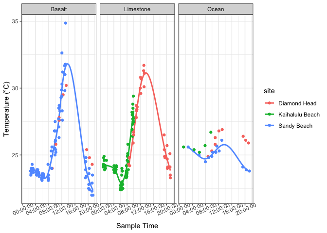<!-- -->

``` r
data %>% filter(site %in% "Sandy Beach") %>% ggplot(aes(x = sample_time, y = salinity_pool, color = pool_number)) +   facet_wrap(~site, scales = "free_x") + geom_line(linewidth = 0.8) + geom_point() + theme_minimal() + labs(title = "Salinity (pool)")  + theme(axis.text.x = element_text(angle = 30))
```

<!-- -->

``` r
data %>% ggplot(aes(x = sample_time, y = salinity_pool)) +
    facet_wrap(~substrate) + geom_smooth() + geom_point() + theme_minimal() + labs(title = "Salinity (Pool)")  + theme(axis.text.x = element_text(angle = 30))
```

    ## `geom_smooth()` using method = 'loess' and formula = 'y ~ x'

    ## Warning in simpleLoess(y, x, w, span, degree = degree, parametric = parametric,
    ## : span too small.  fewer data values than degrees of freedom.

    ## Warning in simpleLoess(y, x, w, span, degree = degree, parametric = parametric,
    ## : pseudoinverse used at 4775.4

    ## Warning in simpleLoess(y, x, w, span, degree = degree, parametric = parametric,
    ## : neighborhood radius 11245

    ## Warning in simpleLoess(y, x, w, span, degree = degree, parametric = parametric,
    ## : reciprocal condition number 0

    ## Warning in simpleLoess(y, x, w, span, degree = degree, parametric = parametric,
    ## : There are other near singularities as well. 3.4159e+07

    ## Warning in simpleLoess(y, x, w, span, degree = degree, parametric = parametric,
    ## : Chernobyl! trL>n 5
    ## Warning in simpleLoess(y, x, w, span, degree = degree, parametric = parametric,
    ## : Chernobyl! trL>n 5

    ## Warning in sqrt(sum.squares/one.delta): NaNs produced

    ## Warning in predLoess(object$y, object$x, newx = if (is.null(newdata)) object$x
    ## else if (is.data.frame(newdata))
    ## as.matrix(model.frame(delete.response(terms(object)), : span too small.  fewer
    ## data values than degrees of freedom.

    ## Warning in predLoess(object$y, object$x, newx = if (is.null(newdata)) object$x
    ## else if (is.data.frame(newdata))
    ## as.matrix(model.frame(delete.response(terms(object)), : pseudoinverse used at
    ## 4775.4

    ## Warning in predLoess(object$y, object$x, newx = if (is.null(newdata)) object$x
    ## else if (is.data.frame(newdata))
    ## as.matrix(model.frame(delete.response(terms(object)), : neighborhood radius
    ## 11245

    ## Warning in predLoess(object$y, object$x, newx = if (is.null(newdata)) object$x
    ## else if (is.data.frame(newdata))
    ## as.matrix(model.frame(delete.response(terms(object)), : reciprocal condition
    ## number 0

    ## Warning in predLoess(object$y, object$x, newx = if (is.null(newdata)) object$x
    ## else if (is.data.frame(newdata))
    ## as.matrix(model.frame(delete.response(terms(object)), : There are other near
    ## singularities as well. 3.4159e+07

    ## Warning in stats::qt(level/2 + 0.5, pred$df): NaNs produced

    ## Warning in max(ids, na.rm = TRUE): no non-missing arguments to max; returning
    ## -Inf

<!-- -->

``` r
data %>% ggplot(aes(x = sample_time, y = salinity_pool, color = substrate)) +
    facet_wrap(~substrate, 
               labeller = as_labeller(c(basalt = "Basalt", limestone = "Limestone", ocean = "Ocean"))) + 
  geom_smooth(method = "gam", se=FALSE) + 
  geom_point() + theme_bw() +
  labs(x = "Sample Time", y = "Pool Salinity")  + 
  guides(color = "none") +
  theme(axis.text.x = element_text(angle = 25)) 
```

    ## `geom_smooth()` using formula = 'y ~ s(x, bs = "cs")'

    ## Warning: Failed to fit group 3.
    ## Caused by error in `smooth.construct.cr.smooth.spec()`:
    ## ! x has insufficient unique values to support 10 knots: reduce k.

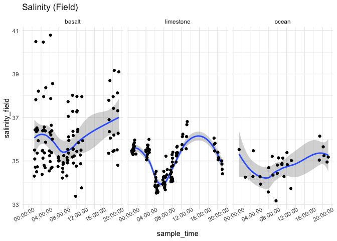<!-- -->

### pH

``` r
data %>% filter(site %in% "Kaihalulu Beach") %>% ggplot(aes(x = sample_time, y = pH, color = pool_number)) +
    facet_wrap(~site, scales = "free_x") + geom_line(linewidth = 0.8) + geom_point() + theme_minimal() + labs(title = "pH (tris)")  + theme(axis.text.x = element_text(angle = 30))
```

<!-- -->

``` r
data %>% filter(site %in% "Sandy Beach") %>% ggplot(aes(x = sample_time, y = pH, color = pool_number)) +
    facet_wrap(~site, scales = "free_x") + geom_line(linewidth = 0.8) + geom_point() + theme_minimal() + labs(title = "pH (tris)")  + theme(axis.text.x = element_text(angle = 30))
```

<!-- -->

``` r
data %>% filter(site %in% "Kaihalulu Beach") %>% ggplot(aes(x = sample_time, y = pH_probe, color = pool_number)) +
    facet_wrap(~site, scales = "free_x") + geom_line(linewidth = 0.8) + geom_point() + theme_minimal() + labs(title = "pH (probe)")  + theme(axis.text.x = element_text(angle = 30))
```

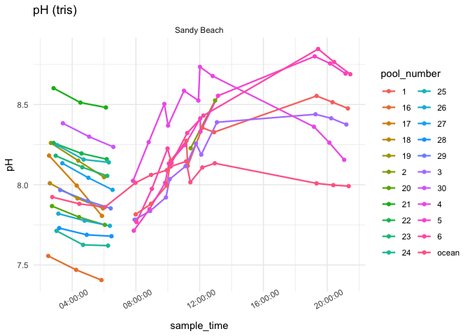<!-- -->

``` r
data %>% filter(site %in% "Sandy Beach") %>% ggplot(aes(x = sample_time, y = pH_probe, color = pool_number)) +
    facet_wrap(~site, scales = "free_x") + geom_line(linewidth = 0.8) + geom_point() + theme_minimal() + labs(title = "pH (probe)")  + theme(axis.text.x = element_text(angle = 30))
```

<!-- -->

``` r
data %>% ggplot(aes(x = sample_time, y = pH)) +
    facet_wrap(~substrate) + geom_smooth() + geom_point() + theme_minimal() + labs(title = "pH")  + theme(axis.text.x = element_text(angle = 30))
```

    ## `geom_smooth()` using method = 'loess' and formula = 'y ~ x'

    ## Warning in simpleLoess(y, x, w, span, degree = degree, parametric = parametric,
    ## : span too small.  fewer data values than degrees of freedom.

    ## Warning in simpleLoess(y, x, w, span, degree = degree, parametric = parametric,
    ## : pseudoinverse used at 4775.4

    ## Warning in simpleLoess(y, x, w, span, degree = degree, parametric = parametric,
    ## : neighborhood radius 11245

    ## Warning in simpleLoess(y, x, w, span, degree = degree, parametric = parametric,
    ## : reciprocal condition number 0

    ## Warning in simpleLoess(y, x, w, span, degree = degree, parametric = parametric,
    ## : There are other near singularities as well. 3.4159e+07

    ## Warning in simpleLoess(y, x, w, span, degree = degree, parametric = parametric,
    ## : Chernobyl! trL>n 5
    ## Warning in simpleLoess(y, x, w, span, degree = degree, parametric = parametric,
    ## : Chernobyl! trL>n 5

    ## Warning in sqrt(sum.squares/one.delta): NaNs produced

    ## Warning in predLoess(object$y, object$x, newx = if (is.null(newdata)) object$x
    ## else if (is.data.frame(newdata))
    ## as.matrix(model.frame(delete.response(terms(object)), : span too small.  fewer
    ## data values than degrees of freedom.

    ## Warning in predLoess(object$y, object$x, newx = if (is.null(newdata)) object$x
    ## else if (is.data.frame(newdata))
    ## as.matrix(model.frame(delete.response(terms(object)), : pseudoinverse used at
    ## 4775.4

    ## Warning in predLoess(object$y, object$x, newx = if (is.null(newdata)) object$x
    ## else if (is.data.frame(newdata))
    ## as.matrix(model.frame(delete.response(terms(object)), : neighborhood radius
    ## 11245

    ## Warning in predLoess(object$y, object$x, newx = if (is.null(newdata)) object$x
    ## else if (is.data.frame(newdata))
    ## as.matrix(model.frame(delete.response(terms(object)), : reciprocal condition
    ## number 0

    ## Warning in predLoess(object$y, object$x, newx = if (is.null(newdata)) object$x
    ## else if (is.data.frame(newdata))
    ## as.matrix(model.frame(delete.response(terms(object)), : There are other near
    ## singularities as well. 3.4159e+07

    ## Warning in stats::qt(level/2 + 0.5, pred$df): NaNs produced

    ## Warning in max(ids, na.rm = TRUE): no non-missing arguments to max; returning
    ## -Inf

<!-- -->

``` r
data %>% ggplot(aes(x = sample_time, y = pH, color = substrate)) +
    facet_wrap(~substrate, 
               labeller = as_labeller(c(basalt = "Basalt", limestone = "Limestone", ocean = "Ocean"))) + 
  geom_smooth(method = "lm", se=FALSE) + 
  geom_point() + theme_bw() +
  labs(x = "Sample Time")  + 
  guides(color = "none") +
  theme(axis.text.x = element_text(angle = 25)) 
```

    ## `geom_smooth()` using formula = 'y ~ x'

<!-- -->

### TA

``` r
data %>% filter(site %in% "Kaihalulu Beach") %>% ggplot(aes(x = sample_time, y = TA_norm, color = pool_number)) +   facet_wrap(~site, scales = "free_x") + geom_line(linewidth = 0.8) + geom_point() + theme_minimal() + labs(title = "TA normalized")  + theme(axis.text.x = element_text(angle = 30))
```

<!-- -->

``` r
data %>% filter(site %in% "Sandy Beach") %>% ggplot(aes(x = sample_time, y = TA_norm, color = pool_number)) +   facet_wrap(~site, scales = "free_x") + geom_line(linewidth = 0.8) + geom_point() + theme_minimal() + labs(title = "TA normalized")  + theme(axis.text.x = element_text(angle = 30))
```

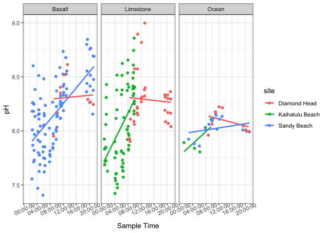<!-- -->

``` r
data %>% ggplot(aes(x = sample_time, y = TA_norm)) +
    facet_wrap(~substrate) +
  geom_smooth(method = "lm", se=FALSE) + 
  geom_point() + 
  theme_minimal() + 
  labs(title = "TA Norm")  +
  theme(axis.text.x = element_text(angle = 30))
```

    ## `geom_smooth()` using formula = 'y ~ x'

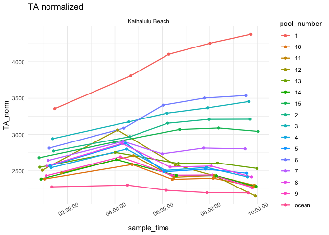<!-- -->

``` r
data %>% ggplot(aes(x = sample_time, y = TA_norm, color = substrate)) +
    facet_wrap(~substrate, 
               labeller = as_labeller(c(basalt = "Basalt", limestone = "Limestone", ocean = "Ocean"))) + 
  geom_smooth(method = "lm", se=FALSE) + 
  geom_point() + theme_bw() +
  labs(x = "Sample Time", y = "Total Alkalinity")  + 
  guides(color = "none") +
  theme(axis.text.x = element_text(angle = 25)) 
```

    ## `geom_smooth()` using formula = 'y ~ x'

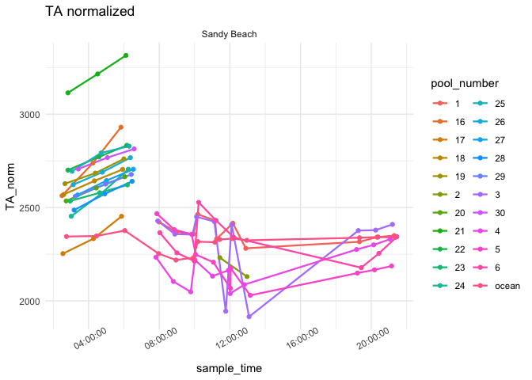<!-- -->

### O2

``` r
data %>% filter(site %in% "Kaihalulu Beach") %>% ggplot(aes(x = sample_time, y = dissolved_oxygen, color = pool_number)) + facet_wrap(~site, scales = "free_x") + geom_line(linewidth = 0.8) + geom_point() + theme_minimal() + labs(title = "DO")  + theme(axis.text.x = element_text(angle = 30))
```

<!-- -->

``` r
data %>% filter(site %in% "Sandy Beach") %>% ggplot(aes(x = sample_time, y = dissolved_oxygen, color = pool_number)) +   facet_wrap(~site, scales = "free_x") + geom_line(linewidth = 0.8) + geom_point() + theme_minimal() + labs(title = "DO")  + theme(axis.text.x = element_text(angle = 30))
```

<!-- -->

``` r
data %>% ggplot(aes(x = sample_time, y = dissolved_oxygen)) +
    facet_wrap(~substrate) +
  geom_smooth(method = "lm", se=FALSE) + 
  geom_point() + 
  theme_minimal() + 
  labs(title = "DO")  +
  theme(axis.text.x = element_text(angle = 30))
```

    ## `geom_smooth()` using formula = 'y ~ x'

<!-- -->

``` r
data %>% ggplot(aes(x = sample_time, y = dissolved_oxygen, color = substrate)) +
    facet_wrap(~substrate, 
               labeller = as_labeller(c(basalt = "Basalt", limestone = "Limestone", ocean = "Ocean"))) + 
  geom_smooth(method = "lm", se=FALSE) + 
  geom_point() + theme_bw() +
  labs(x = "Sample Time", y = "Dissolved Oxygen")  + 
  guides(color = "none") +
  theme(axis.text.x = element_text(angle = 25)) 
```

    ## `geom_smooth()` using formula = 'y ~ x'

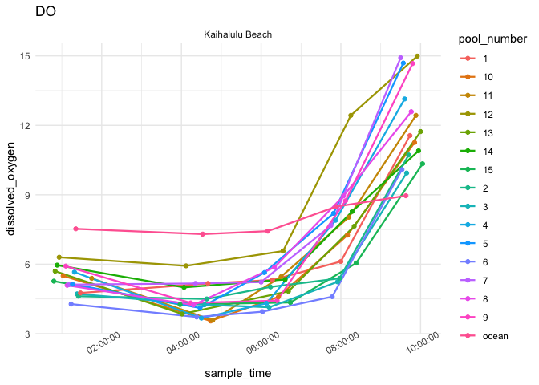<!-- -->

### Deltas

``` r
delta_calc %>% ggplot(aes(x = substrate, y = delta_pH, color = substrate)) + #, label = pool_number)) + 
  geom_boxplot(alpha = 0.7) + 
  geom_point() + 
 # geom_text(hjust=0, vjust=0) +
  theme_bw() + 
  scale_color_manual(values = c("gray20", "sienna2", "palegreen3", "dodgerblue3")) +
  guides(color = "none") +
  labs(x = "Substrate", y = "Delta pH") + 
  geom_hline(yintercept = 0, linetype = "dashed", color = "gray")
```

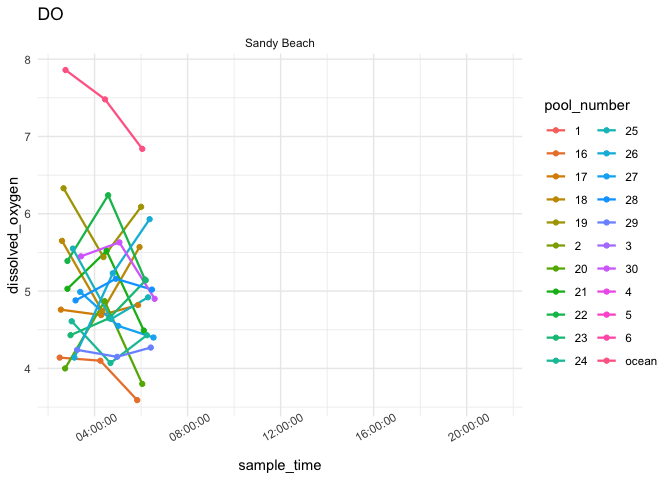<!-- -->

``` r
delta_calc %>% ggplot(aes(x = substrate, y = delta_TA, color = substrate)) + #, label = pool_number)) + 
  geom_boxplot(alpha = 0.7) + 
  geom_point() + 
 # geom_text(hjust=0, vjust=0) +
  theme_bw() + 
  scale_color_manual(values = c("gray20", "sienna2", "palegreen3", "dodgerblue3")) +
  guides(color = "none") +
  labs(x = "Substrate", y = "Delta TA") + 
  geom_hline(yintercept = 0, linetype = "dashed", color = "gray")
```

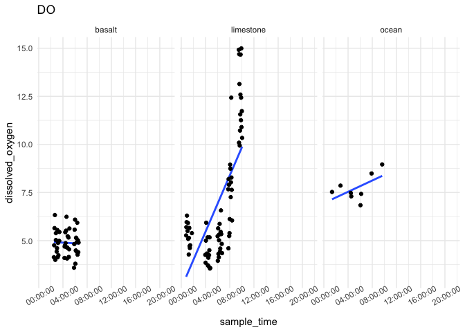<!-- -->

### Delta TA vs Delta pH

``` r
# committee meeting figure
data %>% 
  filter(!substrate %in% "ocean") %>% 
  ggplot(aes(x = pH, y = TA_norm)) + 
  geom_point() + 
  geom_smooth(method = "lm") + 
  facet_wrap(~substrate, 
               labeller = as_labeller(c(basalt = "Basalt", limestone = "Limestone"))) +
  theme_bw() + 
  labs(x = "pH", y = "Total Alkalinity") 
```

    ## `geom_smooth()` using formula = 'y ~ x'

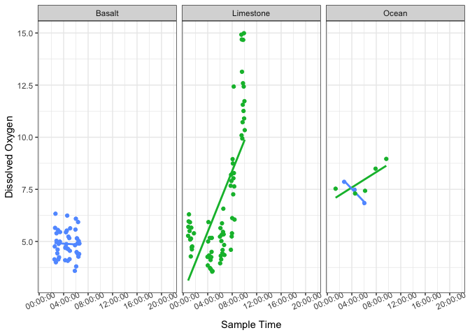<!-- -->

``` r
# committee meeting figure
delta_calc %>% 
  filter(substrate == "limestone" | substrate == "basalt") %>%
  ggplot(aes(x = delta_pH_norm, y = delta_TA_norm)) + 
  facet_wrap(~substrate, 
               labeller = as_labeller(c(basalt = "Basalt", limestone = "Limestone", ocean = "Ocean"))) +
  geom_point() + 
  geom_smooth(method = "lm") + 
  theme_bw() + 
  labs(x = "Delta pH/Hour", y = "Delta TA/Hour") 
```

    ## `geom_smooth()` using formula = 'y ~ x'

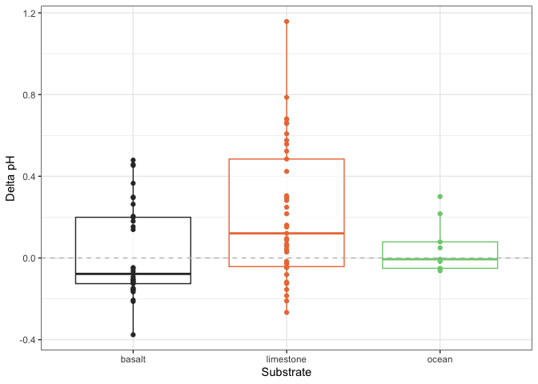<!-- -->
