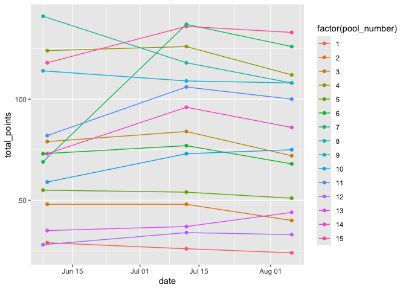
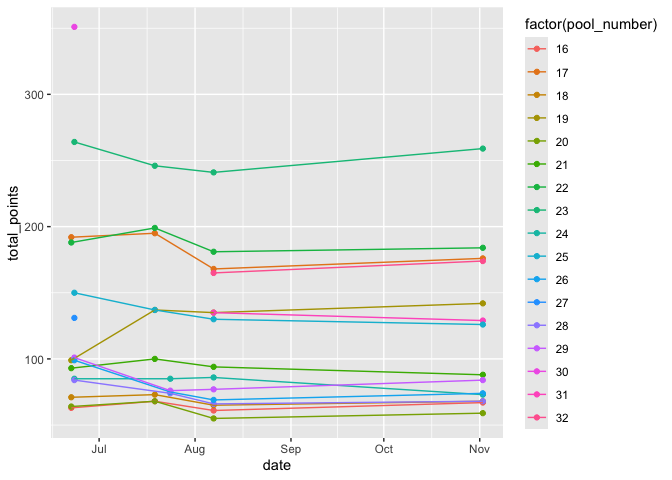
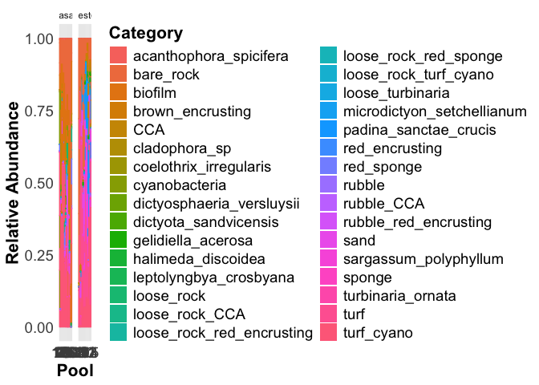
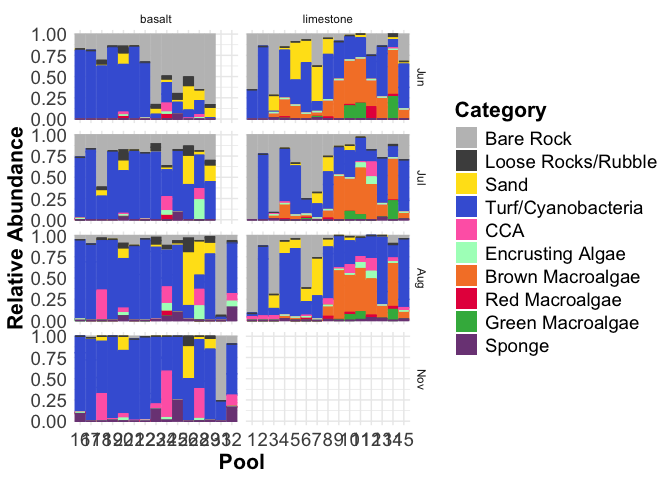
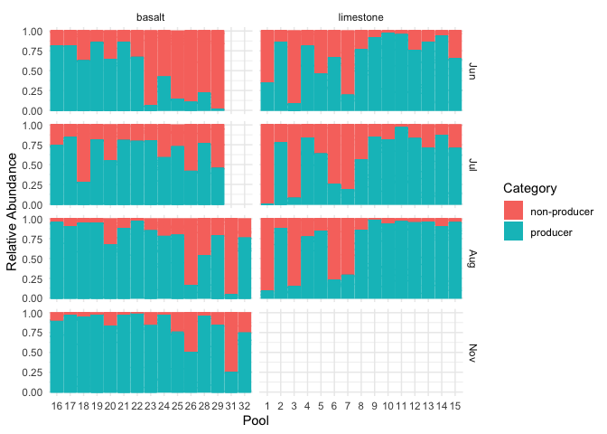
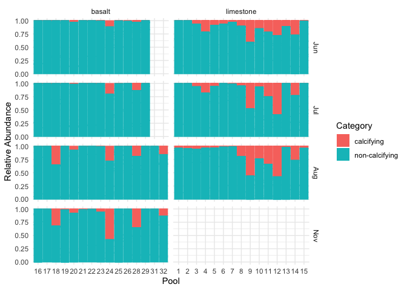
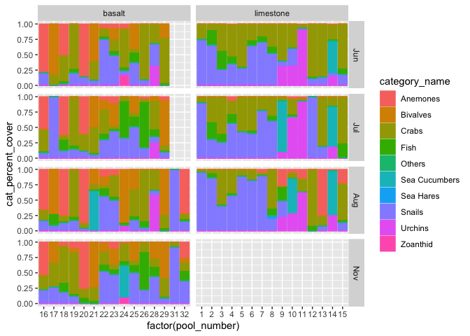
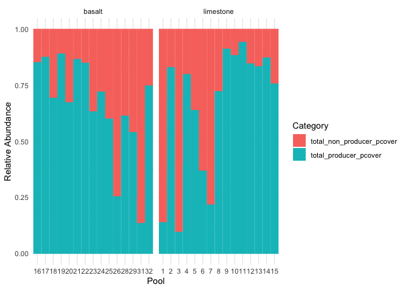
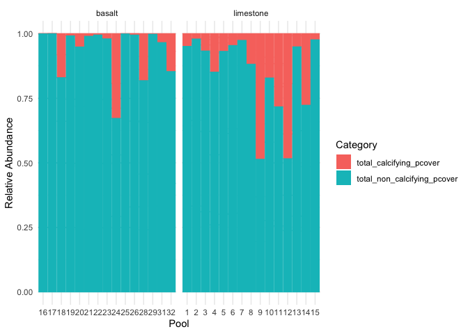

TP_community_composition
================
Micaela Chapuis
2025-09-01

## Load Libraries

``` r
library(tidyverse)
library(here)
```

## Load in Data

``` r
benthic <- read_csv(here("Data", "benthic_community_composition.csv"))
mobile <- read_csv(here("Data", "mobile_community_composition.csv"))
tp_parameters <- read_csv(here("Data", "tidepool_parameters.csv"))
categories <- read_csv(here("Data", "community_composition_categories.csv"))
```

Plot number of points per pool over time just to check (should be mostly
straight lines)

``` r
benthic %>% filter(site %in% "Kaihalulu Beach") %>% ggplot(aes(x = date, y = total_points, color = factor(pool_number))) + geom_point() + geom_line() 
```

<!-- -->

``` r
benthic %>% filter(site %in% "Sandy Beach") %>% ggplot(aes(x = date, y = total_points, color = factor(pool_number))) + geom_point() + geom_line() 
```

<!-- -->

## Benthic

Make a column for month

``` r
benthic$month <- month(benthic$date, label = TRUE)
```

``` r
benthic_long <- benthic %>%
  select(-c("notes":"observers")) %>%
  pivot_longer(
    cols = c("bare_rock":"red_sponge"),
    names_to = "id",
    values_to = "num_points")
```

Assign species to broader categories by joining with other datasheet

``` r
benthic_categories <- left_join(benthic_long, categories)
```

    ## Joining with `by = join_by(id)`

Calculate percent cover by species

``` r
benthic_long <- benthic_long %>%
                mutate(spp_percent_cover = (num_points/total_points)*100)
```

Plot

``` r
benthic_long %>% ggplot(aes(x= factor(pool_number),
               y = num_points, 
               fill= factor(id), 
               color= id)) + # set lines surrounding each color to match the fill colors 
      geom_bar(stat="identity", position="fill") + # stacked bars
      facet_wrap(~substrate, scales = "free_x",
                 labeller = as_labeller(c(basalt = "Basalt", limestone = "Limestone"))) + 
  
      labs(x = "Pool", # labels
           y="Relative Abundance",
           fill = "Category") +

      theme_minimal() +  # theme
      theme(title = element_text(size = 18, face = "bold"), # make title bigger and bold
            axis.title = element_text(size = 16), # make all text bigger
            axis.text = element_text(size = 14),
            legend.title = element_text(size = 16),
            legend.text = element_text(size = 14)) +
    
      
      guides(color = "none") #+ # keep only legend for fill since fill and color are the same
```

<!-- -->

``` r
#      scale_fill_manual(values = c('#e6194b', '#3cb44b', "lightblue", '#4363d8', '#f58231', '#000075', '#46f0f0', '#f032e6', '#fabebe', '#800000', '#008080',  '#e6beff', '#aaffc3', '#ffe119' , '#808000')) +
      
#      scale_color_manual(values = c('#e6194b', '#3cb44b', "lightblue", '#4363d8', '#f58231', '#000075', '#46f0f0', '#f032e6', '#fabebe', '#800000', '#008080',  '#e6beff', '#aaffc3', '#ffe119' , '#808000'))
```

Calculate percent cover by category

``` r
benthic_categories_pcover <- benthic_categories %>%
                             mutate(cat_percent_cover = (num_points/total_points)*100) %>%
                             select(-c(total_points, id, num_points, production, calcification)) %>%
                             group_by(date, site, water_date, pool_number, substrate, category, category_name) %>%
                             mutate(cat_percent_cover = sum(cat_percent_cover)) %>%
                             distinct(date, site, water_date, pool_number, substrate, .keep_all = TRUE)  # Ensure only one row per pool
```

Change factor order

``` r
# Change order levels 
benthic_categories$category_name <- factor(benthic_categories$category_name, 
                                             levels=c("Bare Rock", "Loose Rocks/Rubble", "Sand", "Turf/Cyanobacteria", "CCA", "Encrusting Algae", "Brown Macroalgae", "Red Macroalgae", "Green Macroalgae", "Sponge"))
```

``` r
benthic_categories %>% 
  filter(!pool_number %in% c(27, 30)) %>%
  ggplot(aes(x= factor(pool_number),
               y = num_points, 
               fill= factor(category_name), 
               color= category_name)) + # set lines surrounding each color to match the fill colors
      geom_bar(stat="identity", position="fill") + # stacked bars
      facet_grid(month ~substrate, scales = "free_x") +
  
      labs(x = "Pool", # labels
           y="Relative Abundance",
           fill = "Category") +

      theme_minimal() +  # theme
      theme(title = element_text(size = 18, face = "bold"), # make title bigger and bold
            axis.title = element_text(size = 16), # make all text bigger
            axis.text = element_text(size = 14),
            legend.title = element_text(size = 16),
            legend.text = element_text(size = 14)) +
    
      
      guides(color = "none")  + # keep only legend for fill since fill and color are the same
      
      scale_fill_manual(values = c('gray75', 'gray30', '#ffe119', '#4363d8', "hotpink", '#aaffc3', '#f58231', '#e6194b', '#3cb44b', "#7C4585")) +
      
      scale_color_manual(values = c('gray75', 'gray30', '#ffe119', '#4363d8', "hotpink", '#aaffc3', '#f58231', '#e6194b', '#3cb44b', "#7C4585"))
```

<!-- -->

Benthic Producers Calculate percent cover for producer/non-producers

``` r
benthic_producers <- benthic_categories %>%
                             mutate(cat_percent_cover = (num_points/total_points)*100) %>%
                             select(-c(total_points, id, num_points, category, category_name, calcification)) %>%
                             group_by(date, site, water_date, pool_number, substrate, production) %>%
                             mutate(prod_percent_cover = sum(cat_percent_cover)) %>%
                             distinct(date, site, water_date, pool_number, substrate, .keep_all = TRUE)  # Ensure only one row per pool
```

``` r
benthic_prod_wide <- benthic_producers %>%
  select(!cat_percent_cover) %>%
  pivot_wider(
    names_from = production,
    values_from = prod_percent_cover) %>%
  rename("producer_pcover" = "producer",
         "non_producer_pcover" = "non-producer")
```

``` r
benthic_categories %>% 
  filter(!pool_number %in% c(27, 30)) %>%
  ggplot(aes(x= factor(pool_number),
               y = num_points, 
               fill= factor(production), 
               color= production)) + # set lines surrounding each color to match the fill colors
      geom_bar(stat="identity", position="fill") + # stacked bars
      facet_grid(month ~substrate, scales = "free_x") +
  
      labs(x = "Pool", # labels
           y="Relative Abundance",
           fill = "Category")  +
  
      guides(color = "none")  + # keep only legend for fill since fill and color are the same
      theme_minimal() 
```

<!-- -->

Benthic Calcifiers

``` r
benthic_calcifiers <- benthic_categories %>%
                             mutate(cat_percent_cover = (num_points/total_points)*100) %>%
                             select(-c(total_points, id, num_points, category, category_name, production)) %>%
                             group_by(date, site, water_date, pool_number, substrate, calcification) %>%
                             mutate(calc_percent_cover = sum(cat_percent_cover)) %>%
                             distinct(date, site, water_date, pool_number, substrate, .keep_all = TRUE)  # Ensure only one row per pool
```

``` r
benthic_calc_wide <- benthic_calcifiers %>%
  select(!cat_percent_cover) %>%
  pivot_wider(
    names_from = calcification,
    values_from = calc_percent_cover) %>%
  rename("calcifying_pcover" = "calcifying",
         "non_calcifying_pcover" = "non-calcifying")
```

``` r
benthic_categories %>% 
  filter(!pool_number %in% c(27, 30)) %>%
  ggplot(aes(x= factor(pool_number),
               y = num_points, 
               fill= factor(calcification), 
               color= calcification)) + # set lines surrounding each color to match the fill colors
      geom_bar(stat="identity", position="fill") + # stacked bars
      facet_grid(month ~substrate, scales = "free_x") +
  
      labs(x = "Pool", # labels
           y="Relative Abundance",
           fill = "Category")  +
  
      guides(color = "none")  + # keep only legend for fill since fill and color are the same
      theme_minimal() 
```

<!-- -->

## Mobile

Join with tidepool parameters to get surface area of each pool

``` r
mobile <- left_join(mobile, tp_parameters, by = c("pool_number", "site", "substrate"))
```

Make a column for month

``` r
mobile$month <- month(mobile$date, label = TRUE)
```

``` r
mobile_long <- mobile %>%
  select(-c("notes.x":"perimeter_m", "max_depth_m":"notes.y")) %>%
  pivot_longer(
    cols = c("hermit_crab_large":"shrimp"),
    names_to = "id",
    values_to = "count")
```

Assign species to broader categories by joining with other datasheet

``` r
mobile_categories <- left_join(mobile_long, categories, by = "id")
```

Calculate mobile percent cover

``` r
mobile_categories_pcover <- mobile_categories %>%
                             mutate(pcover = ((count*surface_area_m2)/pool_surface_area_m2)*100) %>%
                             select(-c(count, id, pool_surface_area_m2, avg_diameter_or_length_cm:surface_area_m2, production, calcification)) %>%
                             group_by(date, site, water_date, pool_number, substrate, category, category_name) %>%
                             mutate(cat_percent_cover = sum(pcover)) %>%
                             select(-pcover) %>%
                             distinct(date, site, water_date, pool_number, substrate, .keep_all = TRUE)  # only one row per category per pool
```

Mobile Calcifiers

``` r
mobile_calcifiers <- mobile_categories %>%
                        mutate(pcover = ((count*surface_area_m2)/pool_surface_area_m2)*100) %>%
                        select(-c(count, id, pool_surface_area_m2, avg_diameter_or_length_cm:surface_area_m2, category, category_name, production)) %>%
                        group_by(date, site, water_date, pool_number, substrate, calcification) %>%
                        mutate(calc_percent_cover = sum(pcover)) %>%
                        select(-pcover) %>%
                        distinct(date, site, water_date, pool_number, substrate, .keep_all = TRUE)  # Ensure only one row per pool
```

``` r
mobile_calc_wide <- mobile_calcifiers %>%
  pivot_wider(
    names_from = calcification,
    values_from = calc_percent_cover) %>%
  rename("inv_calcifying_pcover" = "calcifying",
         "inv_non_calcifying_pcover" = "non-calcifying")
```

Mobile Producers

``` r
mobile_producers <- mobile_categories %>%
                        mutate(pcover = ((count*surface_area_m2)/pool_surface_area_m2)*100) %>%
                        select(-c(count, id, pool_surface_area_m2, avg_diameter_or_length_cm:surface_area_m2, category, category_name, calcification)) %>%
                        group_by(date, site, water_date, pool_number, substrate, production) %>%
                        mutate(prod_percent_cover = sum(pcover)) %>%
                        select(-pcover) %>%
                        distinct(date, site, water_date, pool_number, substrate, .keep_all = TRUE)  # Ensure only one row per pool
```

``` r
mobile_prod_wide <- mobile_producers %>%
  pivot_wider(
    names_from = production,
    values_from = prod_percent_cover) %>%
  rename("inv_producer_pcover" = "producer",
         "inv_non_producer_pcover" = "non-producer")
```

``` r
mobile_categories_pcover %>% 
  filter(!pool_number %in% c(27,30)) %>%
  ggplot(aes(x = factor(pool_number),
             y = cat_percent_cover, 
             fill = category_name, 
             color = category_name)) +
  geom_bar(stat = "identity", position = "fill") +
  facet_grid(month~substrate, scale = "free_x") 
```

<!-- -->

Community Composition Summary (Producer and Calcifier percent cover and
density by pool)

``` r
comm_comp_summary <- list(benthic_prod_wide, benthic_calc_wide, mobile_prod_wide, mobile_calc_wide) %>% reduce(left_join)
```

    ## Joining with `by = join_by(date, site, water_date, pool_number, substrate,
    ## month, avg_diameter_or_length_cm, other_dimension_cm, surface_area_cm2,
    ## surface_area_m2)`
    ## Joining with `by = join_by(date, site, water_date, pool_number, substrate,
    ## month)`
    ## Joining with `by = join_by(date, site, water_date, pool_number, substrate,
    ## month)`

``` r
comm_comp_summary <- as.data.frame(comm_comp_summary) %>%
                        select(-c(date, avg_diameter_or_length_cm:surface_area_m2)) %>%
                        rename("date" = "water_date") %>% 
                        mutate(total_producer_pcover = producer_pcover + inv_producer_pcover,
                               total_non_producer_pcover = non_producer_pcover + inv_non_producer_pcover,
                               total_calcifying_pcover = calcifying_pcover + inv_calcifying_pcover,
                               total_non_calcifying_pcover = non_calcifying_pcover + inv_non_calcifying_pcover)
```

``` r
comm_comp_summary_long <- comm_comp_summary %>%
  pivot_longer(
    cols = c("total_producer_pcover":"total_non_calcifying_pcover"),
    names_to = "category",
    values_to = "pcover")
```

``` r
comm_comp_summary_long %>%
  filter((!pool_number %in% c(27, 30)) & (category %in% c("total_producer_pcover", "total_non_producer_pcover"))) %>%
  ggplot(aes(x= factor(pool_number),
               y = pcover, 
               fill= factor(category), 
               color= category)) + # set lines surrounding each color to match the fill colors
      geom_bar(stat="identity", position="fill") + # stacked bars
      facet_wrap(~substrate, scales = "free_x") +
  
      labs(x = "Pool", # labels
           y="Relative Abundance",
           fill = "Category")  +
  
      guides(color = "none")  + # keep only legend for fill since fill and color are the same
      theme_minimal() 
```

    ## Warning: Removed 6 rows containing missing values or values outside the scale range
    ## (`geom_bar()`).

<!-- -->

``` r
comm_comp_summary_long %>%
  filter((!pool_number %in% c(27, 30)) & (category %in% c("total_calcifying_pcover", "total_non_calcifying_pcover"))) %>%
  ggplot(aes(x= factor(pool_number),
               y = pcover, 
               fill= factor(category), 
               color= category)) + # set lines surrounding each color to match the fill colors
      geom_bar(stat="identity", position="fill") + # stacked bars
      facet_wrap(~substrate, scales = "free_x") +
  
      labs(x = "Pool", # labels
           y="Relative Abundance",
           fill = "Category")  +
  
      guides(color = "none")  + # keep only legend for fill since fill and color are the same
      theme_minimal() 
```

    ## Warning: Removed 6 rows containing missing values or values outside the scale range
    ## (`geom_bar()`).

<!-- -->

``` r
write.csv(comm_comp_summary, here("Data", "comm_comp_summary.csv"))
```
