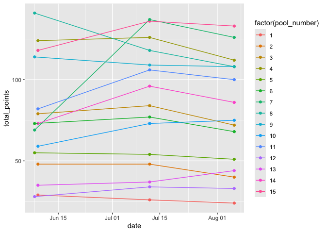

TP_community_composition
================
Micaela Chapuis
2025-09-01

## Load Libraries

``` r
library(tidyverse)
library(here)
```

## Load in Data

``` r
benthic <- read_csv(here("Data", "benthic_community_composition.csv"))
mobile <- read_csv(here("Data", "mobile_community_composition.csv"))
tp_parameters <- read_csv(here("Data", "tidepool_parameters.csv"))
```

Plot number of points per pool over time just to check (should be mostly
straight lines)

``` r
benthic %>% filter(site %in% "Kaihalulu Beach") %>% ggplot(aes(x = date, y = total_points, color = factor(pool_number))) + geom_point() + geom_line() 
```

<!-- -->

``` r
benthic %>% filter(site %in% "Sandy Beach") %>% ggplot(aes(x = date, y = total_points, color = factor(pool_number))) + geom_point() + geom_line() 
```

<!-- -->

## Benthic

Make a column for month

``` r
benthic$month <- month(benthic$date, label = TRUE)
```

``` r
benthic_long <- benthic %>%
  select(-c("notes":"observers")) %>%
  pivot_longer(
    cols = c("bare_rock":"red_sponge"),
    names_to = "id",
    values_to = "num_points")
```

``` r
benthic_long <- benthic_long %>%
                mutate(spp_percent_cover = (num_points/total_points)*100)
```

``` r
benthic_long %>% ggplot(aes(x= factor(pool_number),
               y = num_points, 
               fill= factor(id), 
               color= id)) + # set lines surrounding each color to match the fill colors 
      geom_bar(stat="identity", position="fill") + # stacked bars
      facet_wrap(~substrate, scales = "free_x",
                 labeller = as_labeller(c(basalt = "Basalt", limestone = "Limestone"))) + 
  
      labs(x = "Pool", # labels
           y="Relative Abundance",
           fill = "Category") +

      theme_minimal() +  # theme
      theme(title = element_text(size = 18, face = "bold"), # make title bigger and bold
            axis.title = element_text(size = 16), # make all text bigger
            axis.text = element_text(size = 14),
            legend.title = element_text(size = 16),
            legend.text = element_text(size = 14)) +
    
      
      guides(color = "none") #+ # keep only legend for fill since fill and color are the same
```

<!-- -->

``` r
#      scale_fill_manual(values = c('#e6194b', '#3cb44b', "lightblue", '#4363d8', '#f58231', '#000075', '#46f0f0', '#f032e6', '#fabebe', '#800000', '#008080',  '#e6beff', '#aaffc3', '#ffe119' , '#808000')) +
      
#      scale_color_manual(values = c('#e6194b', '#3cb44b', "lightblue", '#4363d8', '#f58231', '#000075', '#46f0f0', '#f032e6', '#fabebe', '#800000', '#008080',  '#e6beff', '#aaffc3', '#ffe119' , '#808000'))
```

Assign species to broader categories

``` r
bare_rock <- c("bare_rock")
sand <- c("sand")
turf_cyano <- c("turf", "cyanobacteria", "turf_cyano", "biofilm", "leptolyngbya_crosbyana", "loose_rock_turf_cyano")
CCA <- c("CCA", "loose_rock_CCA", "rubble_CCA")
encrusting_algae <- c("brown_encrusting", "red_encrusting", "loose_rock_red_encrusting",  "rubble_red_encrusting")
brown_macroalgae <- c("sargassum_polyphyllum", "padina_sanctae_crucis", "turbinaria_ornata", "loose_turbinaria", "dictyota_sandvicensis")
red_macroalgae <- c("acanthophora_spicifera", "gelidiella_acerosa")
green_macroalgae <- c("microdictyon_setchellianum","halimeda_discoidea","cladophora_sp", "dictyosphaeria_versluysii")
loose_abiotic <- c("loose_rock", "rubble")
sponge <- c("sponge", "red_sponge")
```

Classify species into categories

``` r
benthic_long_categories <- benthic_long %>% 
                              mutate(category = case_when(id %in% bare_rock ~ "Bare Rock", # create a new column: if the species from the id column is in a certain vector (defined above), enter the specific category in the new column
                                                          id %in% sand ~ "Sand",
                                                          id %in% turf_cyano ~ "Turf/Cyanobacteria",
                                                          id %in% CCA ~ "CCA",
                                                          id %in% encrusting_algae ~ "Encrusting Algae",
                                                          id %in% brown_macroalgae ~ "Brown Algae",
                                                          id %in% red_macroalgae ~ "Red Algae",
                                                          id %in% green_macroalgae ~ "Green Algae",
                                                          id %in% loose_abiotic ~ "Loose Rocks/Rubble",
                                                          id %in% sponge ~ "Sponge"))
```

Calculate

``` r
benthic_categories_pcover <- benthic_long_categories %>%
                             mutate(cat_percent_cover = (num_points/total_points)*100) %>%
                             select(-c(total_points, id, num_points)) %>%
                             group_by(date, site, water_date, pool_number, substrate, category) %>%
                             mutate(cat_percent_cover = sum(cat_percent_cover)) %>%
                             distinct(date, site, water_date, pool_number, substrate, .keep_all = TRUE)  # Ensure only one row per pool
```

Change factor order

``` r
# Change order levels 
benthic_long_categories$category <- factor(benthic_long_categories$category, 
                                             levels=c("Bare Rock", "Loose Rocks/Rubble", "Sand", "Turf/Cyanobacteria", "CCA", "Encrusting Algae", "Brown Algae", "Red Algae", "Green Algae", "Sponge"))
```

``` r
benthic_long_categories %>% ggplot(aes(x= factor(pool_number),
               y = num_points, 
               fill= factor(category), 
               color= category)) + # set lines surrounding each color to match the fill colors
      geom_bar(stat="identity", position="fill") + # stacked bars
      facet_grid(month ~substrate, scales = "free_x") +
  
      labs(x = "Pool", # labels
           y="Relative Abundance",
           fill = "Category") +

      theme_minimal() +  # theme
      theme(title = element_text(size = 18, face = "bold"), # make title bigger and bold
            axis.title = element_text(size = 16), # make all text bigger
            axis.text = element_text(size = 14),
            legend.title = element_text(size = 16),
            legend.text = element_text(size = 14)) +
    
      
      guides(color = "none")  + # keep only legend for fill since fill and color are the same
      
      scale_fill_manual(values = c('gray75', 'gray30', '#ffe119', '#4363d8', "hotpink", '#aaffc3', '#f58231', '#e6194b', '#3cb44b', "#7C4585")) +
      
      scale_color_manual(values = c('gray75', 'gray30', '#ffe119', '#4363d8', "hotpink", '#aaffc3', '#f58231', '#e6194b', '#3cb44b', "#7C4585"))
```

<!-- -->

## Mobile

Join with tidepool parameters to get surface area of each pool

``` r
mobile <- left_join(mobile, tp_parameters, by = c("pool_number", "site", "substrate"))
```

Make a column for month

``` r
mobile$month <- month(mobile$date, label = TRUE)
```

``` r
mobile_long <- mobile %>%
  select(-c("notes.x":"perimeter_m", "depth":"notes.y")) %>%
  pivot_longer(
    cols = c("hermit_crab_large":"shrimp"),
    names_to = "id",
    values_to = "count")
```

``` r
crabs <- c("hermit_crab_large", "hermit_crab_small", "shore_crab", "crab_other")
snails <- c("snail_large", "snail_small", "cowrie")
seahares <- c("seahare")
anemones <- c("exaiptasia_diaphana")
bivalves <- c("bivalve")
fish <- c("fish_1cm", "fish_2cm", "fish_3cm", "fish_greater_4cm", "eel")
sea_cucumbers <- c("holothuria_atra", "holothuria_cinerascens", "actinopyga_varians", "sea_cucumber")
urchins <- c("echinometra_oblonga", "echinometra_mathaei")
others <- c("jellyfish_small", "shrimp")
```

Classify species into categories

``` r
mobile_long_categories <- mobile_long %>% 
                              mutate(category = case_when(id %in% crabs ~ "Crabs", # create a new column: if the species from the id column is in a certain vector (defined above), enter the specific category in the new column
                                                          id %in% snails ~ "Snails",
                                                          id %in% seahares ~ "Sea Hares",
                                                          id %in% anemones ~ "Anemones",
                                                          id %in% bivalves ~ "Bivalves",
                                                          id %in% fish ~ "Fish",
                                                          id %in% sea_cucumbers ~ "Sea Cucumbers",
                                                          id %in% urchins ~ "Sea Urchins",
                                                          id %in% others ~ "Others"))
```

Calculate density

``` r
mobile_categories_density <- mobile_long_categories %>%
                             mutate(density = (count/surface_area_m2)) %>%
                             select(-c(count, id, surface_area_m2)) %>%
                             group_by(date, site, water_date, pool_number, substrate, category) %>%
                             mutate(density = sum(density)) %>%
                             distinct(date, site, water_date, pool_number, substrate, .keep_all = TRUE)  # Ensure only one row per pool
```

``` r
mobile_categories_density %>% ggplot(aes(x = factor(pool_number),
                    y = log(density), fill = category, color = category)) +
  geom_bar(stat = "identity") +
  facet_grid(month~substrate, scale = "free_x") 
```

    ## Warning: Removed 513 rows containing missing values or values outside the scale range
    ## (`geom_bar()`).

<!-- -->
