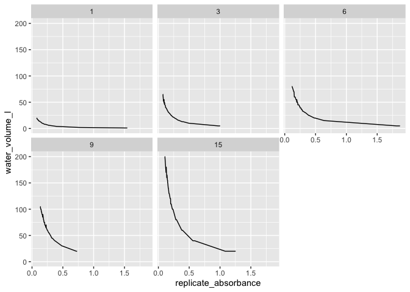
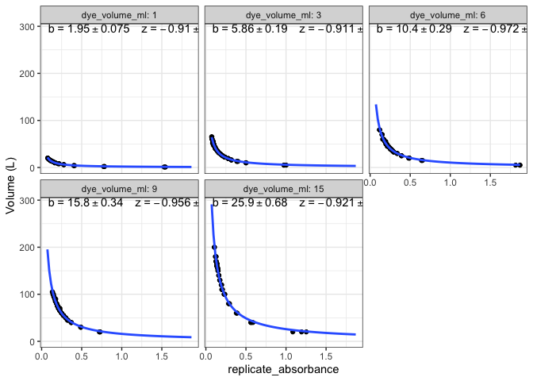

Volume_Calculation
================
Micaela Chapuis
2025-10-16

## Load Libraries

``` r
library(tidyverse)
library(nlme)
library(broom)
library(ggpmisc)
library(here)
```

## Load the Data

``` r
curve <- read_csv(here("Data", "Volume", "dye_curve.csv"))
tp_absorbance <- read_csv(here("Data", "Volume", "tidepool_absorbances.csv"))
```

## Calculation Code Taken from Silbiger Lab Protocols

Analyze data

``` r
# average the technical replicate absorbances to get one absorbance value per replicate (3 values per dye/water combination)
curve_reps <- curve %>%
              group_by(dye_volume_ml, water_volume_l, replicate) %>%
              summarise(replicate_absorbance = mean(calculated_absorbance))
```

    ## `summarise()` has grouped output by 'dye_volume_ml', 'water_volume_l'. You can
    ## override using the `.groups` argument.

``` r
curve_reps %>% # this is the dataframe
  group_by(dye_volume_ml) %>% # grouping by dye volume
  ggplot(aes(x= replicate_absorbance, y= water_volume_l))+   # setup plot with x and y data
  geom_line() + # adding lines
  facet_wrap(~dye_volume_ml) # dividing plots by dye volume 
```

<!-- -->

Write a power function for each curve

``` r
pool_coefs <- curve_reps %>%
              group_by(dye_volume_ml) %>% #grouping by  dye volume
              nest()%>% # nest everything by dye volume
              mutate( # mutate the dataframe
                fit = map(data,~nls(water_volume_l~b*replicate_absorbance^z, start = list(b=-1, z=-1), data = .)), # run the regression model
                tidied = map(fit,tidy)) %>% # make it clean 
              unnest(tidied) %>% # unnest the data so that it is a dataframe again
              select(c(dye_volume_ml, term, estimate)) %>% # only select the parameters that we want
              spread(key = term, value =  estimate) # spread the data so that each parameter has its own column
```

Plot the Results

``` r
formula <- y~I(b*x^z) # power function
ggplot(curve_reps, aes(x = replicate_absorbance, y = water_volume_l))+
  geom_point()+
  geom_smooth(method="nls",  # add best fit line
              formula=formula, # this is an nls argument
              method.args = list(start=c(b=-1, z=-1)), # this too
              se=FALSE, fullrange = TRUE)+
  ylab('Volume (L)')+
  stat_fit_tidy(method = "nls", #add the values for each model
                method.args = list(formula = formula, start=c(b=-1, z=-1)),
                label.x = "left",
                label.y = 1.5,
                mapping = aes(label = paste("b~`=`~", signif(..b_estimate.., digits = 3),
                                  "%+-%", signif(..b_se.., digits = 2),
                                  "~~~~z~`=`~", signif(..z_estimate.., digits = 3),
                                  "%+-%", signif(..z_se.., digits = 2),
                                  sep = "")),
                parse = TRUE) +
  facet_wrap(~dye_volume_ml, labeller = label_both)+
  theme_bw()
```

    ## Warning: The dot-dot notation (`..b_estimate..`) was deprecated in ggplot2 3.4.0.
    ## ℹ Please use `after_stat(b_estimate)` instead.
    ## This warning is displayed once every 8 hours.
    ## Call `lifecycle::last_lifecycle_warnings()` to see where this warning was
    ## generated.

<!-- -->

``` r
ggsave(here("Data", "Volume", "DyeStandardCurves.png"), device = 'png',width = 9, height = 6)
```

## Now Calculate Pool Volumes

Take the average absorbance for each technical replicate

``` r
# average the technical replicate absorbances to get one absorbance value per replicate (3 values per pool)
tp_absorbance_reps <- tp_absorbance %>%
                      group_by(pool_number, replicate, dye_volume_ml) %>%
                      summarise(replicate_absorbance = mean(calculated_absorbance, na.rm = TRUE))
```

    ## `summarise()` has grouped output by 'pool_number', 'replicate'. You can
    ## override using the `.groups` argument.

Join the data and calculate pool volume, then take  
The formula is A=bV^z, where A is absorbance and V is volume  
We are using V = (A / b)^(1/z)

``` r
volume_calc <- tp_absorbance_reps %>%
              left_join(pool_coefs, by = "dye_volume_ml") %>%
              mutate(pool_volume = (replicate_absorbance / b)^(1 / z))
```

Average the replicate volumes for each tidepool and calculate SD and SE

``` r
pool_volumes <- volume_calc %>%
                  group_by(pool_number) %>%
                  summarise(
                     mean_volume = mean(pool_volume, na.rm = TRUE),
                     sd_volume = sd(pool_volume, na.rm = TRUE),
                     se_volume = sd(pool_volume, na.rm = TRUE) / sqrt(n()))
```

``` r
#write_csv(pool_volumes, here("Data", "pool_volumes.csv"))
```
