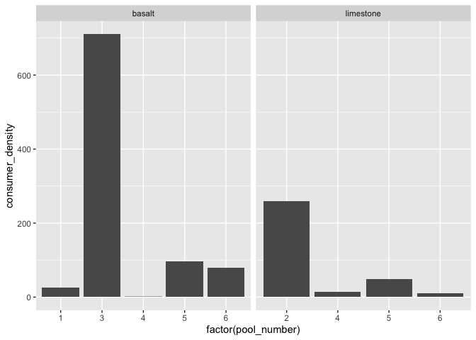
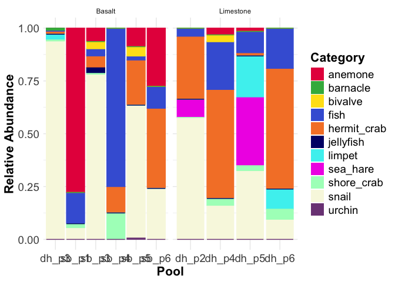

community_composition
================
Micaela Chapuis
2025-03-25

## Load Libraries

``` r
library(tidyverse)
```

    ## ── Attaching core tidyverse packages ──────────────────────── tidyverse 2.0.0 ──
    ## ✔ dplyr     1.1.4     ✔ readr     2.1.5
    ## ✔ forcats   1.0.0     ✔ stringr   1.5.1
    ## ✔ ggplot2   3.5.1     ✔ tibble    3.2.1
    ## ✔ lubridate 1.9.4     ✔ tidyr     1.3.1
    ## ✔ purrr     1.0.2     
    ## ── Conflicts ────────────────────────────────────────── tidyverse_conflicts() ──
    ## ✖ dplyr::filter() masks stats::filter()
    ## ✖ dplyr::lag()    masks stats::lag()
    ## ℹ Use the conflicted package (<http://conflicted.r-lib.org/>) to force all conflicts to become errors

``` r
library(here)
```

    ## here() starts at /Users/micachapuis/GitHub/HawaiiTidepools

## Load in Data

``` r
prods <- read_csv(here("Test Sampling", "Data", "producers.csv"))
cons <- read_csv(here("Test Sampling", "Data", "consumers.csv"))
```

``` r
prods_summary <- prods %>% group_by(date, site, pool_number, pool_ID)  %>% summarise(prods_pcover = sum(turf_cyano_cover, macro_cover, CCA_cover))
```

    ## `summarise()` has grouped output by 'date', 'site', 'pool_number'. You can
    ## override using the `.groups` argument.

``` r
write_csv(prods_summary, here("Test Sampling", "Data", "prodcover.csv"))
```

## Producers

``` r
prods_long <- prods %>%
  select(-c("substrate_cover":"notes")) %>%
  pivot_longer(
    cols = c("substrate":"sponge"),
    names_to = "id",
    values_to = "num_points")
```

``` r
prods_long %>% ggplot(aes(x= factor(pool_number),
               y = num_points, 
               fill= factor(id), 
               color= id)) + # set lines surrounding each color to match the fill colors 
      geom_bar(stat="identity", position="fill") + # stacked bars
      facet_wrap(~site) + 
  
      labs(x = "Pool", # labels
           y="Relative Abundance",
           fill = "Category") +

      theme_minimal() +  # theme
      theme(title = element_text(size = 18, face = "bold"), # make title bigger and bold
            axis.title = element_text(size = 16), # make all text bigger
            axis.text = element_text(size = 14),
            legend.title = element_text(size = 16),
            legend.text = element_text(size = 14)) +
    
      
      guides(color = "none") + # keep only legend for fill since fill and color are the same
      
      scale_fill_manual(values = c('#e6194b', '#3cb44b', '#ffe119', '#4363d8', '#f58231', '#000075', '#46f0f0', '#f032e6', '#fabebe', '#008080', '#e6beff', '#800000', '#aaffc3', '#808000', "lightblue")) +
      
      scale_color_manual(values = c('#e6194b', '#3cb44b', '#ffe119', '#4363d8', '#f58231', '#000075', '#46f0f0', '#f032e6', '#fabebe', '#008080', '#e6beff', '#800000', '#aaffc3', '#808000', "lightblue"))
```

<!-- -->

``` r
prods_cover_long <- prods %>%
  select(-c("substrate":"total_points", "cover_sum", "notes")) %>%
  pivot_longer(
    cols = c("substrate_cover":"sponge_cover"),
    names_to = "id",
    values_to = "num_points")
```

``` r
prods_cover_long %>% ggplot(aes(x= factor(pool_number),
               y = num_points, 
               fill= factor(id), 
               color= id)) + # set lines surrounding each color to match the fill colors
      geom_bar(stat="identity", position="fill") + # stacked bars
      facet_wrap(~site) +
  
      labs(x = "Pool", # labels
           y="Relative Abundance",
           fill = "Category") +

      theme_minimal() +  # theme
      theme(title = element_text(size = 18, face = "bold"), # make title bigger and bold
            axis.title = element_text(size = 16), # make all text bigger
            axis.text = element_text(size = 14),
            legend.title = element_text(size = 16),
            legend.text = element_text(size = 14)) +
    
      
      guides(color = "none") + # keep only legend for fill since fill and color are the same
      
      scale_fill_manual(values = c('#e6194b', '#ffe119', '#3cb44b', '#fabebe', '#f58231')) +
      
      scale_color_manual(values = c('#e6194b', '#ffe119', '#3cb44b', '#fabebe', '#f58231'))
```

<!-- -->

## Consumers

``` r
cons %>% ggplot(aes(x = factor(pool_number),
                    y = consumer_density)) +
  geom_bar(stat = "identity") +
  facet_wrap(~site) 
```

<!-- -->

``` r
cons_long <- cons %>%
  select(-c("total_consumers":"notes")) %>%
  pivot_longer(
    cols = c("sea_hare":"barnacle"),
    names_to = "id",
    values_to = "count")
```

``` r
cons_long %>% ggplot(aes(x = factor(pool_number),
                    y = count , 
                    fill = id)) + 
  geom_bar(stat = "identity") +
  facet_wrap(~site)
```

<!-- -->

``` r
cons_long %>% ggplot(aes(x= factor(pool_number),
               y = count, 
               fill= factor(id), 
               color= id)) + # set lines surrounding each color to match the fill colors
      geom_bar(stat="identity", position="fill") + # stacked bars
      facet_wrap(~site) +
   
      labs(x = "Pool", # labels
           y="Relative Abundance",
           fill = "Category") +

      theme_minimal() +  # theme
      theme(title = element_text(size = 18, face = "bold"), # make title bigger and bold
            axis.title = element_text(size = 16), # make all text bigger
            axis.text = element_text(size = 14),
            legend.title = element_text(size = 16),
            legend.text = element_text(size = 14)) +
    
      
      guides(color = "none") + # keep only legend for fill since fill and color are the same
      
      scale_fill_manual(values = c('#e6194b', '#3cb44b', '#ffe119', '#4363d8', '#f58231', '#000075', '#46f0f0', '#f032e6', '#aaffc3')) +
      
      scale_color_manual(values = c('#e6194b', '#3cb44b', '#ffe119', '#4363d8', '#f58231', '#000075', '#46f0f0', '#f032e6', '#aaffc3'))
```

<!-- -->
