First Analysis
================
Micaela Chapuis
2025-02-25

## Load Libraries

``` r
library(tidyverse)
```

    ## ── Attaching core tidyverse packages ──────────────────────── tidyverse 2.0.0 ──
    ## ✔ dplyr     1.1.4     ✔ readr     2.1.5
    ## ✔ forcats   1.0.0     ✔ stringr   1.5.1
    ## ✔ ggplot2   3.5.1     ✔ tibble    3.2.1
    ## ✔ lubridate 1.9.3     ✔ tidyr     1.3.1
    ## ✔ purrr     1.0.2     
    ## ── Conflicts ────────────────────────────────────────── tidyverse_conflicts() ──
    ## ✖ dplyr::filter() masks stats::filter()
    ## ✖ dplyr::lag()    masks stats::lag()
    ## ℹ Use the conflicted package (<http://conflicted.r-lib.org/>) to force all conflicts to become errors

``` r
library(here)
```

    ## here() starts at /Users/micachapuis/GitHub/HawaiiTidepools

``` r
library(seacarb)
```

    ## Loading required package: oce
    ## Loading required package: gsw
    ## Loading required package: SolveSAPHE

``` r
library(lubridate)
```

## Load in Data

``` r
chem <- read_csv(here("Test Sampling", "Data", "tidepool_chemistry.csv"))
params <- read_csv(here("Test Sampling", "Data", "tidepool_parameters.csv"))
pHSlope <- read_csv(here("Test Sampling", "Data", "pHSlope.csv"))
TA_Sandy <- read_csv(here("Test Sampling", "Data", "TA", "TA_SB_20250216.csv"))
TA_DH <- read_csv(here("Test Sampling", "Data", "TA", "TA_DH_20250223.csv"))
```

## Data cleaning and joining

Make all pool numbers factors

``` r
chem$pool_number <- factor(chem$pool_number)
params$pool_number <- factor(params$pool_number)
```

Remove junk samples from TA Data

``` r
junks <- c("junk1", "junk2", "junk3")
TA_Sandy <- TA_Sandy %>% filter(!SampleID %in% junks)
TA_DH <- TA_DH %>% filter(!SampleID %in% junks)
```

Sandy TA data needs to have “sb\_” added to the sample ID

``` r
TA_Sandy$SampleID <- str_c("sb_", TA_Sandy$SampleID)
```

``` r
colnames(TA_Sandy)[2] <- "TA1" # rename the column so I can later coalesce them together

data <- plyr::join_all(list(chem,(TA_Sandy %>% select(SampleID, TA1)),(TA_DH %>% select(SampleID, TA))), by='SampleID', type='left') # join all 3 dfs by sample ID. From the TA dfs pick which columns i want to keep

data$alkalinity <- coalesce(data$TA1, data$TA) # combine the TA1 (from sandy) and TA (from dh) into one alkalinity column
```

Add in pH calculated from tris and physical parameters

``` r
data <- left_join(data, pHSlope)
```

    ## Joining with `by = join_by(date, SampleID)`

``` r
data <- left_join(data, (params %>% select(date, site, pool_number, substrate, perimeter_m, surface_area_m2)))
```

    ## Joining with `by = join_by(date, site, pool_number)`

Selecting columns

``` r
data <- data %>% select(-observers, -notes, -TA1, -TA)
```

Adding in “ocean” as substrate

``` r
data <- data %>% mutate(substrate = replace_na(substrate, "ocean"))
```

Salinity Normalize TA

``` r
data <- data %>% mutate(TA_norm = alkalinity*Salinity_lab/35)
```

Calculate delta pH and delta TA

``` r
delta_calc <- data %>% 
  select(site, pool_number, substrate, time_point, sample_time, pH, TA_norm)  %>%
  group_by(site, pool_number, substrate) %>%  # Group by metadata
  arrange(time_point, .by_group = TRUE) %>%  # Ensure correct order
  reframe(
    delta_pH = case_when(
      site == "Diamond Head" ~ pH[time_point = 1] - pH[time_point = 3],  # Diamond Head (Time 1 - Time 3)
      site == "Sandy Beach" ~ pH[time_point = 1] - pH[time_point = 2]   # Sandy Beach (Time 1 - Time 2)
    ),
    delta_TA = case_when(
      site == "Diamond Head" ~ TA_norm[time_point = 1] - TA_norm[time_point = 3],  # Diamond Head (Time 1 - Time 3)
      site == "Sandy Beach" ~ TA_norm[time_point = 1] - TA_norm[time_point = 2]   # Sandy Beach (Time 1 - Time 2)
    ), 
    delta_time = case_when(
      site == "Diamond Head" ~ as.numeric(difftime(sample_time[time_point = 3], sample_time[time_point = 1], units = "mins")),  # Time 3 - Time 1 for Diamond Head
      site == "Sandy Beach" ~ as.numeric(difftime(sample_time[time_point = 2], sample_time[time_point = 1], units = "mins"))   # Time 2 - Time 1 for Sandy Beach
    )
  ) %>% 
    distinct(site, pool_number, substrate, .keep_all = TRUE)  # Ensure only one row per pool
```

Doing it for just two timepoints for now (T1-T2)

``` r
delta_calc2 <- data %>% 
  select(site, pool_number, substrate, time_point, sample_time, pH, TA_norm)  %>%
  group_by(site, pool_number, substrate) %>%  # Group by metadata
  arrange(time_point, .by_group = TRUE) %>%  # Ensure correct order
  reframe(
    delta_pH = case_when(
      site == "Diamond Head" ~ pH[time_point = 1] - pH[time_point = 2],  # Diamond Head (Time 1 - Time 3)
      site == "Sandy Beach" ~ pH[time_point = 1] - pH[time_point = 2]   # Sandy Beach (Time 1 - Time 2)
    ),
    delta_TA = case_when(
      site == "Diamond Head" ~ TA_norm[time_point = 1] - TA_norm[time_point = 2],  # Diamond Head (Time 1 - Time 3)
      site == "Sandy Beach" ~ TA_norm[time_point = 1] - TA_norm[time_point = 2]   # Sandy Beach (Time 1 - Time 2)
    ), 
    delta_time = case_when(
      site == "Diamond Head" ~ as.numeric(difftime(sample_time[time_point = 2], sample_time[time_point = 1], units = "mins")),  # Time 3 - Time 1 for Diamond Head
      site == "Sandy Beach" ~ as.numeric(difftime(sample_time[time_point = 2], sample_time[time_point = 1], units = "mins"))   # Time 2 - Time 1 for Sandy Beach
    )
  ) %>% 
    distinct(site, pool_number, substrate, .keep_all = TRUE)  # Ensure only one row per pool
```

Now T2-T3

``` r
delta_calc3 <- data %>% 
  select(site, pool_number, substrate, time_point, sample_time, pH, TA_norm)  %>%
  group_by(site, pool_number, substrate) %>%  # Group by metadata
  arrange(time_point, .by_group = TRUE) %>%  # Ensure correct order
  reframe(
    delta_pH = case_when(
      site == "Diamond Head" ~ pH[time_point = 2] - pH[time_point = 3],  # Diamond Head (Time 1 - Time 3)
      site == "Sandy Beach" ~ pH[time_point = 1] - pH[time_point = 2]   # Sandy Beach (Time 1 - Time 2)
    ),
    delta_TA = case_when(
      site == "Diamond Head" ~ TA_norm[time_point = 2] - TA_norm[time_point = 3],  # Diamond Head (Time 1 - Time 3)
      site == "Sandy Beach" ~ TA_norm[time_point = 1] - TA_norm[time_point = 2]   # Sandy Beach (Time 1 - Time 2)
    ), 
    delta_time = case_when(
      site == "Diamond Head" ~ as.numeric(difftime(sample_time[time_point = 3], sample_time[time_point = 2], units = "mins")),  # Time 3 - Time 1 for Diamond Head
      site == "Sandy Beach" ~ as.numeric(difftime(sample_time[time_point = 2], sample_time[time_point = 1], units = "mins"))   # Time 2 - Time 1 for Sandy Beach
    )
  ) %>% 
    distinct(site, pool_number, substrate, .keep_all = TRUE)  # Ensure only one row per pool
```

Separating Sandy Beach and Diamond Head

``` r
sandy_data <- data %>% filter(site %in% "Sandy Beach") 
dh_data <- data %>% filter(site %in% "Diamond Head")
```

## Data Viz!

``` r
data %>% ggplot(aes(x = sample_time, y = temp_pool, color = pool_number)) +
  facet_wrap(~site, scales = "free_x") + geom_line(linewidth = 0.8) + geom_point() + theme_minimal() + labs(title = "Temperature") + theme(axis.text.x = element_text(angle = 30))
```

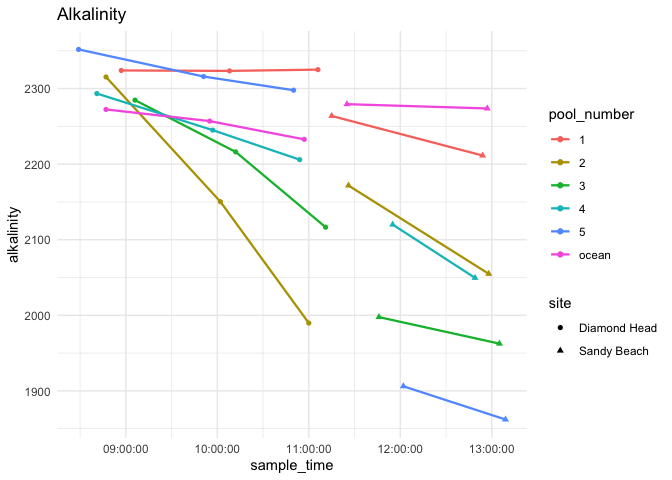<!-- -->

``` r
data %>% ggplot(aes(x = sample_time, y = pH, color = pool_number)) +
    facet_wrap(~site, scales = "free_x") + geom_line(linewidth = 0.8) + geom_point() + theme_minimal() + labs(title = "pH")  + theme(axis.text.x = element_text(angle = 30))
```

<!-- -->

``` r
data %>% ggplot(aes(x = sample_time, y = TA_norm, color = pool_number)) +   facet_wrap(~site, scales = "free_x") + geom_line(linewidth = 0.8) + geom_point() + theme_minimal() + labs(title = "TA normalized")  + theme(axis.text.x = element_text(angle = 30))
```

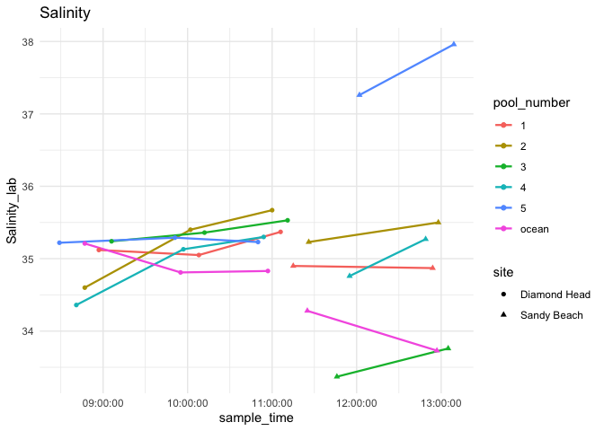<!-- -->

``` r
data %>% ggplot(aes(x = sample_time, y = Salinity_lab, color = pool_number)) +   facet_wrap(~site, scales = "free_x") + geom_line(linewidth = 0.8) + geom_point() + theme_minimal() + labs(title = "Salinity")  + theme(axis.text.x = element_text(angle = 30))
```

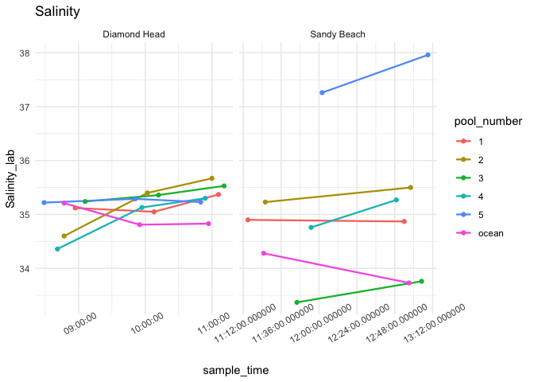<!-- -->

------------------------------------------------------------------------

TA

``` r
delta_calc %>% ggplot(aes(x = substrate, y = delta_TA, color = substrate)) + 
  facet_wrap(~site, scales = "free_x") +
  geom_boxplot(alpha = 0.7) + 
  geom_point() + 
  theme_bw() + 
  scale_color_manual(values = c("gray20", "sienna2", "palegreen3", "dodgerblue3")) +
  guides(color = "none") +
  labs(x = "Substrate", y = "Delta TA", title = "DH T1-T3") + 
  geom_hline(yintercept = 0, linetype = "dashed", color = "gray")
```

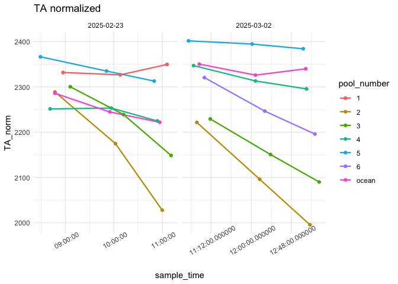<!-- -->

``` r
delta_calc2 %>% ggplot(aes(x = substrate, y = delta_TA, color = substrate)) + 
  facet_wrap(~site, scales = "free_x") +
  geom_boxplot(alpha = 0.7) + 
  geom_point() + 
  theme_bw() + 
  scale_color_manual(values = c("gray20", "sienna2", "palegreen3", "dodgerblue3")) +
  guides(color = "none") +
  labs(x = "Substrate", y = "Delta TA", title = "DH T1-T2") + 
  geom_hline(yintercept = 0, linetype = "dashed", color = "gray")
```

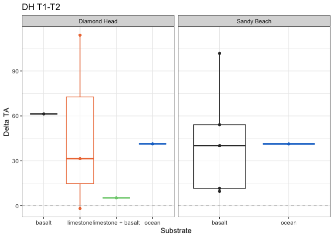<!-- -->

``` r
delta_calc3 %>% ggplot(aes(x = substrate, y = delta_TA, color = substrate)) + 
  facet_wrap(~site, scales = "free_x") +
  geom_boxplot(alpha = 0.7) + 
  geom_point() + 
  theme_bw() + 
  scale_color_manual(values = c("gray20", "sienna2", "palegreen3", "dodgerblue3")) +
  guides(color = "none") +
  labs(x = "Substrate", y = "Delta TA", title = "DH T2-T3") + 
  geom_hline(yintercept = 0, linetype = "dashed", color = "gray")
```

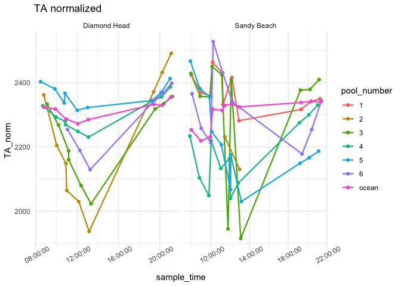<!-- -->

pH

``` r
delta_calc %>% ggplot(aes(x = substrate, y = delta_pH, color = substrate)) + 
  facet_wrap(~site, scales = "free_x") +
  geom_boxplot(alpha = 0.7) + 
  geom_point() + 
  theme_bw() + 
  scale_color_manual(values = c("gray20", "sienna2", "palegreen3", "dodgerblue3")) +
  guides(color = "none") +
  labs(x = "Substrate", y = "Delta pH", title = "DH T1-T3") + 
  geom_hline(yintercept = 0, linetype = "dashed", color = "gray")
```

<!-- -->

``` r
delta_calc2 %>% ggplot(aes(x = substrate, y = delta_pH, color = substrate)) + 
  facet_wrap(~site, scales = "free_x") +
  geom_boxplot(alpha = 0.7) + 
  geom_point() + 
  theme_bw() + 
  scale_color_manual(values = c("gray20", "sienna2", "palegreen3", "dodgerblue3")) +
  guides(color = "none") +
  labs(x = "Substrate", y = "Delta pH", title = "DH T1-T2") + 
  geom_hline(yintercept = 0, linetype = "dashed", color = "gray")
```

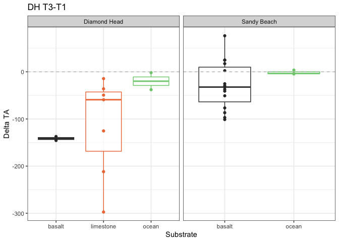<!-- -->

``` r
delta_calc3 %>% ggplot(aes(x = substrate, y = delta_pH, color = substrate)) + 
  facet_wrap(~site, scales = "free_x") +
  geom_boxplot(alpha = 0.7) + 
  geom_point() + 
  theme_bw() + 
  scale_color_manual(values = c("gray20", "sienna2", "palegreen3", "dodgerblue3")) +
  guides(color = "none") +
  labs(x = "Substrate", y = "Delta pH", title = "DH T2-T3") + 
  geom_hline(yintercept = 0, linetype = "dashed", color = "gray")
```

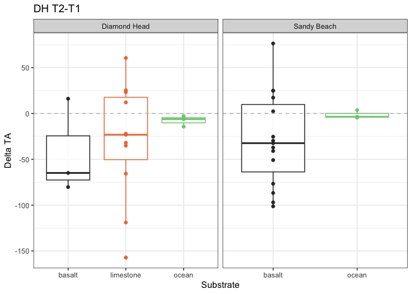<!-- -->

``` r
delta_calc %>% 
  filter(substrate == "limestone" | substrate == "basalt") %>%
  ggplot(aes(x = delta_pH, y = delta_TA, color = substrate)) + 
  facet_wrap(~site, scales = "free_x") +
  geom_point() + 
  theme_bw() + 
  scale_color_manual(values = c("gray20", "sienna2")) +
  guides(color = "none") +
  labs(x = "Delta pH", y = "Delta TA", title = "DH T1-T3") 
```

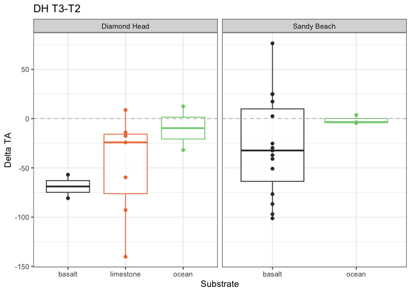<!-- -->

``` r
delta_calc2 %>% 
  filter(substrate == "limestone" | substrate == "basalt") %>%
  ggplot(aes(x = delta_pH, y = delta_TA, color = substrate)) + 
  facet_wrap(~site, scales = "free_x") +
  geom_point() + 
  theme_bw() + 
  scale_color_manual(values = c("gray20", "sienna2")) +
  guides(color = "none") +
  labs(x = "Delta pH", y = "Delta TA", title = "DH T1-T2") 
```

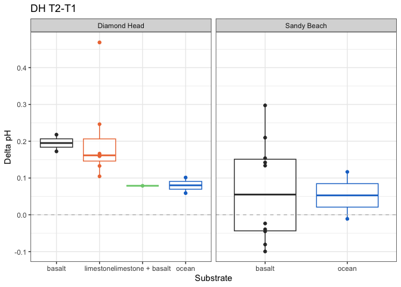<!-- -->

``` r
delta_calc3 %>% 
  filter(substrate == "limestone" | substrate == "basalt") %>%
  ggplot(aes(x = delta_pH, y = delta_TA, color = substrate)) + 
  facet_wrap(~site, scales = "free_x") +
  geom_point() + 
  theme_bw() + 
  scale_color_manual(values = c("gray20", "sienna2")) +
  guides(color = "none") +
  labs(x = "Delta pH", y = "Delta TA", title = "DH T2-T3") 
```

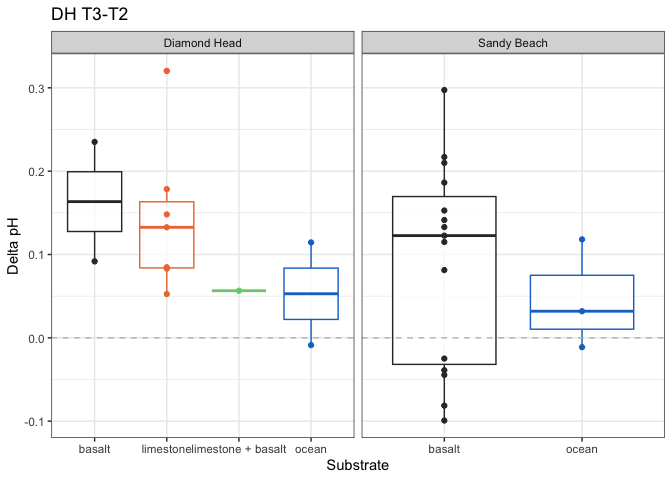<!-- -->
