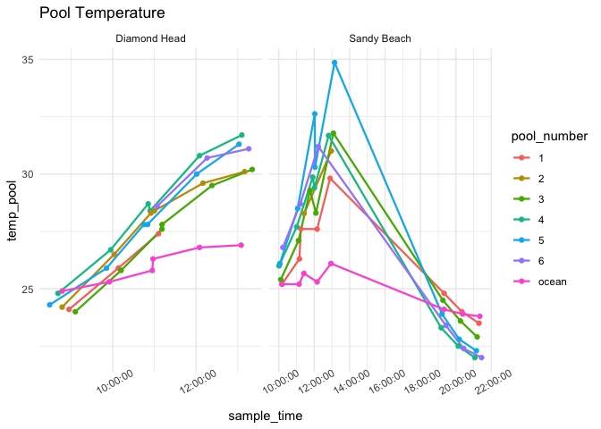
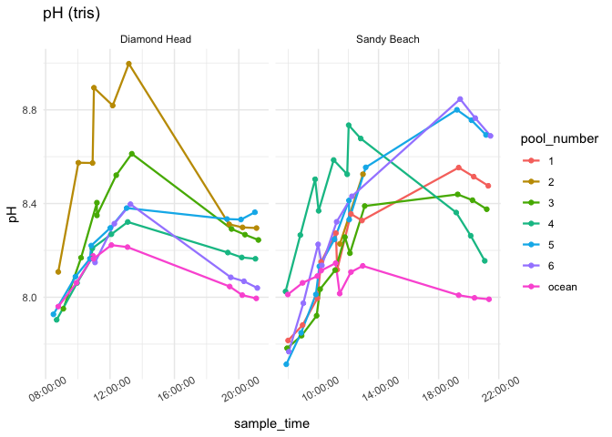
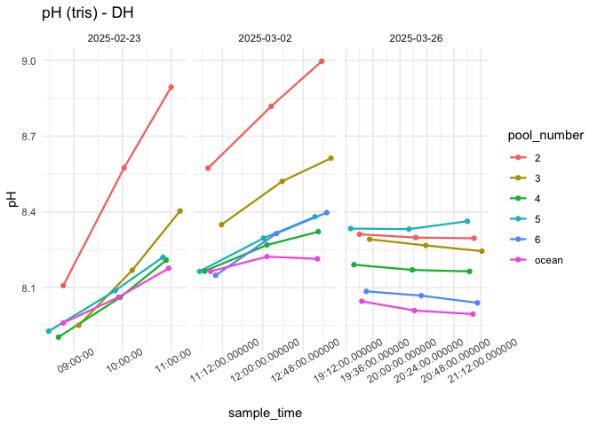
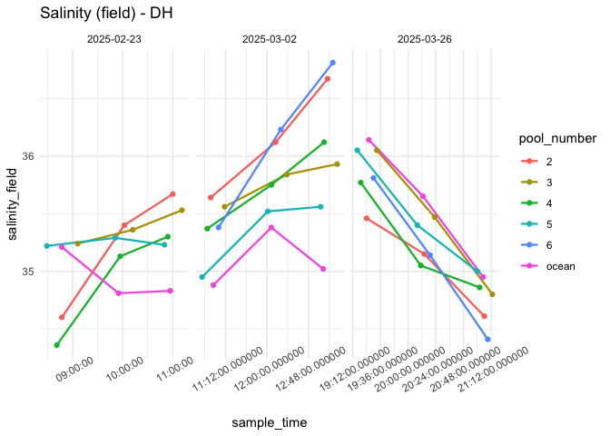
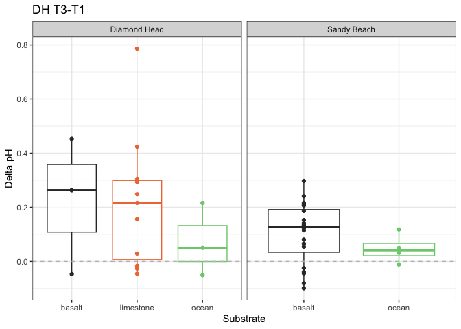

First Analysis
================
Micaela Chapuis
2025-02-25

## Load Libraries

``` r
library(tidyverse)
```

    ## ── Attaching core tidyverse packages ──────────────────────── tidyverse 2.0.0 ──
    ## ✔ dplyr     1.1.4     ✔ readr     2.1.5
    ## ✔ forcats   1.0.0     ✔ stringr   1.5.1
    ## ✔ ggplot2   3.5.1     ✔ tibble    3.2.1
    ## ✔ lubridate 1.9.3     ✔ tidyr     1.3.1
    ## ✔ purrr     1.0.2     
    ## ── Conflicts ────────────────────────────────────────── tidyverse_conflicts() ──
    ## ✖ dplyr::filter() masks stats::filter()
    ## ✖ dplyr::lag()    masks stats::lag()
    ## ℹ Use the conflicted package (<http://conflicted.r-lib.org/>) to force all conflicts to become errors

``` r
library(here)
```

    ## here() starts at /Users/micachapuis/GitHub/HawaiiTidepools

``` r
library(seacarb)
```

    ## Loading required package: oce
    ## Loading required package: gsw
    ## Loading required package: SolveSAPHE

``` r
library(lubridate)
library(car)
```

    ## Loading required package: carData
    ## 
    ## Attaching package: 'car'
    ## 
    ## The following object is masked from 'package:dplyr':
    ## 
    ##     recode
    ## 
    ## The following object is masked from 'package:purrr':
    ## 
    ##     some

## Load in Data

``` r
chem <- read_csv(here("Test Sampling", "Data", "tidepool_chemistry.csv"))
params <- read_csv(here("Test Sampling", "Data", "tidepool_parameters.csv"))
pHSlope <- read_csv(here("Test Sampling", "Data", "pHSlope.csv"))
TA <- read_csv(here("Test Sampling", "Data", "total_alkalinity.csv"))
```

## Data cleaning and joining

Make all pool numbers factors

``` r
chem$pool_number <- factor(chem$pool_number)
params$pool_number <- factor(params$pool_number)
```

Remove junk samples from TA Data

``` r
junks <- c("junk1", "junk2", "junk3")
TA <- TA %>% filter(!sample_ID %in% junks)
```

Join in TA data

``` r
data <- left_join(chem, TA, by = "sample_ID")
```

Add in pH calculated from tris and physical parameters

``` r
data <- left_join(data, pHSlope)
```

    ## Joining with `by = join_by(date, sample_ID)`

``` r
data <- left_join(data, (params %>% select(site, pool_number, substrate, perimeter_m, surface_area_m2)), by = c("site", "pool_number"))
```

Selecting columns

``` r
data <- data %>% select(-observers, -notes, Sample.Index)
```

Adding in “ocean” as substrate

``` r
data <- data %>% mutate(substrate = replace_na(substrate, "ocean"))
```

Salinity Normalize TA

``` r
data <- data %>% mutate(TA_norm = TA*salinity_lab/35)
```

Calculate delta pH and delta TA

``` r
delta_calc <- data %>% 
  select(date, site, pool_number, substrate, time_point, temp_pool, sample_time, pH, TA_norm)  %>%
  group_by(date, site, pool_number, substrate) %>%  # group by metadata
  arrange(time_point, .by_group = TRUE) %>%  # ensure correct order
  reframe(
    delta_pH = case_when(
      site == "Diamond Head" ~ pH[time_point = 3] - pH[time_point = 1],  # Diamond Head (Time 3 - Time 1)
      site == "Sandy Beach" ~ pH[time_point = 2] - pH[time_point = 1]   # Sandy Beach (Time 2 - Time 1)
    ),
    delta_TA = case_when(
      site == "Diamond Head" ~ TA_norm[time_point = 3] - TA_norm[time_point = 1],  # Diamond Head (Time 3 - Time 1)
      site == "Sandy Beach" ~ TA_norm[time_point = 2] - TA_norm[time_point = 1]   # Sandy Beach (Time 2 - Time 1)
    ), 
    delta_temp = case_when(
      site == "Diamond Head" ~ temp_pool[time_point = 3] - temp_pool[time_point = 1],  # Diamond Head (Time 3 - Time 1)
      site == "Sandy Beach" ~ temp_pool[time_point = 2] - temp_pool[time_point = 1]   # Sandy Beach (Time 2 - Time 1)
    ), 
    delta_time = case_when(
      site == "Diamond Head" ~ as.numeric(difftime(sample_time[time_point = 3], sample_time[time_point = 1], units = "mins")),  # Time 3 - Time 1 for Diamond Head
      site == "Sandy Beach" ~ as.numeric(difftime(sample_time[time_point = 2], sample_time[time_point = 1], units = "mins"))   # Time 2 - Time 1 for Sandy Beach
    )
  ) %>% 
    distinct(date, site, pool_number, substrate, .keep_all = TRUE)  # Ensure only one row per pool
```

Doing it for just two timepoints for now (T1-T2)

``` r
delta_calc2 <- data %>% 
  select(date, site, pool_number, substrate, time_point, temp_pool, sample_time, pH, TA_norm)  %>%
  group_by(date, site, pool_number, substrate) %>%  # group by metadata
  arrange(time_point, .by_group = TRUE) %>%  # ensure correct order
  reframe(
    delta_pH = case_when(
      site == "Diamond Head" ~ pH[time_point = 2] - pH[time_point = 1],  # Diamond Head (Time 2 - Time 1)
      site == "Sandy Beach" ~ pH[time_point = 2] - pH[time_point = 1]   # Sandy Beach (Time 2 - Time 1)
    ),
    delta_TA = case_when(
      site == "Diamond Head" ~ TA_norm[time_point = 2] - TA_norm[time_point = 1],  # Diamond Head (Time 2 - Time 1)
      site == "Sandy Beach" ~ TA_norm[time_point = 2] - TA_norm[time_point = 1]   # Sandy Beach (Time 2 - Time 1)
    ), 
    delta_temp = case_when(
      site == "Diamond Head" ~ temp_pool[time_point = 2] - temp_pool[time_point = 1],  # Diamond Head (Time 2 - Time 1)
      site == "Sandy Beach" ~ temp_pool[time_point = 2] - temp_pool[time_point = 1]   # Sandy Beach (Time 2 - Time 1)
    ), 
    delta_time = case_when(
      site == "Diamond Head" ~ as.numeric(difftime(sample_time[time_point = 2], sample_time[time_point = 1], units = "mins")),  # Time 2 - Time 1 for Diamond Head
      site == "Sandy Beach" ~ as.numeric(difftime(sample_time[time_point = 2], sample_time[time_point = 1], units = "mins"))   # Time 2 - Time 1 for Sandy Beach
    )
  ) %>% 
    distinct(date, site, pool_number, substrate, .keep_all = TRUE)  # Ensure only one row per pool
```

Now T2-T3

``` r
delta_calc3 <- data %>% 
  select(date, site, pool_number, substrate, time_point, temp_pool, sample_time, pH, TA_norm)  %>%
  group_by(date, site, pool_number, substrate) %>%  # group by metadata
  arrange(time_point, .by_group = TRUE) %>%  # ensure correct order
  reframe(
    delta_pH = case_when(
      site == "Diamond Head" ~ pH[time_point = 3] - pH[time_point = 2],  # Diamond Head (Time 3 - Time 2)
      site == "Sandy Beach" ~ pH[time_point = 2] - pH[time_point = 1]   # Sandy Beach (Time 2 - Time 1)
    ),
    delta_TA = case_when(
      site == "Diamond Head" ~ TA_norm[time_point = 3] - TA_norm[time_point = 2],  # Diamond Head (Time 3 - Time 2)
      site == "Sandy Beach" ~ TA_norm[time_point = 2] - TA_norm[time_point = 1]   # Sandy Beach (Time 2 - Time 1)
    ), 
    delta_temp = case_when(
      site == "Diamond Head" ~ temp_pool[time_point = 3] - temp_pool[time_point = 2],  # Diamond Head (Time 3 - Time 2)
      site == "Sandy Beach" ~ temp_pool[time_point = 2] - temp_pool[time_point = 1]   # Sandy Beach (Time 2 - Time 1)
    ), 
    delta_time = case_when(
      site == "Diamond Head" ~ as.numeric(difftime(sample_time[time_point = 3], sample_time[time_point = 2], units = "mins")),  # Time 3 - Time 2 for Diamond Head
      site == "Sandy Beach" ~ as.numeric(difftime(sample_time[time_point = 2], sample_time[time_point = 1], units = "mins"))   # Time 2 - Time 1 for Sandy Beach
    )
  ) %>% 
    distinct(date, site, pool_number, substrate, .keep_all = TRUE)  # Ensure only one row per pool
```

## Data Viz!

### Temperature

``` r
data %>% ggplot(aes(x = sample_time, y = temp_pool, color = pool_number)) +
  facet_wrap(~site, scales = "free_x") + geom_line(linewidth = 0.8) + geom_point() + theme_minimal() + labs(title = "Pool Temperature") + theme(axis.text.x = element_text(angle = 30))
```

<!-- -->

``` r
data %>% filter(site == "Sandy Beach") %>%
  ggplot(aes(x = sample_time, y = temp_pool, color = pool_number)) +   facet_wrap(~date, scales = "free_x") + geom_line(linewidth = 0.8) + geom_point() + theme_minimal() + labs(title = "Pool Temperature")  + theme(axis.text.x = element_text(angle = 30))
```

<!-- -->

### pH

``` r
data %>% ggplot(aes(x = sample_time, y = pH, color = pool_number)) +
    facet_wrap(~site, scales = "free_x") + geom_line(linewidth = 0.8) + geom_point() + theme_minimal() + labs(title = "pH (tris)")  + theme(axis.text.x = element_text(angle = 30))
```

<!-- -->

``` r
data %>% ggplot(aes(x = sample_time, y = pH_probe, color = pool_number)) +
    facet_wrap(~site, scales = "free_x") + geom_line(linewidth = 0.8) + geom_point() + theme_minimal() + labs(title = "pH (probe)")  + theme(axis.text.x = element_text(angle = 30))
```

<!-- -->

``` r
data %>% filter(site == "Sandy Beach") %>%
  ggplot(aes(x = sample_time, y = pH, color = pool_number)) +   facet_wrap(~date, scales = "free_x") + geom_line(linewidth = 0.8) + geom_point() + theme_minimal() + labs(title = "pH (tris)")  + theme(axis.text.x = element_text(angle = 30))
```

<!-- -->

### TA

``` r
data %>% ggplot(aes(x = sample_time, y = TA_norm, color = pool_number)) +   facet_wrap(~site, scales = "free_x") + geom_line(linewidth = 0.8) + geom_point() + theme_minimal() + labs(title = "TA normalized")  + theme(axis.text.x = element_text(angle = 30))
```

<!-- -->

``` r
data %>% filter(site == "Sandy Beach") %>%
  ggplot(aes(x = sample_time, y = TA_norm, color = pool_number)) +   facet_wrap(~date, scales = "free_x") + geom_line(linewidth = 0.8) + geom_point() + theme_minimal() + labs(title = "TA normalized")  + theme(axis.text.x = element_text(angle = 30))
```

<!-- -->

### Salinity

``` r
data %>% ggplot(aes(x = sample_time, y = salinity_field, color = pool_number)) +   facet_wrap(~site, scales = "free_x") + geom_line(linewidth = 0.8) + geom_point() + theme_minimal() + labs(title = "Salinity (field)")  + theme(axis.text.x = element_text(angle = 30))
```

<!-- -->

``` r
data %>% filter(site == "Sandy Beach") %>%
  ggplot(aes(x = sample_time, y = salinity_field, color = pool_number)) +   facet_wrap(~date, scales = "free_x") + geom_line(linewidth = 0.8) + geom_point() + theme_minimal() + labs(title = "Salinity (field)")  + theme(axis.text.x = element_text(angle = 30))
```

<!-- -->

### Deltas

#### Delta TA

``` r
delta_calc %>% ggplot(aes(x = substrate, y = delta_TA, color = substrate)) + #, label = pool_number)) + 
  facet_wrap(~site, scales = "free_x") +
  geom_boxplot(alpha = 0.7) + 
  geom_point() + 
 # geom_text(hjust=0, vjust=0) +
  theme_bw() + 
  scale_color_manual(values = c("gray20", "sienna2", "palegreen3", "dodgerblue3")) +
  guides(color = "none") +
  labs(x = "Substrate", y = "Delta TA", title = "DH T3-T1") + 
  geom_hline(yintercept = 0, linetype = "dashed", color = "gray")
```

<!-- -->

``` r
delta_calc2 %>% ggplot(aes(x = substrate, y = delta_TA, color = substrate)) + #, label = pool_number)) + 
  facet_wrap(~site, scales = "free_x") +
  geom_boxplot(alpha = 0.7) + 
  geom_point() + 
 # geom_text(hjust=0, vjust=0) +
  theme_bw() + 
  scale_color_manual(values = c("gray20", "sienna2", "palegreen3", "dodgerblue3")) +
  guides(color = "none") +
  labs(x = "Substrate", y = "Delta TA", title = "DH T2-T1") + 
  geom_hline(yintercept = 0, linetype = "dashed", color = "gray")
```

<!-- -->

``` r
delta_calc3 %>% ggplot(aes(x = substrate, y = delta_TA, color = substrate)) + #, label = pool_number)) + 
  facet_wrap(~site, scales = "free_x") +
  geom_boxplot(alpha = 0.7) + 
  geom_point() + 
 # geom_text(hjust=0, vjust=0) +
  theme_bw() + 
  scale_color_manual(values = c("gray20", "sienna2", "palegreen3", "dodgerblue3")) +
  guides(color = "none") +
  labs(x = "Substrate", y = "Delta TA", title = "DH T3-T2") + 
  geom_hline(yintercept = 0, linetype = "dashed", color = "gray")
```

<!-- -->

#### Delta pH

``` r
delta_calc %>% ggplot(aes(x = substrate, y = delta_pH, color = substrate)) + #, label = pool_number)) + 
  facet_wrap(~site, scales = "free_x") +
  geom_boxplot(alpha = 0.7) + 
  geom_point() + 
#  geom_text(hjust=0, vjust=0) +
  theme_bw() + 
  scale_color_manual(values = c("gray20", "sienna2", "palegreen3", "dodgerblue3")) +
  guides(color = "none") +
  labs(x = "Substrate", y = "Delta pH", title = "DH T3-T1") + 
  geom_hline(yintercept = 0, linetype = "dashed", color = "gray")
```

<!-- -->

``` r
delta_calc2 %>% ggplot(aes(x = substrate, y = delta_pH, color = substrate)) + 
  facet_wrap(~site, scales = "free_x") +
  geom_boxplot(alpha = 0.7) + 
  geom_point() + 
  theme_bw() + 
  scale_color_manual(values = c("gray20", "sienna2", "palegreen3", "dodgerblue3")) +
  guides(color = "none") +
  labs(x = "Substrate", y = "Delta pH", title = "DH T2-T1") + 
  geom_hline(yintercept = 0, linetype = "dashed", color = "gray")
```

<!-- -->

``` r
delta_calc3 %>% ggplot(aes(x = substrate, y = delta_pH, color = substrate)) + 
  facet_wrap(~site, scales = "free_x") +
  geom_boxplot(alpha = 0.7) + 
  geom_point() + 
  theme_bw() + 
  scale_color_manual(values = c("gray20", "sienna2", "palegreen3", "dodgerblue3")) +
  guides(color = "none") +
  labs(x = "Substrate", y = "Delta pH", title = "DH T3-T2") + 
  geom_hline(yintercept = 0, linetype = "dashed", color = "gray")
```

<!-- -->

#### Delta TA vs Delta pH

``` r
delta_calc %>% 
  filter(substrate == "limestone" | substrate == "basalt") %>%
  ggplot(aes(x = delta_pH, y = delta_TA, color = substrate)) + 
  facet_wrap(~site, scales = "free_x") +
  geom_point() + 
  theme_bw() + 
  scale_color_manual(values = c("gray20", "sienna2")) +
  guides(color = "none") +
  labs(x = "Delta pH", y = "Delta TA", title = "DH T3-T1") 
```

<!-- -->

``` r
delta_calc2 %>% 
  filter(substrate == "limestone" | substrate == "basalt") %>%
  ggplot(aes(x = delta_pH, y = delta_TA, color = substrate)) + 
  facet_wrap(~site, scales = "free_x") +
  geom_point() + 
  theme_bw() + 
  scale_color_manual(values = c("gray20", "sienna2")) +
  guides(color = "none") +
  labs(x = "Delta pH", y = "Delta TA", title = "DH T2-T1") 
```

<!-- -->

``` r
delta_calc3 %>% 
  filter(substrate == "limestone" | substrate == "basalt") %>%
  ggplot(aes(x = delta_pH, y = delta_TA, color = substrate)) + 
  facet_wrap(~site, scales = "free_x") +
  geom_point() + 
  theme_bw() + 
  scale_color_manual(values = c("gray20", "sienna2")) +
  guides(color = "none") +
  labs(x = "Delta pH", y = "Delta TA", title = "DH T3-T2") 
```

<!-- -->

#### Delta Temp vs Delta pH

``` r
delta_calc %>% 
  filter(substrate == "limestone" | substrate == "basalt") %>%
  ggplot(aes(x = delta_temp, y = delta_pH, color = substrate)) + 
  facet_wrap(~site, scales = "free_x") +
  geom_point() + 
  theme_bw() + 
  scale_color_manual(values = c("gray20", "sienna2")) +
  guides(color = "none") +
  labs(x = "Delta Temperature", y = "Delta pH", title = "DH T3-T1") 
```

<!-- -->

## Models

### ph vs params

``` r
model1 <- lm(pH ~ sample_time + perimeter_m + surface_area_m2, data = data)
summary(model1)
```

    ## 
    ## Call:
    ## lm(formula = pH ~ sample_time + perimeter_m + surface_area_m2, 
    ##     data = data)
    ## 
    ## Residuals:
    ##      Min       1Q   Median       3Q      Max 
    ## -0.45294 -0.14753 -0.02264  0.12996  0.57573 
    ## 
    ## Coefficients:
    ##                   Estimate Std. Error t value Pr(>|t|)    
    ## (Intercept)      8.052e+00  1.093e-01  73.680  < 2e-16 ***
    ## sample_time      9.173e-06  2.239e-06   4.096 0.000134 ***
    ## perimeter_m     -2.652e-02  1.311e-02  -2.023 0.047741 *  
    ## surface_area_m2  2.899e-02  2.226e-02   1.302 0.198047    
    ## ---
    ## Signif. codes:  0 '***' 0.001 '**' 0.01 '*' 0.05 '.' 0.1 ' ' 1
    ## 
    ## Residual standard error: 0.226 on 57 degrees of freedom
    ##   (23 observations deleted due to missingness)
    ## Multiple R-squared:  0.2466, Adjusted R-squared:  0.2069 
    ## F-statistic: 6.218 on 3 and 57 DF,  p-value: 0.000996

``` r
Anova(model1)
```

    ## Anova Table (Type II tests)
    ## 
    ## Response: pH
    ##                  Sum Sq Df F value    Pr(>F)    
    ## sample_time     0.85686  1 16.7777 0.0001343 ***
    ## perimeter_m     0.20907  1  4.0937 0.0477413 *  
    ## surface_area_m2 0.08662  1  1.6960 0.1980465    
    ## Residuals       2.91105 57                      
    ## ---
    ## Signif. codes:  0 '***' 0.001 '**' 0.01 '*' 0.05 '.' 0.1 ' ' 1

### TA vs params

``` r
model2 <- lm(TA ~ sample_time + perimeter_m + surface_area_m2, data = data)
summary(model2)
```

    ## 
    ## Call:
    ## lm(formula = TA ~ sample_time + perimeter_m + surface_area_m2, 
    ##     data = data)
    ## 
    ## Residuals:
    ##     Min      1Q  Median      3Q     Max 
    ## -308.04 -132.24   55.18  114.35  175.40 
    ## 
    ## Coefficients:
    ##                   Estimate Std. Error t value Pr(>|t|)    
    ## (Intercept)      2.215e+03  6.734e+01  32.891   <2e-16 ***
    ## sample_time     -1.686e-03  1.380e-03  -1.222    0.227    
    ## perimeter_m     -5.689e-01  8.075e+00  -0.070    0.944    
    ## surface_area_m2  8.021e+00  1.372e+01   0.585    0.561    
    ## ---
    ## Signif. codes:  0 '***' 0.001 '**' 0.01 '*' 0.05 '.' 0.1 ' ' 1
    ## 
    ## Residual standard error: 139.2 on 57 degrees of freedom
    ##   (23 observations deleted due to missingness)
    ## Multiple R-squared:  0.03619,    Adjusted R-squared:  -0.01454 
    ## F-statistic: 0.7134 on 3 and 57 DF,  p-value: 0.548

``` r
Anova(model2)
```

    ## Anova Table (Type II tests)
    ## 
    ## Response: TA
    ##                  Sum Sq Df F value Pr(>F)
    ## sample_time       28937  1  1.4925 0.2269
    ## perimeter_m          96  1  0.0050 0.9441
    ## surface_area_m2    6630  1  0.3420 0.5610
    ## Residuals       1105107 57

### ph vs TA

``` r
model3 <- lm(pH ~ TA, data)
summary(model3)
```

    ## 
    ## Call:
    ## lm(formula = pH ~ TA, data = data)
    ## 
    ## Residuals:
    ##      Min       1Q   Median       3Q      Max 
    ## -0.36074 -0.12526 -0.03134  0.14701  0.31227 
    ## 
    ## Coefficients:
    ##               Estimate Std. Error t value Pr(>|t|)    
    ## (Intercept) 11.4918161  0.2857981   40.21   <2e-16 ***
    ## TA          -0.0014618  0.0001314  -11.13   <2e-16 ***
    ## ---
    ## Signif. codes:  0 '***' 0.001 '**' 0.01 '*' 0.05 '.' 0.1 ' ' 1
    ## 
    ## Residual standard error: 0.1623 on 82 degrees of freedom
    ## Multiple R-squared:  0.6016, Adjusted R-squared:  0.5967 
    ## F-statistic: 123.8 on 1 and 82 DF,  p-value: < 2.2e-16

### pH vs substrate

``` r
model4 <- lm(pH ~ substrate, data)
summary(model4)
```

    ## 
    ## Call:
    ## lm(formula = pH ~ substrate, data = data)
    ## 
    ## Residuals:
    ##      Min       1Q   Median       3Q      Max 
    ## -0.45208 -0.14203 -0.02023  0.11905  0.67187 
    ## 
    ## Coefficients:
    ##                             Estimate Std. Error t value Pr(>|t|)    
    ## (Intercept)                  8.40372    0.03314 253.562  < 2e-16 ***
    ## substratelimestone          -0.07736    0.05920  -1.307  0.19503    
    ## substratelimestone + basalt -0.42249    0.13394  -3.154  0.00227 ** 
    ## substrateocean              -0.30907    0.06861  -4.505 2.24e-05 ***
    ## ---
    ## Signif. codes:  0 '***' 0.001 '**' 0.01 '*' 0.05 '.' 0.1 ' ' 1
    ## 
    ## Residual standard error: 0.2248 on 80 degrees of freedom
    ## Multiple R-squared:  0.2542, Adjusted R-squared:  0.2263 
    ## F-statistic: 9.091 on 3 and 80 DF,  p-value: 3.011e-05

``` r
Anova(model4)
```

    ## Warning in printHypothesis(L, rhs, names(b)): one or more coefficients in the hypothesis include
    ##      arithmetic operators in their names;
    ##   the printed representation of the hypothesis will be omitted

    ## Anova Table (Type II tests)
    ## 
    ## Response: pH
    ##           Sum Sq Df F value    Pr(>F)    
    ## substrate 1.3781  3  9.0914 3.011e-05 ***
    ## Residuals 4.0422 80                      
    ## ---
    ## Signif. codes:  0 '***' 0.001 '**' 0.01 '*' 0.05 '.' 0.1 ' ' 1

### TA vs substrate

``` r
model5 <- lm(TA ~ substrate, data)
summary(model5)
```

    ## 
    ## Call:
    ## lm(formula = TA ~ substrate, data = data)
    ## 
    ## Residuals:
    ##     Min      1Q  Median      3Q     Max 
    ## -341.43  -82.49   11.40   89.80  294.01 
    ## 
    ## Coefficients:
    ##                             Estimate Std. Error t value Pr(>|t|)    
    ## (Intercept)                  2133.68      18.58 114.863  < 2e-16 ***
    ## substratelimestone             36.14      33.18   1.089  0.27934    
    ## substratelimestone + basalt   190.41      75.07   2.536  0.01315 *  
    ## substrateocean                130.55      38.46   3.395  0.00107 ** 
    ## ---
    ## Signif. codes:  0 '***' 0.001 '**' 0.01 '*' 0.05 '.' 0.1 ' ' 1
    ## 
    ## Residual standard error: 126 on 80 degrees of freedom
    ## Multiple R-squared:  0.1678, Adjusted R-squared:  0.1366 
    ## F-statistic: 5.378 on 3 and 80 DF,  p-value: 0.002009

``` r
Anova(model5)
```

    ## Warning in printHypothesis(L, rhs, names(b)): one or more coefficients in the hypothesis include
    ##      arithmetic operators in their names;
    ##   the printed representation of the hypothesis will be omitted

    ## Anova Table (Type II tests)
    ## 
    ## Response: TA
    ##            Sum Sq Df F value   Pr(>F)   
    ## substrate  256075  3  5.3776 0.002009 **
    ## Residuals 1269841 80                    
    ## ---
    ## Signif. codes:  0 '***' 0.001 '**' 0.01 '*' 0.05 '.' 0.1 ' ' 1

### temp vs substrate

``` r
model6 <- lm(temp_pool ~ substrate, data)
summary(model6)
```

    ## 
    ## Call:
    ## lm(formula = temp_pool ~ substrate, data = data)
    ## 
    ## Residuals:
    ##     Min      1Q  Median      3Q     Max 
    ## -4.8305 -1.7417  0.0333  1.6424  8.0285 
    ## 
    ## Coefficients:
    ##                             Estimate Std. Error t value Pr(>|t|)    
    ## (Intercept)                  26.8305     0.4058  66.120   <2e-16 ***
    ## substratelimestone            1.5361     0.7248   2.119   0.0372 *  
    ## substratelimestone + basalt  -1.0305     1.6400  -0.628   0.5315    
    ## substrateocean               -1.4539     0.8401  -1.731   0.0874 .  
    ## ---
    ## Signif. codes:  0 '***' 0.001 '**' 0.01 '*' 0.05 '.' 0.1 ' ' 1
    ## 
    ## Residual standard error: 2.752 on 80 degrees of freedom
    ## Multiple R-squared:  0.1184, Adjusted R-squared:  0.08538 
    ## F-statistic: 3.583 on 3 and 80 DF,  p-value: 0.01736

``` r
Anova(model6)
```

    ## Warning in printHypothesis(L, rhs, names(b)): one or more coefficients in the hypothesis include
    ##      arithmetic operators in their names;
    ##   the printed representation of the hypothesis will be omitted

    ## Anova Table (Type II tests)
    ## 
    ## Response: temp_pool
    ##           Sum Sq Df F value  Pr(>F)  
    ## substrate  81.41  3  3.5825 0.01736 *
    ## Residuals 605.96 80                  
    ## ---
    ## Signif. codes:  0 '***' 0.001 '**' 0.01 '*' 0.05 '.' 0.1 ' ' 1
