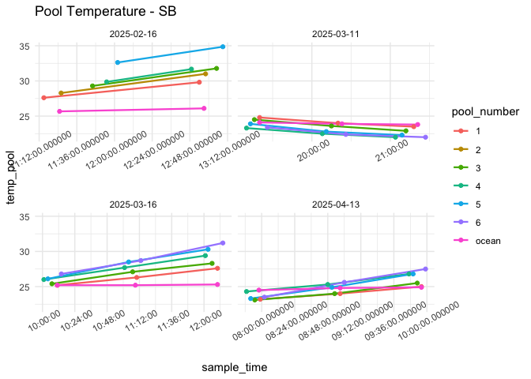

First Analysis
================
Micaela Chapuis
2025-02-25

## Load Libraries

``` r
library(tidyverse)
```

    ## ── Attaching core tidyverse packages ──────────────────────── tidyverse 2.0.0 ──
    ## ✔ dplyr     1.1.4     ✔ readr     2.1.5
    ## ✔ forcats   1.0.0     ✔ stringr   1.5.1
    ## ✔ ggplot2   3.5.1     ✔ tibble    3.2.1
    ## ✔ lubridate 1.9.3     ✔ tidyr     1.3.1
    ## ✔ purrr     1.0.2     
    ## ── Conflicts ────────────────────────────────────────── tidyverse_conflicts() ──
    ## ✖ dplyr::filter() masks stats::filter()
    ## ✖ dplyr::lag()    masks stats::lag()
    ## ℹ Use the conflicted package (<http://conflicted.r-lib.org/>) to force all conflicts to become errors

``` r
library(here)
```

    ## here() starts at /Users/micachapuis/GitHub/HawaiiTidepools

``` r
library(seacarb)
```

    ## Loading required package: oce
    ## Loading required package: gsw
    ## Loading required package: SolveSAPHE

``` r
library(lubridate)
library(car)
```

    ## Loading required package: carData
    ## 
    ## Attaching package: 'car'
    ## 
    ## The following object is masked from 'package:dplyr':
    ## 
    ##     recode
    ## 
    ## The following object is masked from 'package:purrr':
    ## 
    ##     some

## Load in Data

``` r
chem <- read_csv(here("Test Sampling", "Data", "tidepool_chemistry.csv"))
params <- read_csv(here("Test Sampling", "Data", "tidepool_parameters.csv"))
pHSlope <- read_csv(here("Test Sampling", "Data", "pHSlope.csv"))
TA <- read_csv(here("Test Sampling", "Data", "total_alkalinity.csv"))
```

## Data cleaning and joining

Make all pool numbers factors

``` r
chem$pool_number <- factor(chem$pool_number)
params$pool_number <- factor(params$pool_number)
```

Remove junk samples from TA Data

``` r
junks <- c("junk1", "junk2", "junk3")
TA <- TA %>% filter(!sample_ID %in% junks)
```

Join in TA data

``` r
data <- left_join(chem, TA, by = "sample_ID")
```

Add in pH calculated from tris and physical parameters

``` r
data <- left_join(data, pHSlope)
```

    ## Joining with `by = join_by(date, sample_ID)`

``` r
data <- left_join(data, (params %>% select(site, pool_number, substrate, perimeter_m, surface_area_m2)), by = c("site", "pool_number"))
```

Selecting columns

``` r
data <- data %>% select(-observers, -notes, Sample.Index)
```

Adding in “ocean” as substrate

``` r
data <- data %>% mutate(substrate = replace_na(substrate, "ocean"))
```

Salinity Normalize TA

``` r
data <- data %>% mutate(TA_norm = TA*salinity_lab/35)
```

Calculate delta pH and delta TA

``` r
delta_calc <- data %>% 
  select(date, site, pool_number, substrate, time_point, temp_pool, sample_time, pH, TA_norm)  %>%
  group_by(date, site, pool_number, substrate) %>%  # group by metadata
  arrange(time_point, .by_group = TRUE) %>%  # ensure correct order
  reframe(
    delta_pH = case_when(
      site == "Diamond Head" ~ pH[time_point = 3] - pH[time_point = 1],  # Diamond Head (Time 3 - Time 1)
      site == "Sandy Beach" ~ pH[time_point = 2] - pH[time_point = 1]   # Sandy Beach (Time 2 - Time 1)
    ),
    delta_TA = case_when(
      site == "Diamond Head" ~ TA_norm[time_point = 3] - TA_norm[time_point = 1],  # Diamond Head (Time 3 - Time 1)
      site == "Sandy Beach" ~ TA_norm[time_point = 2] - TA_norm[time_point = 1]   # Sandy Beach (Time 2 - Time 1)
    ), 
    delta_temp = case_when(
      site == "Diamond Head" ~ temp_pool[time_point = 3] - temp_pool[time_point = 1],  # Diamond Head (Time 3 - Time 1)
      site == "Sandy Beach" ~ temp_pool[time_point = 2] - temp_pool[time_point = 1]   # Sandy Beach (Time 2 - Time 1)
    ), 
    delta_time = case_when(
      site == "Diamond Head" ~ as.numeric(difftime(sample_time[time_point = 3], sample_time[time_point = 1], units = "mins")),  # Time 3 - Time 1 for Diamond Head
      site == "Sandy Beach" ~ as.numeric(difftime(sample_time[time_point = 2], sample_time[time_point = 1], units = "mins"))   # Time 2 - Time 1 for Sandy Beach
    )
  ) %>% 
    distinct(date, site, pool_number, substrate, .keep_all = TRUE)  # Ensure only one row per pool
```

Doing it for just two timepoints for now (T1-T2)

``` r
delta_calc2 <- data %>% 
  select(date, site, pool_number, substrate, time_point, temp_pool, sample_time, pH, TA_norm)  %>%
  group_by(date, site, pool_number, substrate) %>%  # group by metadata
  arrange(time_point, .by_group = TRUE) %>%  # ensure correct order
  reframe(
    delta_pH = case_when(
      site == "Diamond Head" ~ pH[time_point = 2] - pH[time_point = 1],  # Diamond Head (Time 2 - Time 1)
      site == "Sandy Beach" ~ pH[time_point = 2] - pH[time_point = 1]   # Sandy Beach (Time 2 - Time 1)
    ),
    delta_TA = case_when(
      site == "Diamond Head" ~ TA_norm[time_point = 2] - TA_norm[time_point = 1],  # Diamond Head (Time 2 - Time 1)
      site == "Sandy Beach" ~ TA_norm[time_point = 2] - TA_norm[time_point = 1]   # Sandy Beach (Time 2 - Time 1)
    ), 
    delta_temp = case_when(
      site == "Diamond Head" ~ temp_pool[time_point = 2] - temp_pool[time_point = 1],  # Diamond Head (Time 2 - Time 1)
      site == "Sandy Beach" ~ temp_pool[time_point = 2] - temp_pool[time_point = 1]   # Sandy Beach (Time 2 - Time 1)
    ), 
    delta_time = case_when(
      site == "Diamond Head" ~ as.numeric(difftime(sample_time[time_point = 2], sample_time[time_point = 1], units = "mins")),  # Time 2 - Time 1 for Diamond Head
      site == "Sandy Beach" ~ as.numeric(difftime(sample_time[time_point = 2], sample_time[time_point = 1], units = "mins"))   # Time 2 - Time 1 for Sandy Beach
    )
  ) %>% 
    distinct(date, site, pool_number, substrate, .keep_all = TRUE)  # Ensure only one row per pool
```

Now T2-T3

``` r
delta_calc3 <- data %>% 
  select(date, site, pool_number, substrate, time_point, temp_pool, sample_time, pH, TA_norm)  %>%
  group_by(date, site, pool_number, substrate) %>%  # group by metadata
  arrange(time_point, .by_group = TRUE) %>%  # ensure correct order
  reframe(
    delta_pH = case_when(
      site == "Diamond Head" ~ pH[time_point = 3] - pH[time_point = 2],  # Diamond Head (Time 3 - Time 2)
      site == "Sandy Beach" ~ pH[time_point = 2] - pH[time_point = 1]   # Sandy Beach (Time 2 - Time 1)
    ),
    delta_TA = case_when(
      site == "Diamond Head" ~ TA_norm[time_point = 3] - TA_norm[time_point = 2],  # Diamond Head (Time 3 - Time 2)
      site == "Sandy Beach" ~ TA_norm[time_point = 2] - TA_norm[time_point = 1]   # Sandy Beach (Time 2 - Time 1)
    ), 
    delta_temp = case_when(
      site == "Diamond Head" ~ temp_pool[time_point = 3] - temp_pool[time_point = 2],  # Diamond Head (Time 3 - Time 2)
      site == "Sandy Beach" ~ temp_pool[time_point = 2] - temp_pool[time_point = 1]   # Sandy Beach (Time 2 - Time 1)
    ), 
    delta_time = case_when(
      site == "Diamond Head" ~ as.numeric(difftime(sample_time[time_point = 3], sample_time[time_point = 2], units = "mins")),  # Time 3 - Time 2 for Diamond Head
      site == "Sandy Beach" ~ as.numeric(difftime(sample_time[time_point = 2], sample_time[time_point = 1], units = "mins"))   # Time 2 - Time 1 for Sandy Beach
    )
  ) %>% 
    distinct(date, site, pool_number, substrate, .keep_all = TRUE)  # Ensure only one row per pool
```

## Data Viz!

### Temperature

``` r
data %>% ggplot(aes(x = sample_time, y = temp_pool, color = pool_number)) +
  facet_wrap(~site, scales = "free_x") + geom_line(linewidth = 0.8) + geom_point() + theme_minimal() + labs(title = "Pool Temperature") + theme(axis.text.x = element_text(angle = 30))
```

<!-- -->

``` r
data %>% filter(site == "Diamond Head") %>%
  ggplot(aes(x = sample_time, y = temp_pool, color = pool_number)) +   facet_wrap(~date, scales = "free_x") + geom_line(linewidth = 0.8) + geom_point() + theme_minimal() + labs(title = "Pool Temperature")  + theme(axis.text.x = element_text(angle = 30))
```

<!-- -->

### pH

``` r
data %>% ggplot(aes(x = sample_time, y = pH, color = pool_number)) +
    facet_wrap(~site, scales = "free_x") + geom_line(linewidth = 0.8) + geom_point() + theme_minimal() + labs(title = "pH (tris)")  + theme(axis.text.x = element_text(angle = 30))
```

<!-- -->

``` r
data %>% ggplot(aes(x = sample_time, y = pH_probe, color = pool_number)) +
    facet_wrap(~site, scales = "free_x") + geom_line(linewidth = 0.8) + geom_point() + theme_minimal() + labs(title = "pH (probe)")  + theme(axis.text.x = element_text(angle = 30))
```

<!-- -->

``` r
data %>% filter(site == "Diamond Head") %>%
  ggplot(aes(x = sample_time, y = pH, color = pool_number)) +   facet_wrap(~date, scales = "free_x") + geom_line(linewidth = 0.8) + geom_point() + theme_minimal() + labs(title = "pH (tris)")  + theme(axis.text.x = element_text(angle = 30))
```

<!-- -->

### TA

``` r
data %>% ggplot(aes(x = sample_time, y = TA_norm, color = pool_number)) +   facet_wrap(~site, scales = "free_x") + geom_line(linewidth = 0.8) + geom_point() + theme_minimal() + labs(title = "TA normalized")  + theme(axis.text.x = element_text(angle = 30))
```

    ## Warning: Removed 18 rows containing missing values or values outside the scale range
    ## (`geom_line()`).

    ## Warning: Removed 18 rows containing missing values or values outside the scale range
    ## (`geom_point()`).

<!-- -->

``` r
data %>% filter(site == "Diamond Head") %>%
  ggplot(aes(x = sample_time, y = TA_norm, color = pool_number)) +   facet_wrap(~date, scales = "free_x") + geom_line(linewidth = 0.8) + geom_point() + theme_minimal() + labs(title = "TA normalized")  + theme(axis.text.x = element_text(angle = 30))
```

<!-- -->

### Salinity

``` r
data %>% ggplot(aes(x = sample_time, y = salinity_field, color = pool_number)) +   facet_wrap(~site, scales = "free_x") + geom_line(linewidth = 0.8) + geom_point() + theme_minimal() + labs(title = "Salinity (field)")  + theme(axis.text.x = element_text(angle = 30))
```

<!-- -->

``` r
data %>% filter(site == "Diamond Head") %>%
  ggplot(aes(x = sample_time, y = salinity_field, color = pool_number)) +   facet_wrap(~date, scales = "free_x") + geom_line(linewidth = 0.8) + geom_point() + theme_minimal() + labs(title = "Salinity (field)")  + theme(axis.text.x = element_text(angle = 30))
```

<!-- -->

### Deltas

#### Delta TA

``` r
delta_calc %>% ggplot(aes(x = substrate, y = delta_TA, color = substrate)) + #, label = pool_number)) + 
  facet_wrap(~site, scales = "free_x") +
  geom_boxplot(alpha = 0.7) + 
  geom_point() + 
 # geom_text(hjust=0, vjust=0) +
  theme_bw() + 
  scale_color_manual(values = c("gray20", "sienna2", "palegreen3", "dodgerblue3")) +
  guides(color = "none") +
  labs(x = "Substrate", y = "Delta TA", title = "DH T3-T1") + 
  geom_hline(yintercept = 0, linetype = "dashed", color = "gray")
```

    ## Warning: Removed 6 rows containing non-finite outside the scale range
    ## (`stat_boxplot()`).

    ## Warning: Removed 6 rows containing missing values or values outside the scale range
    ## (`geom_point()`).

<!-- -->

``` r
delta_calc2 %>% ggplot(aes(x = substrate, y = delta_TA, color = substrate)) + #, label = pool_number)) + 
  facet_wrap(~site, scales = "free_x") +
  geom_boxplot(alpha = 0.7) + 
  geom_point() + 
 # geom_text(hjust=0, vjust=0) +
  theme_bw() + 
  scale_color_manual(values = c("gray20", "sienna2", "palegreen3", "dodgerblue3")) +
  guides(color = "none") +
  labs(x = "Substrate", y = "Delta TA", title = "DH T2-T1") + 
  geom_hline(yintercept = 0, linetype = "dashed", color = "gray")
```

    ## Warning: Removed 6 rows containing non-finite outside the scale range
    ## (`stat_boxplot()`).

    ## Warning: Removed 6 rows containing missing values or values outside the scale range
    ## (`geom_point()`).

<!-- -->

``` r
delta_calc3 %>% ggplot(aes(x = substrate, y = delta_TA, color = substrate)) + #, label = pool_number)) + 
  facet_wrap(~site, scales = "free_x") +
  geom_boxplot(alpha = 0.7) + 
  geom_point() + 
 # geom_text(hjust=0, vjust=0) +
  theme_bw() + 
  scale_color_manual(values = c("gray20", "sienna2", "palegreen3", "dodgerblue3")) +
  guides(color = "none") +
  labs(x = "Substrate", y = "Delta TA", title = "DH T3-T2") + 
  geom_hline(yintercept = 0, linetype = "dashed", color = "gray")
```

    ## Warning: Removed 6 rows containing non-finite outside the scale range
    ## (`stat_boxplot()`).

    ## Warning: Removed 6 rows containing missing values or values outside the scale range
    ## (`geom_point()`).

<!-- -->

#### Delta pH

``` r
delta_calc %>% ggplot(aes(x = substrate, y = delta_pH, color = substrate)) + #, label = pool_number)) + 
  facet_wrap(~site, scales = "free_x") +
  geom_boxplot(alpha = 0.7) + 
  geom_point() + 
#  geom_text(hjust=0, vjust=0) +
  theme_bw() + 
  scale_color_manual(values = c("gray20", "sienna2", "palegreen3", "dodgerblue3")) +
  guides(color = "none") +
  labs(x = "Substrate", y = "Delta pH", title = "DH T3-T1") + 
  geom_hline(yintercept = 0, linetype = "dashed", color = "gray")
```

<!-- -->

``` r
delta_calc2 %>% ggplot(aes(x = substrate, y = delta_pH, color = substrate)) + 
  facet_wrap(~site, scales = "free_x") +
  geom_boxplot(alpha = 0.7) + 
  geom_point() + 
  theme_bw() + 
  scale_color_manual(values = c("gray20", "sienna2", "palegreen3", "dodgerblue3")) +
  guides(color = "none") +
  labs(x = "Substrate", y = "Delta pH", title = "DH T2-T1") + 
  geom_hline(yintercept = 0, linetype = "dashed", color = "gray")
```

<!-- -->

``` r
delta_calc3 %>% ggplot(aes(x = substrate, y = delta_pH, color = substrate)) + 
  facet_wrap(~site, scales = "free_x") +
  geom_boxplot(alpha = 0.7) + 
  geom_point() + 
  theme_bw() + 
  scale_color_manual(values = c("gray20", "sienna2", "palegreen3", "dodgerblue3")) +
  guides(color = "none") +
  labs(x = "Substrate", y = "Delta pH", title = "DH T3-T2") + 
  geom_hline(yintercept = 0, linetype = "dashed", color = "gray")
```

<!-- -->

#### Delta TA vs Delta pH

``` r
delta_calc %>% 
  filter(substrate == "limestone" | substrate == "basalt") %>%
  ggplot(aes(x = delta_pH, y = delta_TA, color = substrate)) + 
  facet_wrap(~site, scales = "free_x") +
  geom_point() + 
  theme_bw() + 
  scale_color_manual(values = c("gray20", "sienna2")) +
  guides(color = "none") +
  labs(x = "Delta pH", y = "Delta TA", title = "DH T3-T1") 
```

    ## Warning: Removed 5 rows containing missing values or values outside the scale range
    ## (`geom_point()`).

<!-- -->

``` r
delta_calc2 %>% 
  filter(substrate == "limestone" | substrate == "basalt") %>%
  ggplot(aes(x = delta_pH, y = delta_TA, color = substrate)) + 
  facet_wrap(~site, scales = "free_x") +
  geom_point() + 
  theme_bw() + 
  scale_color_manual(values = c("gray20", "sienna2")) +
  guides(color = "none") +
  labs(x = "Delta pH", y = "Delta TA", title = "DH T2-T1") 
```

    ## Warning: Removed 5 rows containing missing values or values outside the scale range
    ## (`geom_point()`).

<!-- -->

``` r
delta_calc3 %>% 
  filter(substrate == "limestone" | substrate == "basalt") %>%
  ggplot(aes(x = delta_pH, y = delta_TA, color = substrate)) + 
  facet_wrap(~site, scales = "free_x") +
  geom_point() + 
  theme_bw() + 
  scale_color_manual(values = c("gray20", "sienna2")) +
  guides(color = "none") +
  labs(x = "Delta pH", y = "Delta TA", title = "DH T3-T2") 
```

    ## Warning: Removed 5 rows containing missing values or values outside the scale range
    ## (`geom_point()`).

<!-- -->

#### Delta Temp vs Delta pH

``` r
delta_calc %>% 
  filter(substrate == "limestone" | substrate == "basalt") %>%
  ggplot(aes(x = delta_temp, y = delta_pH, color = substrate)) + 
  facet_wrap(~site, scales = "free_x") +
  geom_point() + 
  theme_bw() + 
  scale_color_manual(values = c("gray20", "sienna2")) +
  guides(color = "none") +
  labs(x = "Delta Temperature", y = "Delta pH", title = "DH T3-T1") 
```

<!-- -->

## Models

### ph vs params

``` r
model1 <- lm(pH ~ sample_time + perimeter_m + surface_area_m2, data = data)
summary(model1)
```

    ## 
    ## Call:
    ## lm(formula = pH ~ sample_time + perimeter_m + surface_area_m2, 
    ##     data = data)
    ## 
    ## Residuals:
    ##     Min      1Q  Median      3Q     Max 
    ## -0.3354 -0.1593 -0.0491  0.1188  0.5532 
    ## 
    ## Coefficients:
    ##                   Estimate Std. Error t value Pr(>|t|)    
    ## (Intercept)      8.004e+00  1.204e-01  66.506  < 2e-16 ***
    ## sample_time      1.053e-05  2.580e-06   4.082 0.000181 ***
    ## perimeter_m     -1.713e-02  1.685e-02  -1.016 0.314862    
    ## surface_area_m2 -7.581e-03  2.876e-02  -0.264 0.793314    
    ## ---
    ## Signif. codes:  0 '***' 0.001 '**' 0.01 '*' 0.05 '.' 0.1 ' ' 1
    ## 
    ## Residual standard error: 0.2332 on 45 degrees of freedom
    ##   (17 observations deleted due to missingness)
    ## Multiple R-squared:  0.2763, Adjusted R-squared:  0.228 
    ## F-statistic: 5.727 on 3 and 45 DF,  p-value: 0.002084

``` r
Anova(model1)
```

    ## Anova Table (Type II tests)
    ## 
    ## Response: pH
    ##                  Sum Sq Df F value    Pr(>F)    
    ## sample_time     0.90606  1 16.6627 0.0001806 ***
    ## perimeter_m     0.05618  1  1.0331 0.3148620    
    ## surface_area_m2 0.00378  1  0.0695 0.7933137    
    ## Residuals       2.44693 45                      
    ## ---
    ## Signif. codes:  0 '***' 0.001 '**' 0.01 '*' 0.05 '.' 0.1 ' ' 1

### TA vs params

``` r
model2 <- lm(TA ~ sample_time + perimeter_m + surface_area_m2, data = data)
summary(model2)
```

    ## 
    ## Call:
    ## lm(formula = TA ~ sample_time + perimeter_m + surface_area_m2, 
    ##     data = data)
    ## 
    ## Residuals:
    ##     Min      1Q  Median      3Q     Max 
    ## -173.30  -74.07  -11.78   77.72  210.22 
    ## 
    ## Coefficients:
    ##                   Estimate Std. Error t value Pr(>|t|)    
    ## (Intercept)      2.997e+03  1.415e+02  21.185  < 2e-16 ***
    ## sample_time     -2.113e-02  3.482e-03  -6.068 7.89e-07 ***
    ## perimeter_m     -4.253e+00  1.081e+01  -0.394    0.696    
    ## surface_area_m2  1.839e+01  1.978e+01   0.930    0.359    
    ## ---
    ## Signif. codes:  0 '***' 0.001 '**' 0.01 '*' 0.05 '.' 0.1 ' ' 1
    ## 
    ## Residual standard error: 105.2 on 33 degrees of freedom
    ##   (29 observations deleted due to missingness)
    ## Multiple R-squared:  0.5335, Adjusted R-squared:  0.4911 
    ## F-statistic: 12.58 on 3 and 33 DF,  p-value: 1.206e-05

``` r
Anova(model2)
```

    ## Anova Table (Type II tests)
    ## 
    ## Response: TA
    ##                 Sum Sq Df F value    Pr(>F)    
    ## sample_time     407215  1 36.8241 7.892e-07 ***
    ## perimeter_m       1713  1  0.1549    0.6964    
    ## surface_area_m2   9563  1  0.8647    0.3592    
    ## Residuals       364927 33                      
    ## ---
    ## Signif. codes:  0 '***' 0.001 '**' 0.01 '*' 0.05 '.' 0.1 ' ' 1

### ph vs TA

``` r
model3 <- lm(pH ~ TA, data)
summary(model3)
```

    ## 
    ## Call:
    ## lm(formula = pH ~ TA, data = data)
    ## 
    ## Residuals:
    ##      Min       1Q   Median       3Q      Max 
    ## -0.29076 -0.08695 -0.00893  0.06294  0.33282 
    ## 
    ## Coefficients:
    ##               Estimate Std. Error t value Pr(>|t|)    
    ## (Intercept) 11.7248703  0.3200616   36.63  < 2e-16 ***
    ## TA          -0.0015887  0.0001477  -10.75 3.85e-14 ***
    ## ---
    ## Signif. codes:  0 '***' 0.001 '**' 0.01 '*' 0.05 '.' 0.1 ' ' 1
    ## 
    ## Residual standard error: 0.139 on 46 degrees of freedom
    ##   (18 observations deleted due to missingness)
    ## Multiple R-squared:  0.7154, Adjusted R-squared:  0.7092 
    ## F-statistic: 115.6 on 1 and 46 DF,  p-value: 3.852e-14

### pH vs substrate

``` r
model4 <- lm(pH ~ substrate, data)
summary(model4)
```

    ## 
    ## Call:
    ## lm(formula = pH ~ substrate, data = data)
    ## 
    ## Residuals:
    ##      Min       1Q   Median       3Q      Max 
    ## -0.50447 -0.12449 -0.02583  0.09452  0.67426 
    ## 
    ## Coefficients:
    ##                             Estimate Std. Error t value Pr(>|t|)    
    ## (Intercept)                  8.45701    0.04138 204.357  < 2e-16 ***
    ## substratelimestone          -0.12721    0.06512  -1.953  0.05529 .  
    ## substratelimestone + basalt -0.47498    0.13932  -3.409  0.00115 ** 
    ## substrateocean              -0.36948    0.08086  -4.569 2.39e-05 ***
    ## ---
    ## Signif. codes:  0 '***' 0.001 '**' 0.01 '*' 0.05 '.' 0.1 ' ' 1
    ## 
    ## Residual standard error: 0.2304 on 62 degrees of freedom
    ## Multiple R-squared:  0.3144, Adjusted R-squared:  0.2812 
    ## F-statistic: 9.476 on 3 and 62 DF,  p-value: 3.054e-05

``` r
Anova(model4)
```

    ## Warning in printHypothesis(L, rhs, names(b)): one or more coefficients in the hypothesis include
    ##      arithmetic operators in their names;
    ##   the printed representation of the hypothesis will be omitted

    ## Anova Table (Type II tests)
    ## 
    ## Response: pH
    ##           Sum Sq Df F value    Pr(>F)    
    ## substrate 1.5093  3  9.4762 3.054e-05 ***
    ## Residuals 3.2916 62                      
    ## ---
    ## Signif. codes:  0 '***' 0.001 '**' 0.01 '*' 0.05 '.' 0.1 ' ' 1

### TA vs substrate

``` r
model5 <- lm(TA ~ substrate, data)
summary(model5)
```

    ## 
    ## Call:
    ## lm(formula = TA ~ substrate, data = data)
    ## 
    ## Residuals:
    ##     Min      1Q  Median      3Q     Max 
    ## -341.43  -46.63    6.12   75.96  206.24 
    ## 
    ## Coefficients:
    ##                             Estimate Std. Error t value Pr(>|t|)    
    ## (Intercept)                  2078.44      30.03  69.211  < 2e-16 ***
    ## substratelimestone             91.39      39.86   2.293  0.02671 *  
    ## substratelimestone + basalt   245.66      75.58   3.251  0.00221 ** 
    ## substrateocean                169.26      52.01   3.254  0.00219 ** 
    ## ---
    ## Signif. codes:  0 '***' 0.001 '**' 0.01 '*' 0.05 '.' 0.1 ' ' 1
    ## 
    ## Residual standard error: 120.1 on 44 degrees of freedom
    ##   (18 observations deleted due to missingness)
    ## Multiple R-squared:  0.283,  Adjusted R-squared:  0.2341 
    ## F-statistic: 5.789 on 3 and 44 DF,  p-value: 0.001998

``` r
Anova(model5)
```

    ## Warning in printHypothesis(L, rhs, names(b)): one or more coefficients in the hypothesis include
    ##      arithmetic operators in their names;
    ##   the printed representation of the hypothesis will be omitted

    ## Anova Table (Type II tests)
    ## 
    ## Response: TA
    ##           Sum Sq Df F value   Pr(>F)   
    ## substrate 250587  3  5.7888 0.001998 **
    ## Residuals 634889 44                    
    ## ---
    ## Signif. codes:  0 '***' 0.001 '**' 0.01 '*' 0.05 '.' 0.1 ' ' 1

### temp vs substrate

``` r
model6 <- lm(temp_pool ~ substrate, data)
summary(model6)
```

    ## 
    ## Call:
    ## lm(formula = temp_pool ~ substrate, data = data)
    ## 
    ## Residuals:
    ##     Min      1Q  Median      3Q     Max 
    ## -4.4389 -2.4389  0.0333  1.7083  8.4201 
    ## 
    ## Coefficients:
    ##                             Estimate Std. Error t value Pr(>|t|)    
    ## (Intercept)                  26.4389     0.5336  49.545   <2e-16 ***
    ## substratelimestone            1.9278     0.8397   2.296   0.0251 *  
    ## substratelimestone + basalt  -0.6389     1.7965  -0.356   0.7233    
    ## substrateocean               -1.0231     1.0427  -0.981   0.3303    
    ## ---
    ## Signif. codes:  0 '***' 0.001 '**' 0.01 '*' 0.05 '.' 0.1 ' ' 1
    ## 
    ## Residual standard error: 2.971 on 62 degrees of freedom
    ## Multiple R-squared:  0.1268, Adjusted R-squared:  0.08455 
    ## F-statistic: 3.001 on 3 and 62 DF,  p-value: 0.03717

``` r
Anova(model6)
```

    ## Warning in printHypothesis(L, rhs, names(b)): one or more coefficients in the hypothesis include
    ##      arithmetic operators in their names;
    ##   the printed representation of the hypothesis will be omitted

    ## Anova Table (Type II tests)
    ## 
    ## Response: temp_pool
    ##           Sum Sq Df F value  Pr(>F)  
    ## substrate  79.48  3  3.0012 0.03717 *
    ## Residuals 547.32 62                  
    ## ---
    ## Signif. codes:  0 '***' 0.001 '**' 0.01 '*' 0.05 '.' 0.1 ' ' 1
