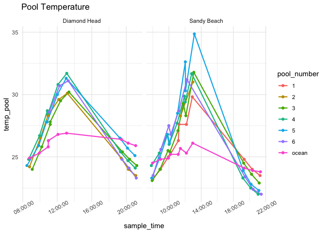
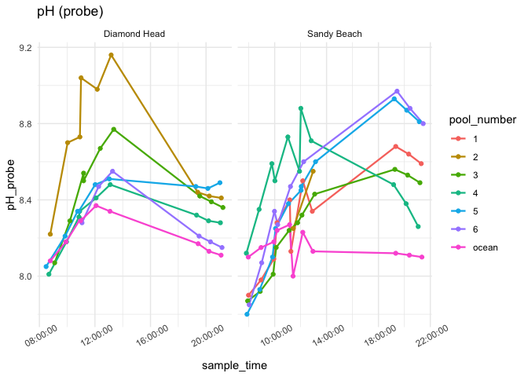
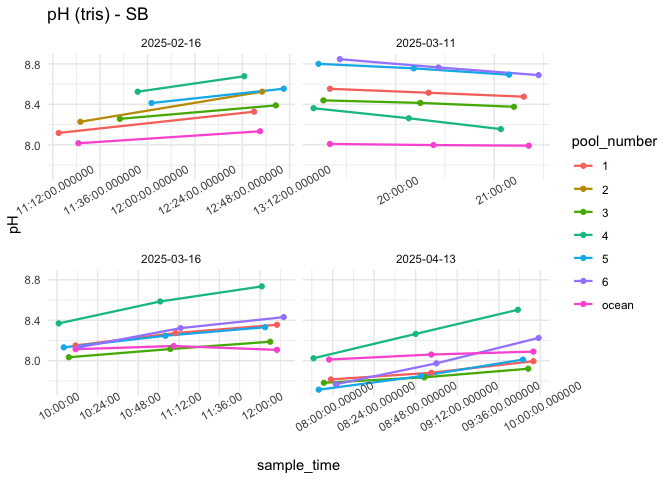
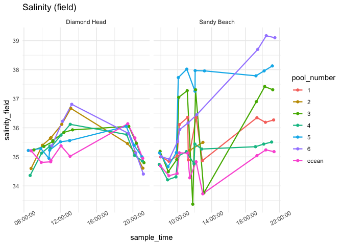
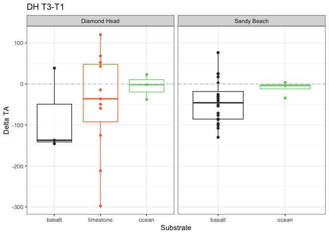

First Analysis
================
Micaela Chapuis
2025-02-25

## Load Libraries

``` r
library(tidyverse)
```

    ## ── Attaching core tidyverse packages ──────────────────────── tidyverse 2.0.0 ──
    ## ✔ dplyr     1.1.4     ✔ readr     2.1.5
    ## ✔ forcats   1.0.0     ✔ stringr   1.5.1
    ## ✔ ggplot2   3.5.1     ✔ tibble    3.2.1
    ## ✔ lubridate 1.9.3     ✔ tidyr     1.3.1
    ## ✔ purrr     1.0.2     
    ## ── Conflicts ────────────────────────────────────────── tidyverse_conflicts() ──
    ## ✖ dplyr::filter() masks stats::filter()
    ## ✖ dplyr::lag()    masks stats::lag()
    ## ℹ Use the conflicted package (<http://conflicted.r-lib.org/>) to force all conflicts to become errors

``` r
library(here)
```

    ## here() starts at /Users/micachapuis/GitHub/HawaiiTidepools

``` r
library(seacarb)
```

    ## Loading required package: oce
    ## Loading required package: gsw
    ## Loading required package: SolveSAPHE

``` r
library(lubridate)
library(car)
```

    ## Loading required package: carData
    ## 
    ## Attaching package: 'car'
    ## 
    ## The following object is masked from 'package:dplyr':
    ## 
    ##     recode
    ## 
    ## The following object is masked from 'package:purrr':
    ## 
    ##     some

## Load in Data

``` r
chem <- read_csv(here("Test Sampling", "Data", "tidepool_chemistry.csv"))
params <- read_csv(here("Test Sampling", "Data", "tidepool_parameters.csv"))
pHSlope <- read_csv(here("Test Sampling", "Data", "pHSlope.csv"))
TA <- read_csv(here("Test Sampling", "Data", "total_alkalinity.csv"))
```

## Data cleaning and joining

Make all pool numbers factors

``` r
chem$pool_number <- factor(chem$pool_number)
params$pool_number <- factor(params$pool_number)
```

Remove junk samples from TA Data

``` r
junks <- c("junk1", "junk2", "junk3")
TA <- TA %>% filter(!sample_ID %in% junks)
```

Join in TA data

``` r
data <- left_join(chem, TA, by = "sample_ID")
```

Add in pH calculated from tris and physical parameters

``` r
data <- left_join(data, pHSlope)
```

    ## Joining with `by = join_by(date, sample_ID)`

``` r
data <- left_join(data, (params %>% select(site, pool_number, substrate, perimeter_m, surface_area_m2)), by = c("site", "pool_number"))
```

Selecting columns

``` r
data <- data %>% select(-observers, -notes, Sample.Index)
```

Removing DH Pool 1 (limestone + basalt)

``` r
data <- data %>% filter(!pool_ID == "dh_p1")
```

Adding in “ocean” as substrate

``` r
data <- data %>% mutate(substrate = replace_na(substrate, "ocean"))
```

Salinity Normalize TA

``` r
data <- data %>% mutate(TA_norm = TA*salinity_lab/35)
```

Calculate delta pH and delta TA

``` r
delta_calc <- data %>% 
  select(date, site, pool_number, substrate, time_point, temp_pool, sample_time, pH, TA_norm)  %>%
  group_by(date, site, pool_number, substrate) %>%  # group by metadata
  arrange(time_point, .by_group = TRUE) %>%  # ensure correct order
  reframe(
    delta_pH = case_when(
      site == "Diamond Head" ~ pH[time_point = 3] - pH[time_point = 1],  # Diamond Head (Time 3 - Time 1)
      site == "Sandy Beach" ~ pH[time_point = 2] - pH[time_point = 1]   # Sandy Beach (Time 2 - Time 1)
    ),
    delta_TA = case_when(
      site == "Diamond Head" ~ TA_norm[time_point = 3] - TA_norm[time_point = 1],  # Diamond Head (Time 3 - Time 1)
      site == "Sandy Beach" ~ TA_norm[time_point = 2] - TA_norm[time_point = 1]   # Sandy Beach (Time 2 - Time 1)
    ), 
    delta_temp = case_when(
      site == "Diamond Head" ~ temp_pool[time_point = 3] - temp_pool[time_point = 1],  # Diamond Head (Time 3 - Time 1)
      site == "Sandy Beach" ~ temp_pool[time_point = 2] - temp_pool[time_point = 1]   # Sandy Beach (Time 2 - Time 1)
    ), 
    delta_time = case_when(
      site == "Diamond Head" ~ as.numeric(difftime(sample_time[time_point = 3], sample_time[time_point = 1], units = "mins")),  # Time 3 - Time 1 for Diamond Head
      site == "Sandy Beach" ~ as.numeric(difftime(sample_time[time_point = 2], sample_time[time_point = 1], units = "mins"))   # Time 2 - Time 1 for Sandy Beach
    )
  ) %>% 
    distinct(date, site, pool_number, substrate, .keep_all = TRUE)  # Ensure only one row per pool
```

Doing it for just two timepoints for now (T1-T2)

``` r
delta_calc2 <- data %>% 
  select(date, site, pool_number, substrate, time_point, temp_pool, sample_time, pH, TA_norm)  %>%
  group_by(date, site, pool_number, substrate) %>%  # group by metadata
  arrange(time_point, .by_group = TRUE) %>%  # ensure correct order
  reframe(
    delta_pH = case_when(
      site == "Diamond Head" ~ pH[time_point = 2] - pH[time_point = 1],  # Diamond Head (Time 2 - Time 1)
      site == "Sandy Beach" ~ pH[time_point = 2] - pH[time_point = 1]   # Sandy Beach (Time 2 - Time 1)
    ),
    delta_TA = case_when(
      site == "Diamond Head" ~ TA_norm[time_point = 2] - TA_norm[time_point = 1],  # Diamond Head (Time 2 - Time 1)
      site == "Sandy Beach" ~ TA_norm[time_point = 2] - TA_norm[time_point = 1]   # Sandy Beach (Time 2 - Time 1)
    ), 
    delta_temp = case_when(
      site == "Diamond Head" ~ temp_pool[time_point = 2] - temp_pool[time_point = 1],  # Diamond Head (Time 2 - Time 1)
      site == "Sandy Beach" ~ temp_pool[time_point = 2] - temp_pool[time_point = 1]   # Sandy Beach (Time 2 - Time 1)
    ), 
    delta_time = case_when(
      site == "Diamond Head" ~ as.numeric(difftime(sample_time[time_point = 2], sample_time[time_point = 1], units = "mins")),  # Time 2 - Time 1 for Diamond Head
      site == "Sandy Beach" ~ as.numeric(difftime(sample_time[time_point = 2], sample_time[time_point = 1], units = "mins"))   # Time 2 - Time 1 for Sandy Beach
    )
  ) %>% 
    distinct(date, site, pool_number, substrate, .keep_all = TRUE)  # Ensure only one row per pool
```

Now T2-T3

``` r
delta_calc3 <- data %>% 
  select(date, site, pool_number, substrate, time_point, temp_pool, sample_time, pH, TA_norm)  %>%
  group_by(date, site, pool_number, substrate) %>%  # group by metadata
  arrange(time_point, .by_group = TRUE) %>%  # ensure correct order
  reframe(
    delta_pH = case_when(
      site == "Diamond Head" ~ pH[time_point = 3] - pH[time_point = 2],  # Diamond Head (Time 3 - Time 2)
      site == "Sandy Beach" ~ pH[time_point = 2] - pH[time_point = 1]   # Sandy Beach (Time 2 - Time 1)
    ),
    delta_TA = case_when(
      site == "Diamond Head" ~ TA_norm[time_point = 3] - TA_norm[time_point = 2],  # Diamond Head (Time 3 - Time 2)
      site == "Sandy Beach" ~ TA_norm[time_point = 2] - TA_norm[time_point = 1]   # Sandy Beach (Time 2 - Time 1)
    ), 
    delta_temp = case_when(
      site == "Diamond Head" ~ temp_pool[time_point = 3] - temp_pool[time_point = 2],  # Diamond Head (Time 3 - Time 2)
      site == "Sandy Beach" ~ temp_pool[time_point = 2] - temp_pool[time_point = 1]   # Sandy Beach (Time 2 - Time 1)
    ), 
    delta_time = case_when(
      site == "Diamond Head" ~ as.numeric(difftime(sample_time[time_point = 3], sample_time[time_point = 2], units = "mins")),  # Time 3 - Time 2 for Diamond Head
      site == "Sandy Beach" ~ as.numeric(difftime(sample_time[time_point = 2], sample_time[time_point = 1], units = "mins"))   # Time 2 - Time 1 for Sandy Beach
    )
  ) %>% 
    distinct(date, site, pool_number, substrate, .keep_all = TRUE)  # Ensure only one row per pool
```

## Data Viz!

### Temperature

``` r
data %>% ggplot(aes(x = sample_time, y = temp_pool, color = pool_number)) +
  facet_wrap(~site, scales = "free_x") + geom_line(linewidth = 0.8) + geom_point() + theme_minimal() + labs(title = "Pool Temperature") + theme(axis.text.x = element_text(angle = 30))
```

<!-- -->

``` r
data %>% filter(site == "Sandy Beach") %>%
  ggplot(aes(x = sample_time, y = temp_pool, color = pool_number)) +   facet_wrap(~date, scales = "free_x") + geom_line(linewidth = 0.8) + geom_point() + theme_minimal() + labs(title = "Pool Temperature")  + theme(axis.text.x = element_text(angle = 30))
```

<!-- -->

### pH

``` r
data %>% ggplot(aes(x = sample_time, y = pH, color = pool_number)) +
    facet_wrap(~site, scales = "free_x") + geom_line(linewidth = 0.8) + geom_point() + theme_minimal() + labs(title = "pH (tris)")  + theme(axis.text.x = element_text(angle = 30))
```

<!-- -->

``` r
data %>% ggplot(aes(x = sample_time, y = pH_probe, color = pool_number)) +
    facet_wrap(~site, scales = "free_x") + geom_line(linewidth = 0.8) + geom_point() + theme_minimal() + labs(title = "pH (probe)")  + theme(axis.text.x = element_text(angle = 30))
```

<!-- -->

``` r
data %>% filter(site == "Sandy Beach") %>%
  ggplot(aes(x = sample_time, y = pH, color = pool_number)) +   facet_wrap(~date, scales = "free_x") + geom_line(linewidth = 0.8) + geom_point() + theme_minimal() + labs(title = "pH (tris)")  + theme(axis.text.x = element_text(angle = 30))
```

<!-- -->

### TA

``` r
data %>% ggplot(aes(x = sample_time, y = TA_norm, color = pool_number)) +   facet_wrap(~site, scales = "free_x") + geom_line(linewidth = 0.8) + geom_point() + theme_minimal() + labs(title = "TA normalized")  + theme(axis.text.x = element_text(angle = 30))
```

<!-- -->

``` r
data %>% filter(site == "Sandy Beach") %>%
  ggplot(aes(x = sample_time, y = TA_norm, color = pool_number)) +   facet_wrap(~date, scales = "free_x") + geom_line(linewidth = 0.8) + geom_point() + theme_minimal() + labs(title = "TA normalized")  + theme(axis.text.x = element_text(angle = 30))
```

<!-- -->

### Salinity

``` r
data %>% ggplot(aes(x = sample_time, y = salinity_field, color = pool_number)) +   facet_wrap(~site, scales = "free_x") + geom_line(linewidth = 0.8) + geom_point() + theme_minimal() + labs(title = "Salinity (field)")  + theme(axis.text.x = element_text(angle = 30))
```

<!-- -->

``` r
data %>% filter(site == "Sandy Beach") %>%
  ggplot(aes(x = sample_time, y = salinity_field, color = pool_number)) +   facet_wrap(~date, scales = "free_x") + geom_line(linewidth = 0.8) + geom_point() + theme_minimal() + labs(title = "Salinity (field)")  + theme(axis.text.x = element_text(angle = 30))
```

<!-- -->

### Deltas

#### Delta TA

``` r
delta_calc %>% ggplot(aes(x = substrate, y = delta_TA, color = substrate)) + #, label = pool_number)) + 
  facet_wrap(~site, scales = "free_x") +
  geom_boxplot(alpha = 0.7) + 
  geom_point() + 
 # geom_text(hjust=0, vjust=0) +
  theme_bw() + 
  scale_color_manual(values = c("gray20", "sienna2", "palegreen3", "dodgerblue3")) +
  guides(color = "none") +
  labs(x = "Substrate", y = "Delta TA", title = "DH T3-T1") + 
  geom_hline(yintercept = 0, linetype = "dashed", color = "gray")
```

<!-- -->

``` r
delta_calc2 %>% ggplot(aes(x = substrate, y = delta_TA, color = substrate)) + #, label = pool_number)) + 
  facet_wrap(~site, scales = "free_x") +
  geom_boxplot(alpha = 0.7) + 
  geom_point() + 
 # geom_text(hjust=0, vjust=0) +
  theme_bw() + 
  scale_color_manual(values = c("gray20", "sienna2", "palegreen3", "dodgerblue3")) +
  guides(color = "none") +
  labs(x = "Substrate", y = "Delta TA", title = "DH T2-T1") + 
  geom_hline(yintercept = 0, linetype = "dashed", color = "gray")
```

<!-- -->

``` r
delta_calc3 %>% ggplot(aes(x = substrate, y = delta_TA, color = substrate)) + #, label = pool_number)) + 
  facet_wrap(~site, scales = "free_x") +
  geom_boxplot(alpha = 0.7) + 
  geom_point() + 
 # geom_text(hjust=0, vjust=0) +
  theme_bw() + 
  scale_color_manual(values = c("gray20", "sienna2", "palegreen3", "dodgerblue3")) +
  guides(color = "none") +
  labs(x = "Substrate", y = "Delta TA", title = "DH T3-T2") + 
  geom_hline(yintercept = 0, linetype = "dashed", color = "gray")
```

<!-- -->

#### Delta pH

``` r
delta_calc %>% ggplot(aes(x = substrate, y = delta_pH, color = substrate)) + #, label = pool_number)) + 
  facet_wrap(~site, scales = "free_x") +
  geom_boxplot(alpha = 0.7) + 
  geom_point() + 
#  geom_text(hjust=0, vjust=0) +
  theme_bw() + 
  scale_color_manual(values = c("gray20", "sienna2", "palegreen3", "dodgerblue3")) +
  guides(color = "none") +
  labs(x = "Substrate", y = "Delta pH", title = "DH T3-T1") + 
  geom_hline(yintercept = 0, linetype = "dashed", color = "gray")
```

<!-- -->

``` r
delta_calc2 %>% ggplot(aes(x = substrate, y = delta_pH, color = substrate)) + 
  facet_wrap(~site, scales = "free_x") +
  geom_boxplot(alpha = 0.7) + 
  geom_point() + 
  theme_bw() + 
  scale_color_manual(values = c("gray20", "sienna2", "palegreen3", "dodgerblue3")) +
  guides(color = "none") +
  labs(x = "Substrate", y = "Delta pH", title = "DH T2-T1") + 
  geom_hline(yintercept = 0, linetype = "dashed", color = "gray")
```

<!-- -->

``` r
delta_calc3 %>% ggplot(aes(x = substrate, y = delta_pH, color = substrate)) + 
  facet_wrap(~site, scales = "free_x") +
  geom_boxplot(alpha = 0.7) + 
  geom_point() + 
  theme_bw() + 
  scale_color_manual(values = c("gray20", "sienna2", "palegreen3", "dodgerblue3")) +
  guides(color = "none") +
  labs(x = "Substrate", y = "Delta pH", title = "DH T3-T2") + 
  geom_hline(yintercept = 0, linetype = "dashed", color = "gray")
```

<!-- -->

#### Delta TA vs Delta pH

``` r
delta_calc %>% 
  filter(substrate == "limestone" | substrate == "basalt") %>%
  ggplot(aes(x = delta_pH, y = delta_TA, color = substrate)) + 
  facet_wrap(~site, scales = "free_x") +
  geom_point() + 
  theme_bw() + 
  scale_color_manual(values = c("gray20", "sienna2")) +
  guides(color = "none") +
  labs(x = "Delta pH", y = "Delta TA", title = "DH T3-T1") 
```

<!-- -->

``` r
delta_calc2 %>% 
  filter(substrate == "limestone" | substrate == "basalt") %>%
  ggplot(aes(x = delta_pH, y = delta_TA, color = substrate)) + 
  facet_wrap(~site, scales = "free_x") +
  geom_point() + 
  theme_bw() + 
  scale_color_manual(values = c("gray20", "sienna2")) +
  guides(color = "none") +
  labs(x = "Delta pH", y = "Delta TA", title = "DH T2-T1") 
```

<!-- -->

``` r
delta_calc3 %>% 
  filter(substrate == "limestone" | substrate == "basalt") %>%
  ggplot(aes(x = delta_pH, y = delta_TA, color = substrate)) + 
  facet_wrap(~site, scales = "free_x") +
  geom_point() + 
  theme_bw() + 
  scale_color_manual(values = c("gray20", "sienna2")) +
  guides(color = "none") +
  labs(x = "Delta pH", y = "Delta TA", title = "DH T3-T2") 
```

<!-- -->

#### Delta Temp vs Delta pH

``` r
delta_calc %>% 
  filter(substrate == "limestone" | substrate == "basalt") %>%
  ggplot(aes(x = delta_temp, y = delta_pH, color = substrate)) + 
  facet_wrap(~site, scales = "free_x") +
  geom_point() + 
  theme_bw() + 
  scale_color_manual(values = c("gray20", "sienna2")) +
  guides(color = "none") +
  labs(x = "Delta Temperature", y = "Delta pH", title = "DH T3-T1") 
```

<!-- -->

## Models

### ph vs params

``` r
model1 <- lm(pH ~ sample_time + perimeter_m + surface_area_m2, data = data)
summary(model1)
```

    ## 
    ## Call:
    ## lm(formula = pH ~ sample_time + perimeter_m + surface_area_m2, 
    ##     data = data)
    ## 
    ## Residuals:
    ##      Min       1Q   Median       3Q      Max 
    ## -0.47062 -0.13969 -0.02427  0.11123  0.53965 
    ## 
    ## Coefficients:
    ##                   Estimate Std. Error t value Pr(>|t|)    
    ## (Intercept)      8.082e+00  1.002e-01  80.687  < 2e-16 ***
    ## sample_time      9.526e-06  1.912e-06   4.982 5.66e-06 ***
    ## perimeter_m     -3.047e-02  1.258e-02  -2.423   0.0184 *  
    ## surface_area_m2  3.135e-02  2.107e-02   1.488   0.1421    
    ## ---
    ## Signif. codes:  0 '***' 0.001 '**' 0.01 '*' 0.05 '.' 0.1 ' ' 1
    ## 
    ## Residual standard error: 0.2124 on 60 degrees of freedom
    ##   (17 observations deleted due to missingness)
    ## Multiple R-squared:  0.3168, Adjusted R-squared:  0.2826 
    ## F-statistic: 9.274 on 3 and 60 DF,  p-value: 3.959e-05

``` r
Anova(model1)
```

    ## Anova Table (Type II tests)
    ## 
    ## Response: pH
    ##                  Sum Sq Df F value    Pr(>F)    
    ## sample_time     1.11921  1 24.8164 5.656e-06 ***
    ## perimeter_m     0.26469  1  5.8690   0.01845 *  
    ## surface_area_m2 0.09980  1  2.2128   0.14211    
    ## Residuals       2.70599 60                      
    ## ---
    ## Signif. codes:  0 '***' 0.001 '**' 0.01 '*' 0.05 '.' 0.1 ' ' 1

### TA vs params

``` r
model2 <- lm(TA ~ sample_time + perimeter_m + surface_area_m2, data = data)
summary(model2)
```

    ## 
    ## Call:
    ## lm(formula = TA ~ sample_time + perimeter_m + surface_area_m2, 
    ##     data = data)
    ## 
    ## Residuals:
    ##     Min      1Q  Median      3Q     Max 
    ## -298.77 -121.07   35.52  110.29  273.11 
    ## 
    ## Coefficients:
    ##                   Estimate Std. Error t value Pr(>|t|)    
    ## (Intercept)      2.223e+03  6.599e+01  33.691   <2e-16 ***
    ## sample_time     -2.244e-03  1.260e-03  -1.782   0.0799 .  
    ## perimeter_m      3.268e+00  8.286e+00   0.394   0.6947    
    ## surface_area_m2  2.272e+00  1.388e+01   0.164   0.8705    
    ## ---
    ## Signif. codes:  0 '***' 0.001 '**' 0.01 '*' 0.05 '.' 0.1 ' ' 1
    ## 
    ## Residual standard error: 139.9 on 60 degrees of freedom
    ##   (17 observations deleted due to missingness)
    ## Multiple R-squared:  0.06073,    Adjusted R-squared:  0.01376 
    ## F-statistic: 1.293 on 3 and 60 DF,  p-value: 0.2851

``` r
Anova(model2)
```

    ## Anova Table (Type II tests)
    ## 
    ## Response: TA
    ##                  Sum Sq Df F value  Pr(>F)  
    ## sample_time       62136  1  3.1746 0.07985 .
    ## perimeter_m        3044  1  0.1555 0.69471  
    ## surface_area_m2     524  1  0.0268 0.87055  
    ## Residuals       1174366 60                  
    ## ---
    ## Signif. codes:  0 '***' 0.001 '**' 0.01 '*' 0.05 '.' 0.1 ' ' 1

### ph vs TA

``` r
model3 <- lm(pH ~ TA, data)
summary(model3)
```

    ## 
    ## Call:
    ## lm(formula = pH ~ TA, data = data)
    ## 
    ## Residuals:
    ##      Min       1Q   Median       3Q      Max 
    ## -0.36069 -0.12624 -0.03507  0.14580  0.31458 
    ## 
    ## Coefficients:
    ##               Estimate Std. Error t value Pr(>|t|)    
    ## (Intercept) 11.4159410  0.2940305   38.83   <2e-16 ***
    ## TA          -0.0014249  0.0001355  -10.52   <2e-16 ***
    ## ---
    ## Signif. codes:  0 '***' 0.001 '**' 0.01 '*' 0.05 '.' 0.1 ' ' 1
    ## 
    ## Residual standard error: 0.1634 on 79 degrees of freedom
    ## Multiple R-squared:  0.5832, Adjusted R-squared:  0.578 
    ## F-statistic: 110.6 on 1 and 79 DF,  p-value: < 2.2e-16

### pH vs substrate

``` r
model4 <- lm(pH ~ substrate, data)
summary(model4)
```

    ## 
    ## Call:
    ## lm(formula = pH ~ substrate, data = data)
    ## 
    ## Residuals:
    ##      Min       1Q   Median       3Q      Max 
    ## -0.45208 -0.14581 -0.02756  0.12046  0.67187 
    ## 
    ## Coefficients:
    ##                    Estimate Std. Error t value Pr(>|t|)    
    ## (Intercept)         8.40372    0.03353 250.659  < 2e-16 ***
    ## substratelimestone -0.07736    0.05988  -1.292      0.2    
    ## substrateocean     -0.30907    0.06941  -4.453 2.79e-05 ***
    ## ---
    ## Signif. codes:  0 '***' 0.001 '**' 0.01 '*' 0.05 '.' 0.1 ' ' 1
    ## 
    ## Residual standard error: 0.2274 on 78 degrees of freedom
    ## Multiple R-squared:  0.2028, Adjusted R-squared:  0.1823 
    ## F-statistic: 9.919 on 2 and 78 DF,  p-value: 0.0001452

``` r
Anova(model4)
```

    ## Anova Table (Type II tests)
    ## 
    ## Response: pH
    ##           Sum Sq Df F value    Pr(>F)    
    ## substrate 1.0257  2  9.9191 0.0001452 ***
    ## Residuals 4.0330 78                      
    ## ---
    ## Signif. codes:  0 '***' 0.001 '**' 0.01 '*' 0.05 '.' 0.1 ' ' 1

### TA vs substrate

``` r
model5 <- lm(TA ~ substrate, data)
summary(model5)
```

    ## 
    ## Call:
    ## lm(formula = TA ~ substrate, data = data)
    ## 
    ## Residuals:
    ##     Min      1Q  Median      3Q     Max 
    ## -341.43  -82.72   14.08   96.80  294.01 
    ## 
    ## Coefficients:
    ##                    Estimate Std. Error t value Pr(>|t|)    
    ## (Intercept)         2133.68      18.81 113.418  < 2e-16 ***
    ## substratelimestone    36.14      33.60   1.075  0.28547    
    ## substrateocean       130.55      38.95   3.352  0.00124 ** 
    ## ---
    ## Signif. codes:  0 '***' 0.001 '**' 0.01 '*' 0.05 '.' 0.1 ' ' 1
    ## 
    ## Residual standard error: 127.6 on 78 degrees of freedom
    ## Multiple R-squared:  0.1262, Adjusted R-squared:  0.1038 
    ## F-statistic: 5.633 on 2 and 78 DF,  p-value: 0.005186

``` r
Anova(model5)
```

    ## Anova Table (Type II tests)
    ## 
    ## Response: TA
    ##            Sum Sq Df F value   Pr(>F)   
    ## substrate  183421  2  5.6333 0.005186 **
    ## Residuals 1269839 78                    
    ## ---
    ## Signif. codes:  0 '***' 0.001 '**' 0.01 '*' 0.05 '.' 0.1 ' ' 1

### temp vs substrate

``` r
model6 <- lm(temp_pool ~ substrate, data)
summary(model6)
```

    ## 
    ## Call:
    ## lm(formula = temp_pool ~ substrate, data = data)
    ## 
    ## Residuals:
    ##     Min      1Q  Median      3Q     Max 
    ## -4.8305 -1.8667  0.0333  1.6695  8.0285 
    ## 
    ## Coefficients:
    ##                    Estimate Std. Error t value Pr(>|t|)    
    ## (Intercept)         26.8305     0.4091  65.584   <2e-16 ***
    ## substratelimestone   1.5361     0.7307   2.102   0.0388 *  
    ## substrateocean      -1.4539     0.8469  -1.717   0.0900 .  
    ## ---
    ## Signif. codes:  0 '***' 0.001 '**' 0.01 '*' 0.05 '.' 0.1 ' ' 1
    ## 
    ## Residual standard error: 2.775 on 78 degrees of freedom
    ## Multiple R-squared:  0.1142, Adjusted R-squared:  0.09146 
    ## F-statistic: 5.027 on 2 and 78 DF,  p-value: 0.008843

``` r
Anova(model6)
```

    ## Anova Table (Type II tests)
    ## 
    ## Response: temp_pool
    ##           Sum Sq Df F value   Pr(>F)   
    ## substrate   77.4  2  5.0266 0.008843 **
    ## Residuals  600.5 78                    
    ## ---
    ## Signif. codes:  0 '***' 0.001 '**' 0.01 '*' 0.05 '.' 0.1 ' ' 1
