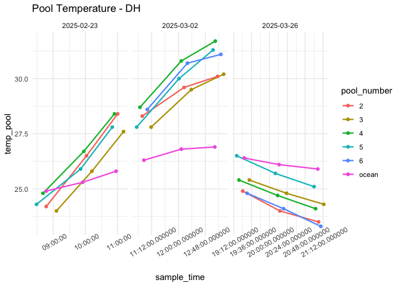
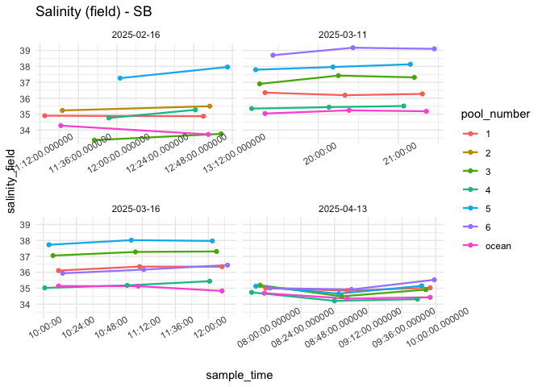
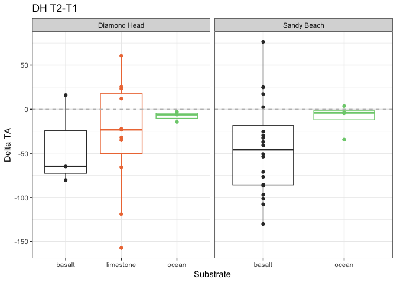
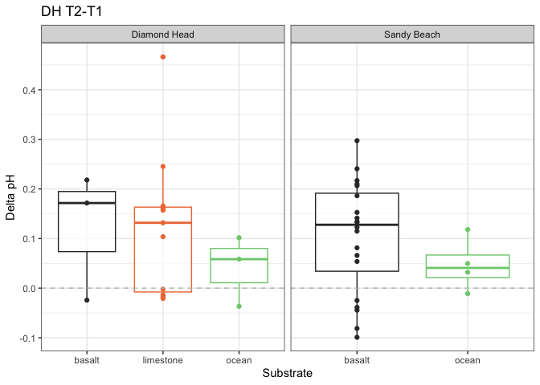

First Analysis
================
Micaela Chapuis
2025-02-25

## Load Libraries

``` r
library(tidyverse)
```

    ## ── Attaching core tidyverse packages ──────────────────────── tidyverse 2.0.0 ──
    ## ✔ dplyr     1.1.4     ✔ readr     2.1.5
    ## ✔ forcats   1.0.0     ✔ stringr   1.5.1
    ## ✔ ggplot2   3.5.1     ✔ tibble    3.2.1
    ## ✔ lubridate 1.9.4     ✔ tidyr     1.3.1
    ## ✔ purrr     1.0.2     
    ## ── Conflicts ────────────────────────────────────────── tidyverse_conflicts() ──
    ## ✖ dplyr::filter() masks stats::filter()
    ## ✖ dplyr::lag()    masks stats::lag()
    ## ℹ Use the conflicted package (<http://conflicted.r-lib.org/>) to force all conflicts to become errors

``` r
library(here)
```

    ## here() starts at /Users/micachapuis/GitHub/HawaiiTidepools

``` r
library(seacarb)
```

    ## Loading required package: oce
    ## Loading required package: gsw
    ## Loading required package: SolveSAPHE

``` r
library(lubridate)
library(car)
```

    ## Loading required package: carData
    ## 
    ## Attaching package: 'car'
    ## 
    ## The following object is masked from 'package:dplyr':
    ## 
    ##     recode
    ## 
    ## The following object is masked from 'package:purrr':
    ## 
    ##     some

## Load in Data n

``` r
chem <- read_csv(here("Test Sampling", "Data", "tidepool_chemistry.csv"))
params <- read_csv(here("Test Sampling", "Data", "tidepool_parameters.csv"))
pHSlope <- read_csv(here("Test Sampling", "Data", "pHSlope.csv"))
TA <- read_csv(here("Test Sampling", "Data", "total_alkalinity.csv"))
```

## Data cleaning and joining

Make all pool numbers factors

``` r
chem$pool_number <- factor(chem$pool_number)
params$pool_number <- factor(params$pool_number)
```

Remove junk samples from TA Data

``` r
junks <- c("junk1", "junk2", "junk3")
TA <- TA %>% filter(!sample_ID %in% junks)
```

Join in TA data

``` r
data <- left_join(chem, TA, by = "sample_ID")
```

Add in pH calculated from tris and physical parameters

``` r
data <- left_join(data, pHSlope)
```

    ## Joining with `by = join_by(date, sample_ID)`

``` r
data <- left_join(data, (params %>% select(site, pool_number, substrate, perimeter_m, surface_area_m2)), by = c("site", "pool_number"))
```

Selecting columns

``` r
data <- data %>% select(-observers, -notes, Sample.Index)
```

Removing DH Pool 1 (limestone + basalt)

``` r
data <- data %>% filter(!pool_ID == "dh_p1")
```

Adding in “ocean” as substrate

``` r
data <- data %>% mutate(substrate = replace_na(substrate, "ocean"))
```

Salinity Normalize TA

``` r
data <- data %>% mutate(TA_norm = TA*salinity_lab/35)
```

Calculate delta pH and delta TA

``` r
delta_calc <- data %>% 
  select(date, site, pool_number, substrate, time_point, temp_pool, sample_time, pH, TA_norm)  %>%
  group_by(date, site, pool_number, substrate) %>%  # group by metadata
  arrange(time_point, .by_group = TRUE) %>%  # ensure correct order
  reframe(
    delta_pH = case_when(
      site == "Diamond Head" ~ pH[time_point = 3] - pH[time_point = 1],  # Diamond Head (Time 3 - Time 1)
      site == "Sandy Beach" ~ pH[time_point = 2] - pH[time_point = 1]   # Sandy Beach (Time 2 - Time 1)
    ),
    delta_TA = case_when(
      site == "Diamond Head" ~ TA_norm[time_point = 3] - TA_norm[time_point = 1],  # Diamond Head (Time 3 - Time 1)
      site == "Sandy Beach" ~ TA_norm[time_point = 2] - TA_norm[time_point = 1]   # Sandy Beach (Time 2 - Time 1)
    ), 
    delta_temp = case_when(
      site == "Diamond Head" ~ temp_pool[time_point = 3] - temp_pool[time_point = 1],  # Diamond Head (Time 3 - Time 1)
      site == "Sandy Beach" ~ temp_pool[time_point = 2] - temp_pool[time_point = 1]   # Sandy Beach (Time 2 - Time 1)
    ), 
    delta_time = case_when(
      site == "Diamond Head" ~ as.numeric(difftime(sample_time[time_point = 3], sample_time[time_point = 1], units = "mins")),  # Time 3 - Time 1 for Diamond Head
      site == "Sandy Beach" ~ as.numeric(difftime(sample_time[time_point = 2], sample_time[time_point = 1], units = "mins"))   # Time 2 - Time 1 for Sandy Beach
    )
  ) %>% 
    distinct(date, site, pool_number, substrate, .keep_all = TRUE)  # Ensure only one row per pool
```

Doing it for just two timepoints for now (T1-T2)

``` r
delta_calc2 <- data %>% 
  select(date, site, pool_number, substrate, time_point, temp_pool, sample_time, pH, TA_norm)  %>%
  group_by(date, site, pool_number, substrate) %>%  # group by metadata
  arrange(time_point, .by_group = TRUE) %>%  # ensure correct order
  reframe(
    delta_pH = case_when(
      site == "Diamond Head" ~ pH[time_point = 2] - pH[time_point = 1],  # Diamond Head (Time 2 - Time 1)
      site == "Sandy Beach" ~ pH[time_point = 2] - pH[time_point = 1]   # Sandy Beach (Time 2 - Time 1)
    ),
    delta_TA = case_when(
      site == "Diamond Head" ~ TA_norm[time_point = 2] - TA_norm[time_point = 1],  # Diamond Head (Time 2 - Time 1)
      site == "Sandy Beach" ~ TA_norm[time_point = 2] - TA_norm[time_point = 1]   # Sandy Beach (Time 2 - Time 1)
    ), 
    delta_temp = case_when(
      site == "Diamond Head" ~ temp_pool[time_point = 2] - temp_pool[time_point = 1],  # Diamond Head (Time 2 - Time 1)
      site == "Sandy Beach" ~ temp_pool[time_point = 2] - temp_pool[time_point = 1]   # Sandy Beach (Time 2 - Time 1)
    ), 
    delta_time = case_when(
      site == "Diamond Head" ~ as.numeric(difftime(sample_time[time_point = 2], sample_time[time_point = 1], units = "mins")),  # Time 2 - Time 1 for Diamond Head
      site == "Sandy Beach" ~ as.numeric(difftime(sample_time[time_point = 2], sample_time[time_point = 1], units = "mins"))   # Time 2 - Time 1 for Sandy Beach
    )
  ) %>% 
    distinct(date, site, pool_number, substrate, .keep_all = TRUE)  # Ensure only one row per pool
```

Now T2-T3

``` r
delta_calc3 <- data %>% 
  select(date, site, pool_number, substrate, time_point, temp_pool, sample_time, pH, TA_norm)  %>%
  group_by(date, site, pool_number, substrate) %>%  # group by metadata
  arrange(time_point, .by_group = TRUE) %>%  # ensure correct order
  reframe(
    delta_pH = case_when(
      site == "Diamond Head" ~ pH[time_point = 3] - pH[time_point = 2],  # Diamond Head (Time 3 - Time 2)
      site == "Sandy Beach" ~ pH[time_point = 2] - pH[time_point = 1]   # Sandy Beach (Time 2 - Time 1)
    ),
    delta_TA = case_when(
      site == "Diamond Head" ~ TA_norm[time_point = 3] - TA_norm[time_point = 2],  # Diamond Head (Time 3 - Time 2)
      site == "Sandy Beach" ~ TA_norm[time_point = 2] - TA_norm[time_point = 1]   # Sandy Beach (Time 2 - Time 1)
    ), 
    delta_temp = case_when(
      site == "Diamond Head" ~ temp_pool[time_point = 3] - temp_pool[time_point = 2],  # Diamond Head (Time 3 - Time 2)
      site == "Sandy Beach" ~ temp_pool[time_point = 2] - temp_pool[time_point = 1]   # Sandy Beach (Time 2 - Time 1)
    ), 
    delta_time = case_when(
      site == "Diamond Head" ~ as.numeric(difftime(sample_time[time_point = 3], sample_time[time_point = 2], units = "mins")),  # Time 3 - Time 2 for Diamond Head
      site == "Sandy Beach" ~ as.numeric(difftime(sample_time[time_point = 2], sample_time[time_point = 1], units = "mins"))   # Time 2 - Time 1 for Sandy Beach
    )
  ) %>% 
    distinct(date, site, pool_number, substrate, .keep_all = TRUE)  # Ensure only one row per pool
```

## Data Viz!

### Temperature

``` r
data %>% ggplot(aes(x = sample_time, y = temp_pool, color = pool_number)) +
  facet_wrap(~site, scales = "free_x") + geom_line(linewidth = 0.8) + geom_point() + theme_minimal() + labs(title = "Pool Temperature") + theme(axis.text.x = element_text(angle = 30))
```

<!-- -->

``` r
data %>% filter(site == "Diamond Head") %>%
  ggplot(aes(x = sample_time, y = temp_pool, color = pool_number)) +   facet_wrap(~date, scales = "free_x") + geom_line(linewidth = 0.8) + geom_point() + theme_minimal() + labs(title = "Pool Temperature - DH")  + theme(axis.text.x = element_text(angle = 30)) 
```

<!-- -->

``` r
data %>% filter(site == "Sandy Beach") %>%
  ggplot(aes(x = sample_time, y = temp_pool, color = pool_number)) +   facet_wrap(~date, scales = "free_x") + geom_line(linewidth = 0.8) + geom_point() + theme_minimal() + labs(title = "Pool Temperature - SB")  + theme(axis.text.x = element_text(angle = 30))
```

<!-- -->

### pH

``` r
data %>% ggplot(aes(x = sample_time, y = pH, color = pool_number)) +
    facet_wrap(~site, scales = "free_x") + geom_line(linewidth = 0.8) + geom_point() + theme_minimal() + labs(title = "pH (tris)")  + theme(axis.text.x = element_text(angle = 30))
```

<!-- -->

``` r
data %>% ggplot(aes(x = sample_time, y = pH_probe, color = pool_number)) +
    facet_wrap(~site, scales = "free_x") + geom_line(linewidth = 0.8) + geom_point() + theme_minimal() + labs(title = "pH (probe)")  + theme(axis.text.x = element_text(angle = 30))
```

<!-- -->

``` r
data %>% filter(site == "Diamond Head") %>%
  ggplot(aes(x = sample_time, y = pH, color = pool_number)) +   facet_wrap(~date, scales = "free_x") + geom_line(linewidth = 0.8) + geom_point() + theme_minimal() + labs(title = "pH (tris) - DH")  + theme(axis.text.x = element_text(angle = 30))
```

<!-- -->

``` r
data %>% filter(site == "Sandy Beach") %>%
  ggplot(aes(x = sample_time, y = pH, color = pool_number)) +   facet_wrap(~date, scales = "free_x") + geom_line(linewidth = 0.8) + geom_point() + theme_minimal() + labs(title = "pH (tris) - SB")  + theme(axis.text.x = element_text(angle = 30))
```

<!-- -->

### TA

``` r
data %>% ggplot(aes(x = sample_time, y = TA_norm, color = pool_number)) +   facet_wrap(~site, scales = "free_x") + geom_line(linewidth = 0.8) + geom_point() + theme_minimal() + labs(title = "TA normalized")  + theme(axis.text.x = element_text(angle = 30))
```

<!-- -->

``` r
data %>% filter(site == "Diamond Head") %>%
  ggplot(aes(x = sample_time, y = TA_norm, color = pool_number)) +   facet_wrap(~date, scales = "free_x") + geom_line(linewidth = 0.8) + geom_point() + theme_minimal() + labs(title = "TA normalized - DH")  + theme(axis.text.x = element_text(angle = 30))
```

<!-- -->

``` r
data %>% filter(site == "Sandy Beach") %>%
  ggplot(aes(x = sample_time, y = TA_norm, color = pool_number)) +   facet_wrap(~date, scales = "free_x") + geom_line(linewidth = 0.8) + geom_point() + theme_minimal() + labs(title = "TA normalized - SB")  + theme(axis.text.x = element_text(angle = 30))
```

<!-- -->

### Salinity

``` r
data %>% ggplot(aes(x = sample_time, y = salinity_field, color = pool_number)) +   facet_wrap(~site, scales = "free_x") + geom_line(linewidth = 0.8) + geom_point() + theme_minimal() + labs(title = "Salinity (field)")  + theme(axis.text.x = element_text(angle = 30))
```

<!-- -->

``` r
data %>% filter(site == "Diamond Head") %>%
  ggplot(aes(x = sample_time, y = salinity_field, color = pool_number)) +   facet_wrap(~date, scales = "free_x") + geom_line(linewidth = 0.8) + geom_point() + theme_minimal() + labs(title = "Salinity (field) - DH")  + theme(axis.text.x = element_text(angle = 30))
```

<!-- -->

``` r
data %>% filter(site == "Sandy Beach") %>%
  ggplot(aes(x = sample_time, y = salinity_field, color = pool_number)) +   facet_wrap(~date, scales = "free_x") + geom_line(linewidth = 0.8) + geom_point() + theme_minimal() + labs(title = "Salinity (field) - SB")  + theme(axis.text.x = element_text(angle = 30))
```

<!-- -->

### Deltas

#### Delta TA

``` r
delta_calc %>% ggplot(aes(x = substrate, y = delta_TA, color = substrate)) + #, label = pool_number)) + 
  facet_wrap(~site, scales = "free_x") +
  geom_boxplot(alpha = 0.7) + 
  geom_point() + 
 # geom_text(hjust=0, vjust=0) +
  theme_bw() + 
  scale_color_manual(values = c("gray20", "sienna2", "palegreen3", "dodgerblue3")) +
  guides(color = "none") +
  labs(x = "Substrate", y = "Delta TA", title = "DH T3-T1") + 
  geom_hline(yintercept = 0, linetype = "dashed", color = "gray")
```

<!-- -->

``` r
delta_calc2 %>% ggplot(aes(x = substrate, y = delta_TA, color = substrate)) + #, label = pool_number)) + 
  facet_wrap(~site, scales = "free_x") +
  geom_boxplot(alpha = 0.7) + 
  geom_point() + 
 # geom_text(hjust=0, vjust=0) +
  theme_bw() + 
  scale_color_manual(values = c("gray20", "sienna2", "palegreen3", "dodgerblue3")) +
  guides(color = "none") +
  labs(x = "Substrate", y = "Delta TA", title = "DH T2-T1") + 
  geom_hline(yintercept = 0, linetype = "dashed", color = "gray")
```

<!-- -->

``` r
delta_calc3 %>% ggplot(aes(x = substrate, y = delta_TA, color = substrate)) + #, label = pool_number)) + 
  facet_wrap(~site, scales = "free_x") +
  geom_boxplot(alpha = 0.7) + 
  geom_point() + 
 # geom_text(hjust=0, vjust=0) +
  theme_bw() + 
  scale_color_manual(values = c("gray20", "sienna2", "palegreen3", "dodgerblue3")) +
  guides(color = "none") +
  labs(x = "Substrate", y = "Delta TA", title = "DH T3-T2") + 
  geom_hline(yintercept = 0, linetype = "dashed", color = "gray")
```

<!-- -->

#### Delta pH

``` r
delta_calc %>% ggplot(aes(x = substrate, y = delta_pH, color = substrate)) + #, label = pool_number)) + 
  facet_wrap(~site, scales = "free_x") +
  geom_boxplot(alpha = 0.7) + 
  geom_point() + 
#  geom_text(hjust=0, vjust=0) +
  theme_bw() + 
  scale_color_manual(values = c("gray20", "sienna2", "palegreen3", "dodgerblue3")) +
  guides(color = "none") +
  labs(x = "Substrate", y = "Delta pH", title = "DH T3-T1") + 
  geom_hline(yintercept = 0, linetype = "dashed", color = "gray")
```

<!-- -->

``` r
delta_calc2 %>% ggplot(aes(x = substrate, y = delta_pH, color = substrate)) + 
  facet_wrap(~site, scales = "free_x") +
  geom_boxplot(alpha = 0.7) + 
  geom_point() + 
  theme_bw() + 
  scale_color_manual(values = c("gray20", "sienna2", "palegreen3", "dodgerblue3")) +
  guides(color = "none") +
  labs(x = "Substrate", y = "Delta pH", title = "DH T2-T1") + 
  geom_hline(yintercept = 0, linetype = "dashed", color = "gray")
```

<!-- -->

``` r
delta_calc3 %>% ggplot(aes(x = substrate, y = delta_pH, color = substrate)) + 
  facet_wrap(~site, scales = "free_x") +
  geom_boxplot(alpha = 0.7) + 
  geom_point() + 
  theme_bw() + 
  scale_color_manual(values = c("gray20", "sienna2", "palegreen3", "dodgerblue3")) +
  guides(color = "none") +
  labs(x = "Substrate", y = "Delta pH", title = "DH T3-T2") + 
  geom_hline(yintercept = 0, linetype = "dashed", color = "gray")
```

<!-- -->

#### Delta TA vs Delta pH

``` r
delta_calc %>% 
  filter(substrate == "limestone" | substrate == "basalt") %>%
  ggplot(aes(x = delta_pH, y = delta_TA, color = substrate)) + 
  facet_wrap(~site, scales = "free_x") +
  geom_point() + 
  theme_bw() + 
  scale_color_manual(values = c("gray20", "sienna2")) +
  guides(color = "none") +
  labs(x = "Delta pH", y = "Delta TA", title = "DH T3-T1") 
```

<!-- -->

``` r
delta_calc2 %>% 
  filter(substrate == "limestone" | substrate == "basalt") %>%
  ggplot(aes(x = delta_pH, y = delta_TA, color = substrate)) + 
  facet_wrap(~site, scales = "free_x") +
  geom_point() + 
  theme_bw() + 
  scale_color_manual(values = c("gray20", "sienna2")) +
  guides(color = "none") +
  labs(x = "Delta pH", y = "Delta TA", title = "DH T2-T1") 
```

<!-- -->

``` r
delta_calc3 %>% 
  filter(substrate == "limestone" | substrate == "basalt") %>%
  ggplot(aes(x = delta_pH, y = delta_TA, color = substrate)) + 
  facet_wrap(~site, scales = "free_x") +
  geom_point() + 
  theme_bw() + 
  scale_color_manual(values = c("gray20", "sienna2")) +
  guides(color = "none") +
  labs(x = "Delta pH", y = "Delta TA", title = "DH T3-T2") 
```

<!-- -->

#### Delta Temp vs Delta pH

``` r
delta_calc %>% 
  filter(substrate == "limestone" | substrate == "basalt") %>%
  ggplot(aes(x = delta_temp, y = delta_pH, color = substrate)) + 
  facet_wrap(~site, scales = "free_x") +
  geom_point() + 
  theme_bw() + 
  scale_color_manual(values = c("gray20", "sienna2")) +
  guides(color = "none") +
  labs(x = "Delta Temperature", y = "Delta pH", title = "DH T3-T1") 
```

<!-- -->

## Models

### ph vs params

``` r
model1 <- lm(pH ~ sample_time + perimeter_m + surface_area_m2, data = data)
summary(model1)
```

    ## 
    ## Call:
    ## lm(formula = pH ~ sample_time + perimeter_m + surface_area_m2, 
    ##     data = data)
    ## 
    ## Residuals:
    ##     Min      1Q  Median      3Q     Max 
    ## -0.4119 -0.1717 -0.0183  0.1548  0.6892 
    ## 
    ## Coefficients:
    ##                   Estimate Std. Error t value Pr(>|t|)    
    ## (Intercept)      7.972e+00  8.800e-02  90.592  < 2e-16 ***
    ## sample_time      7.501e-06  1.554e-06   4.826  5.9e-06 ***
    ## perimeter_m     -1.006e-02  5.342e-03  -1.883    0.063 .  
    ## surface_area_m2  2.257e-02  1.520e-02   1.485    0.141    
    ## ---
    ## Signif. codes:  0 '***' 0.001 '**' 0.01 '*' 0.05 '.' 0.1 ' ' 1
    ## 
    ## Residual standard error: 0.2426 on 87 degrees of freedom
    ##   (26 observations deleted due to missingness)
    ## Multiple R-squared:  0.2396, Adjusted R-squared:  0.2134 
    ## F-statistic: 9.139 on 3 and 87 DF,  p-value: 2.539e-05

``` r
Anova(model1)
```

    ## Anova Table (Type II tests)
    ## 
    ## Response: pH
    ##                 Sum Sq Df F value    Pr(>F)    
    ## sample_time     1.3702  1 23.2883 5.902e-06 ***
    ## perimeter_m     0.2087  1  3.5473   0.06298 .  
    ## surface_area_m2 0.1298  1  2.2060   0.14109    
    ## Residuals       5.1188 87                      
    ## ---
    ## Signif. codes:  0 '***' 0.001 '**' 0.01 '*' 0.05 '.' 0.1 ' ' 1

### TA vs params

``` r
model2 <- lm(TA ~ sample_time + perimeter_m + surface_area_m2, data = data)
summary(model2)
```

    ## 
    ## Call:
    ## lm(formula = TA ~ sample_time + perimeter_m + surface_area_m2, 
    ##     data = data)
    ## 
    ## Residuals:
    ##     Min      1Q  Median      3Q     Max 
    ## -371.98 -114.95   42.76  106.23  236.01 
    ## 
    ## Coefficients:
    ##                   Estimate Std. Error t value Pr(>|t|)    
    ## (Intercept)      2.260e+03  5.471e+01  41.307   <2e-16 ***
    ## sample_time     -1.295e-03  9.664e-04  -1.340    0.184    
    ## perimeter_m      1.016e+00  3.321e+00   0.306    0.760    
    ## surface_area_m2 -2.678e+00  9.447e+00  -0.284    0.777    
    ## ---
    ## Signif. codes:  0 '***' 0.001 '**' 0.01 '*' 0.05 '.' 0.1 ' ' 1
    ## 
    ## Residual standard error: 150.8 on 87 degrees of freedom
    ##   (26 observations deleted due to missingness)
    ## Multiple R-squared:  0.02152,    Adjusted R-squared:  -0.01222 
    ## F-statistic: 0.6377 on 3 and 87 DF,  p-value: 0.5928

``` r
Anova(model2)
```

    ## Anova Table (Type II tests)
    ## 
    ## Response: TA
    ##                  Sum Sq Df F value Pr(>F)
    ## sample_time       40814  1  1.7948 0.1838
    ## perimeter_m        2130  1  0.0936 0.7603
    ## surface_area_m2    1828  1  0.0804 0.7775
    ## Residuals       1978461 87

### ph vs TA

``` r
model3 <- lm(pH ~ TA, data)
summary(model3)
```

    ## 
    ## Call:
    ## lm(formula = pH ~ TA, data = data)
    ## 
    ## Residuals:
    ##      Min       1Q   Median       3Q      Max 
    ## -0.36390 -0.12019 -0.02608  0.13313  0.32519 
    ## 
    ## Coefficients:
    ##               Estimate Std. Error t value Pr(>|t|)    
    ## (Intercept) 11.5910666  0.2353692   49.25   <2e-16 ***
    ## TA          -0.0015091  0.0001063  -14.20   <2e-16 ***
    ## ---
    ## Signif. codes:  0 '***' 0.001 '**' 0.01 '*' 0.05 '.' 0.1 ' ' 1
    ## 
    ## Residual standard error: 0.1572 on 115 degrees of freedom
    ## Multiple R-squared:  0.6368, Adjusted R-squared:  0.6336 
    ## F-statistic: 201.6 on 1 and 115 DF,  p-value: < 2.2e-16

### pH vs substrate

``` r
model4 <- lm(pH ~ substrate, data)
summary(model4)
```

    ## 
    ## Call:
    ## lm(formula = pH ~ substrate, data = data)
    ## 
    ## Residuals:
    ##      Min       1Q   Median       3Q      Max 
    ## -0.58154 -0.12656 -0.01449  0.10988  0.70968 
    ## 
    ## Coefficients:
    ##                     Estimate Std. Error t value Pr(>|t|)    
    ## (Intercept)         8.295278   0.031077 266.927  < 2e-16 ***
    ## substratelimestone -0.007992   0.053280  -0.150 0.881034    
    ## substrateocean     -0.218985   0.063689  -3.438 0.000818 ***
    ## ---
    ## Signif. codes:  0 '***' 0.001 '**' 0.01 '*' 0.05 '.' 0.1 ' ' 1
    ## 
    ## Residual standard error: 0.2486 on 114 degrees of freedom
    ## Multiple R-squared:  0.09931,    Adjusted R-squared:  0.08351 
    ## F-statistic: 6.285 on 2 and 114 DF,  p-value: 0.002575

``` r
Anova(model4)
```

    ## Anova Table (Type II tests)
    ## 
    ## Response: pH
    ##           Sum Sq  Df F value   Pr(>F)   
    ## substrate 0.7769   2  6.2847 0.002575 **
    ## Residuals 7.0463 114                    
    ## ---
    ## Signif. codes:  0 '***' 0.001 '**' 0.01 '*' 0.05 '.' 0.1 ' ' 1

### TA vs substrate

``` r
model5 <- lm(TA ~ substrate, data)
summary(model5)
```

    ## 
    ## Call:
    ## lm(formula = TA ~ substrate, data = data)
    ## 
    ## Residuals:
    ##     Min      1Q  Median      3Q     Max 
    ## -391.11  -69.20   25.46   77.99  265.51 
    ## 
    ## Coefficients:
    ##                    Estimate Std. Error t value Pr(>|t|)    
    ## (Intercept)         2188.25      16.94 129.198   <2e-16 ***
    ## substratelimestone    31.26      29.04   1.077   0.2840    
    ## substrateocean        77.02      34.71   2.219   0.0285 *  
    ## ---
    ## Signif. codes:  0 '***' 0.001 '**' 0.01 '*' 0.05 '.' 0.1 ' ' 1
    ## 
    ## Residual standard error: 135.5 on 114 degrees of freedom
    ## Multiple R-squared:  0.04314,    Adjusted R-squared:  0.02635 
    ## F-statistic:  2.57 on 2 and 114 DF,  p-value: 0.08099

``` r
Anova(model5)
```

    ## Anova Table (Type II tests)
    ## 
    ## Response: TA
    ##            Sum Sq  Df F value  Pr(>F)  
    ## substrate   94356   2  2.5696 0.08099 .
    ## Residuals 2093000 114                  
    ## ---
    ## Signif. codes:  0 '***' 0.001 '**' 0.01 '*' 0.05 '.' 0.1 ' ' 1

### temp vs substrate

``` r
model6 <- lm(temp_pool ~ substrate, data)
summary(model6)
```

    ## 
    ## Call:
    ## lm(formula = temp_pool ~ substrate, data = data)
    ## 
    ## Residuals:
    ##     Min      1Q  Median      3Q     Max 
    ## -4.2735 -2.2242 -0.3242  1.4265  8.5855 
    ## 
    ## Coefficients:
    ##                    Estimate Std. Error t value Pr(>|t|)    
    ## (Intercept)         26.2735     0.3304  79.532   <2e-16 ***
    ## substratelimestone   0.7507     0.5664   1.325    0.188    
    ## substrateocean      -0.8799     0.6770  -1.300    0.196    
    ## ---
    ## Signif. codes:  0 '***' 0.001 '**' 0.01 '*' 0.05 '.' 0.1 ' ' 1
    ## 
    ## Residual standard error: 2.643 on 114 degrees of freedom
    ## Multiple R-squared:  0.04054,    Adjusted R-squared:  0.02371 
    ## F-statistic: 2.408 on 2 and 114 DF,  p-value: 0.09453

``` r
Anova(model6)
```

    ## Anova Table (Type II tests)
    ## 
    ## Response: temp_pool
    ##           Sum Sq  Df F value  Pr(>F)  
    ## substrate  33.64   2  2.4083 0.09453 .
    ## Residuals 796.24 114                  
    ## ---
    ## Signif. codes:  0 '***' 0.001 '**' 0.01 '*' 0.05 '.' 0.1 ' ' 1
