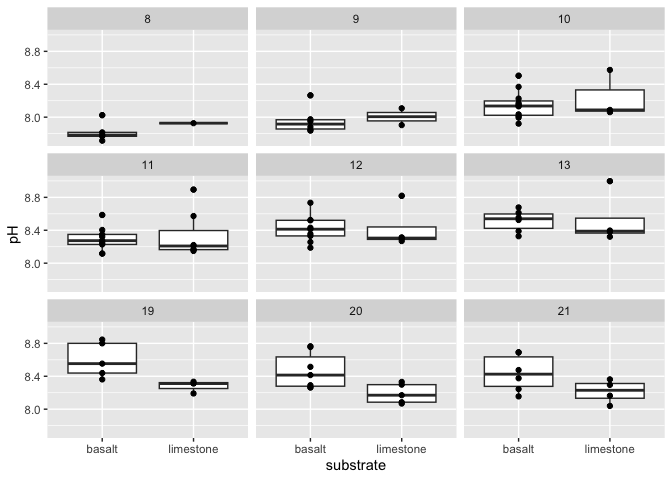

Second Analysis
================
Micaela Chapuis
2025-04-08

## Load Libraries

``` r
library(tidyverse)
library(here)
library(seacarb)
library(lubridate)
library(car)
```

## Load in Data

``` r
chem <- read_csv(here("Test Sampling", "Data", "tidepool_chemistry.csv"))
params <- read_csv(here("Test Sampling", "Data", "tidepool_parameters.csv"))
pHSlope <- read_csv(here("Test Sampling", "Data", "pHSlope.csv"))
TA <- read_csv(here("Test Sampling", "Data", "total_alkalinity.csv"))
```

## Data cleaning and joining

Make all pool numbers factors

``` r
chem$pool_number <- factor(chem$pool_number)
params$pool_number <- factor(params$pool_number)
```

Remove junk samples from TA Data

``` r
junks <- c("junk1", "junk2", "junk3")
TA <- TA %>% filter(!sample_ID %in% junks)
```

Join in TA data

``` r
data <- left_join(chem, TA, by = "sample_ID")
```

Add in pH calculated from tris and physical parameters

``` r
data <- left_join(data, pHSlope)
```

    ## Joining with `by = join_by(date, sample_ID)`

``` r
data <- left_join(data, (params %>% select(site, pool_number, substrate, perimeter_m, surface_area_m2)), by = c("site", "pool_number"))
```

Selecting columns

``` r
data <- data %>% select(-observers, -notes, Sample.Index)
```

Removing DH Pool 1 (limestone + basalt)

``` r
data <- data %>% filter(!pool_ID == "dh_p1")
```

Adding in “ocean” as substrate

``` r
data <- data %>% mutate(substrate = replace_na(substrate, "ocean"))
```

Salinity Normalize TA

``` r
data <- data %>% mutate(TA_norm = TA*salinity_lab/35)
```

Calculate delta pH and delta TA

``` r
delta_calc <- data %>% 
  select(date, site, pool_number, substrate, day_night, time_point, temp_pool, sample_time, pH, TA_norm)  %>%
  group_by(date, site, pool_number, substrate, day_night) %>%  # group by metadata
  arrange(time_point, .by_group = TRUE) %>%  # ensure correct order
  reframe(
    delta_pH = if_else((date == "2025-02-16"), 
                       (pH[time_point = 2] - pH[time_point = 1]), # Sandy Beach 1st time (Time 2 - Time 1)
                       (pH[time_point = 3] - pH[time_point = 1])),   # (Time 3 - Time 1)
    
    delta_TA = if_else((date == "2025-02-16"), 
                       (TA_norm[time_point = 2] - TA_norm[time_point = 1]), # Sandy Beach 1st time (Time 2 - Time 1)
                       (TA_norm[time_point = 3] - TA_norm[time_point = 1])),  # (Time 3 - Time 1)

    delta_temp = if_else((date == "2025-02-16"), 
                       (temp_pool[time_point = 2] - temp_pool[time_point = 1]), # Sandy Beach 1st time (Time 2 - Time 1)
                       (temp_pool[time_point = 3] - temp_pool[time_point = 1])),  # (Time 3 - Time 1)

    delta_time = if_else((date == "2025-02-16"), 
                       (as.numeric(difftime(sample_time[time_point = 2], sample_time[time_point = 1], units = "mins"))), # Sandy Beach 1st time (Time 2 - Time 1)
                       (as.numeric(difftime(sample_time[time_point = 3], sample_time[time_point = 1], units = "mins"))))  # Time 3 - Time 1
    
  ) %>% 
    distinct(date, site, pool_number, substrate, .keep_all = TRUE)  # Ensure only one row per pool
```

## Data Viz

``` r
plot(data$salinity_field, data$salinity_lab)
```

<!-- -->

``` r
data %>% filter(!substrate %in% "ocean") %>% ggplot(aes(x = day_night, y = pH)) + geom_boxplot() + geom_point() + facet_wrap(~substrate)
```

<!-- -->

``` r
data %>% filter(!substrate %in% "ocean") %>% ggplot(aes(x = day_night, y = TA_norm)) + geom_boxplot() + geom_point() + facet_wrap(~substrate)
```

<!-- -->

``` r
data %>% group_by(site, pool_number) %>% mutate(pH_mean = mean(pH)) %>%
  filter(!substrate %in% "ocean") %>% ggplot(aes(x = day_night, y = pH_mean)) + geom_boxplot() + geom_point() + facet_wrap(~substrate)
```

<!-- -->

``` r
delta_calc %>% filter(!substrate %in% "ocean") %>% ggplot(aes(x = day_night, y = delta_TA)) + geom_boxplot() + geom_point() + facet_wrap(~substrate)
```

<!-- -->

``` r
delta_calc %>% filter(!substrate %in% "ocean") %>% ggplot(aes(x = day_night, y = delta_pH)) + geom_boxplot() + geom_point() + facet_wrap(~substrate)
```

<!-- -->

``` r
data %>% ggplot(aes(x = sample_time, y = pH)) +
    facet_wrap(~substrate) + geom_smooth() + geom_point() + theme_minimal() + labs(title = "pH (tris)")  + theme(axis.text.x = element_text(angle = 30))
```

    ## `geom_smooth()` using method = 'loess' and formula = 'y ~ x'

<!-- -->

``` r
data %>% ggplot(aes(x = sample_time, y = TA_norm)) +
    facet_wrap(~substrate) + geom_smooth() + geom_point() + theme_minimal() + labs(title = "TA Norm")  + theme(axis.text.x = element_text(angle = 30))
```

    ## `geom_smooth()` using method = 'loess' and formula = 'y ~ x'

<!-- -->

``` r
data %>% filter(!substrate %in% "ocean") %>% ggplot(aes(x = pH, y = TA_norm)) + geom_point() + geom_smooth(method = "lm") + facet_wrap(~substrate)
```

    ## `geom_smooth()` using formula = 'y ~ x'

<!-- -->

``` r
delta_calc %>% 
  filter(substrate == "limestone" | substrate == "basalt") %>%
  ggplot(aes(x = delta_pH, y = delta_TA)) + 
  facet_wrap(~substrate) +
  geom_point() + 
  geom_smooth(method = "lm") + 
  theme_bw() + 
  scale_color_manual(values = c("gray20", "sienna2")) +
  guides(color = "none") +
  labs(x = "Delta pH", y = "Delta TA") 
```

    ## `geom_smooth()` using formula = 'y ~ x'

<!-- -->
