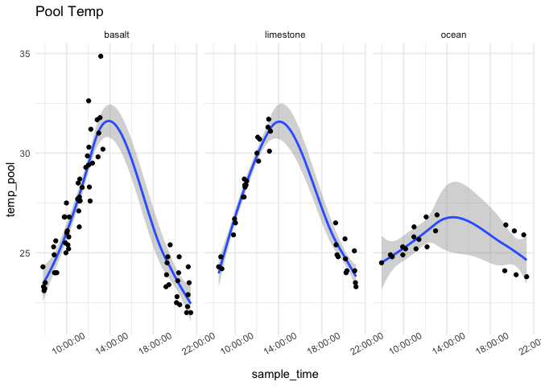
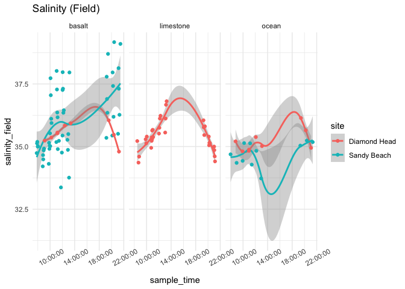

Second Analysis
================
Micaela Chapuis
2025-04-08

## Load Libraries

``` r
library(tidyverse)
library(here)
library(seacarb)
library(lubridate)
library(car)
library(lubridateExtras)
library(lme4)
library(scales)
library(ggeffects)
library(sjPlot)
```

## Load in Data

``` r
chem <- read_csv(here("Test Sampling", "Data", "tidepool_chemistry.csv"))
params <- read_csv(here("Test Sampling", "Data", "tidepool_parameters.csv"))
pHSlope <- read_csv(here("Test Sampling", "Data", "pHSlope.csv"))
TA <- read_csv(here("Test Sampling", "Data", "total_alkalinity.csv"))
```

## Data cleaning and joining

Make all pool numbers factors

``` r
chem$pool_number <- factor(chem$pool_number)
params$pool_number <- factor(params$pool_number)
```

Remove junk samples from TA Data

``` r
junks <- c("junk1", "junk2", "junk3")
TA <- TA %>% filter(!sample_ID %in% junks)
```

Join in TA data

``` r
data <- left_join(chem, TA, by = "sample_ID")
```

Add in pH calculated from tris and physical parameters

``` r
data <- left_join(data, pHSlope)
```

    ## Joining with `by = join_by(date, sample_ID)`

``` r
data <- left_join(data, (params %>% select(site, pool_number, substrate, perimeter_m, surface_area_m2)), by = c("site", "pool_number"))
```

Selecting columns

``` r
data <- data %>% select(-observers, -notes, Sample.Index)
```

Removing DH Pool 1 (limestone + basalt)

``` r
data <- data %>% filter(!pool_ID == "dh_p1")
```

Adding in “ocean” as substrate

``` r
data <- data %>% mutate(substrate = replace_na(substrate, "ocean"))
```

Salinity Normalize TA

``` r
data <- data %>% mutate(TA_norm = TA*salinity_lab/35)
```

Rounding sample time

``` r
data <- data %>% mutate(round_time = round_hms(sample_time, "hour"),
                        rounded_time = hour(round_time))
```

Calculate delta pH and delta TA

``` r
delta_calc <- data %>% 
  select(date, site, pool_number, pool_ID, substrate, day_night, time_point, temp_pool, sample_time, pH, TA_norm)  %>%
  group_by(date, site, pool_number, pool_ID, substrate, day_night) %>%  # group by metadata
  arrange(time_point, .by_group = TRUE) %>%  # ensure correct order
  reframe(
    delta_pH = if_else((date == "2025-02-16"), 
                       (pH[time_point = 2] - pH[time_point = 1]), # Sandy Beach 1st time (Time 2 - Time 1)
                       (pH[time_point = 3] - pH[time_point = 1])),   # (Time 3 - Time 1)
    
    delta_TA = if_else((date == "2025-02-16"), 
                       (TA_norm[time_point = 2] - TA_norm[time_point = 1]), # Sandy Beach 1st time (Time 2 - Time 1)
                       (TA_norm[time_point = 3] - TA_norm[time_point = 1])),  # (Time 3 - Time 1)

    delta_temp = if_else((date == "2025-02-16"), 
                       (temp_pool[time_point = 2] - temp_pool[time_point = 1]), # Sandy Beach 1st time (Time 2 - Time 1)
                       (temp_pool[time_point = 3] - temp_pool[time_point = 1])),  # (Time 3 - Time 1)

    delta_time = if_else((date == "2025-02-16"), 
                       (as.numeric(difftime(sample_time[time_point = 2], sample_time[time_point = 1], units = "mins"))), # Sandy Beach 1st time (Time 2 - Time 1)
                       (as.numeric(difftime(sample_time[time_point = 3], sample_time[time_point = 1], units = "mins"))))  # Time 3 - Time 1
    
  ) %>% 
    distinct(date, site, pool_number, substrate, .keep_all = TRUE)  # Ensure only one row per pool
```

Normalize delta pH and TA to by hour

``` r
delta_calc <- delta_calc %>% mutate(delta_pH_norm = (delta_pH/delta_time)*60,
                                    delta_TA_norm = (delta_TA/delta_time)*60)
```

## Data Viz

``` r
plot(data$salinity_field, data$salinity_lab)
```

<!-- -->

``` r
data %>% filter(!substrate %in% "ocean") %>% ggplot(aes(x = substrate, y = pH)) + geom_boxplot() + geom_point() + facet_wrap(~rounded_time)
```

<!-- -->

``` r
data %>% filter(!substrate %in% "ocean") %>% ggplot(aes(x = substrate, y = TA_norm)) + geom_boxplot() + geom_point() + facet_wrap(~rounded_time)
```

<!-- -->

``` r
# mean pH for each tidepool
data %>% group_by(site, pool_number) %>% mutate(pH_mean = mean(pH)) %>%
  filter(!substrate %in% "ocean") %>% ggplot(aes(x = substrate, y = pH_mean)) + geom_boxplot() + geom_point() + facet_wrap(~day_night)
```

<!-- -->

``` r
# mean pH for each date
data %>% group_by(date, site) %>% mutate(pH_mean = mean(pH)) %>%
  filter(!substrate %in% "ocean") %>% ggplot(aes(x = substrate, y = pH_mean)) + geom_boxplot() + geom_point() + facet_wrap(~day_night)
```

<!-- -->

``` r
# for night the basalt point at the same ph as limestone is DH basalt, for day DH basalt is higher point ~8.4 and ~8.2
```

``` r
delta_calc %>% filter(!substrate %in% "ocean") %>% ggplot(aes(x = substrate, y = delta_TA)) + geom_boxplot() + geom_point() + facet_wrap(~day_night)
```

<!-- -->

``` r
delta_calc %>% filter(!substrate %in% "ocean") %>% ggplot(aes(x = substrate, y = delta_pH)) + geom_boxplot() + geom_point() + facet_wrap(~day_night)
```

<!-- -->

``` r
data %>% ggplot(aes(x = sample_time, y = temp_pool)) +
    facet_wrap(~substrate) + geom_smooth() + geom_point() + theme_minimal() + labs(title = "Pool Temp")  + theme(axis.text.x = element_text(angle = 30))
```

    ## `geom_smooth()` using method = 'loess' and formula = 'y ~ x'

<!-- -->

``` r
# committee meeting fig
data %>% ggplot(aes(x = sample_time, y = temp_pool, color = substrate)) +
    facet_wrap(~substrate, 
               labeller = as_labeller(c(basalt = "Basalt", limestone = "Limestone", ocean = "Ocean"))) + 
  geom_smooth(method = "gam", se=FALSE) + 
  geom_point() + theme_bw() +
  labs(x = "Sample Time", y = "Temperature (°C)")  + 
  guides(color = "none") +
  theme(axis.text.x = element_text(angle = 25)) 
```

    ## `geom_smooth()` using formula = 'y ~ s(x, bs = "cs")'

<!-- -->

``` r
data %>% ggplot(aes(x = sample_time, y = salinity_field)) +
    facet_wrap(~substrate) + geom_smooth() + geom_point() + theme_minimal() + labs(title = "Salinity (Field)")  + theme(axis.text.x = element_text(angle = 30))
```

    ## `geom_smooth()` using method = 'loess' and formula = 'y ~ x'

<!-- -->

``` r
data %>% ggplot(aes(x = sample_time, y = salinity_field, color= site)) +
    facet_wrap(~substrate) + geom_smooth() + geom_point() + theme_minimal() + labs(title = "Salinity (Field)")  + theme(axis.text.x = element_text(angle = 30))
```

    ## `geom_smooth()` using method = 'loess' and formula = 'y ~ x'

<!-- -->

``` r
# committee meeting fig
data %>% ggplot(aes(x = sample_time, y = salinity_field, color = substrate)) +
    facet_wrap(~substrate, 
               labeller = as_labeller(c(basalt = "Basalt", limestone = "Limestone", ocean = "Ocean"))) + 
  geom_smooth(method = "gam", se=FALSE) + 
  geom_point() + theme_bw() +
  labs(x = "Sample Time", y = "Salinity")  + 
  guides(color = "none") +
  theme(axis.text.x = element_text(angle = 25)) 
```

    ## `geom_smooth()` using formula = 'y ~ s(x, bs = "cs")'

<!-- -->

``` r
data %>% ggplot(aes(x = sample_time, y = pH, color = substrate)) +
    facet_wrap(~substrate) + 
  geom_smooth(method = "gam", se=FALSE) + 
  geom_point() + theme_minimal() +
  labs(title = "pH (tris)")  + 
  theme(axis.text.x = element_text(angle = 30))
```

    ## `geom_smooth()` using formula = 'y ~ s(x, bs = "cs")'

<!-- -->

``` r
# committee meeting fig
data %>% ggplot(aes(x = sample_time, y = pH, color = substrate)) +
    facet_wrap(~substrate, 
               labeller = as_labeller(c(basalt = "Basalt", limestone = "Limestone", ocean = "Ocean"))) + 
  geom_smooth(method = "gam", se=FALSE) + 
  geom_point() + theme_bw() +
  labs(x = "Sample Time")  + 
  guides(color = "none") +
  theme(axis.text.x = element_text(size = 11, angle = 25),
        axis.text.y = element_text(size = 11),
        axis.title = element_text(size = 14),
        strip.text.x = element_text(size = 14)) 
```

    ## `geom_smooth()` using formula = 'y ~ s(x, bs = "cs")'

<!-- -->

``` r
data %>% ggplot(aes(x = sample_time, y = TA_norm)) +
    facet_wrap(~substrate) +
  geom_smooth(method = "gam", se=FALSE) + 
  geom_point() + 
  theme_minimal() + 
  labs(title = "TA Norm")  +
  theme(axis.text.x = element_text(angle = 30))
```

    ## `geom_smooth()` using formula = 'y ~ s(x, bs = "cs")'

<!-- -->

``` r
# committee meeting fig
data %>% ggplot(aes(x = sample_time, y = TA_norm, color = site)) +
    facet_wrap(~substrate, 
               labeller = as_labeller(c(basalt = "Basalt", limestone = "Limestone", ocean = "Ocean"))) + 
  geom_smooth(method = "gam", se=FALSE) + 
  geom_point() + theme_bw() +
  labs(x = "Sample Time", y = "Total Alkalinity")  + 
  guides(color = "none") +
  theme(axis.text.x = element_text(angle = 25)) 
```

    ## `geom_smooth()` using formula = 'y ~ s(x, bs = "cs")'

    ## Warning: Failed to fit group 1.
    ## Failed to fit group 1.
    ## Caused by error in `smooth.construct.cr.smooth.spec()`:
    ## ! x has insufficient unique values to support 10 knots: reduce k.

<!-- -->

``` r
# committee meeting figure
data %>% 
  filter(!substrate %in% "ocean") %>% 
  ggplot(aes(x = pH, y = TA_norm)) + 
  geom_point() + 
  geom_smooth(method = "lm") + 
  facet_wrap(~substrate, 
               labeller = as_labeller(c(basalt = "Basalt", limestone = "Limestone"))) +
  theme_bw() + 
  labs(x = "pH", y = "Total Alkalinity") 
```

    ## `geom_smooth()` using formula = 'y ~ x'

<!-- -->

``` r
# committee meeting figure
delta_calc %>% 
  filter(substrate == "limestone" | substrate == "basalt") %>%
  ggplot(aes(x = delta_pH_norm, y = delta_TA_norm)) + 
  facet_wrap(~substrate, 
               labeller = as_labeller(c(basalt = "Basalt", limestone = "Limestone", ocean = "Ocean"))) +
  geom_point(aes(color = date)) + 
  geom_smooth(method = "lm") + 
  theme_bw() + 
  labs(x = "Delta pH/Hour", y = "Delta TA/Hour") 
```

    ## `geom_smooth()` using formula = 'y ~ x'

<!-- -->

``` r
delta_calc %>% 
  filter(substrate == "limestone" | substrate == "basalt") %>%
  ggplot(aes(x = delta_pH_norm, y = delta_temp)) + 
  facet_wrap(~substrate, 
               labeller = as_labeller(c(basalt = "Basalt", limestone = "Limestone", ocean = "Ocean"))) +
  geom_point(aes(color = date)) + 
  geom_smooth(method = "lm") + 
  theme_bw() + 
  labs(x = "Delta pH/Hour", y = "Delta Temp") 
```

    ## `geom_smooth()` using formula = 'y ~ x'

<!-- -->

------------------------------------------------------------------------

``` r
#producers <- read_csv(here("Test Sampling", "Data", "prodcover.csv"))
producers <- read_csv(here("Test Sampling", "Data", "producers.csv"))
new_data <- left_join(data, producers, by = "pool_ID")
new_delta_calc <- left_join(delta_calc, producers, by = "pool_ID")
```

``` r
new_delta_calc %>% ggplot(aes(x = (turf_cyano_cover+macro_cover), y = delta_pH)) + geom_point()
```

    ## Warning: Removed 8 rows containing missing values or values outside the scale range
    ## (`geom_point()`).

<!-- -->

Mean Ph

``` r
mean_ph <- data %>% group_by(pool_ID, substrate) %>% summarise(mean_pH = mean(pH)) 
```

    ## `summarise()` has grouped output by 'pool_ID'. You can override using the
    ## `.groups` argument.

``` r
mean_pH_day <- data %>% filter(day_night == "day") %>% group_by(pool_ID, substrate) %>% summarise(mean_pH = mean(pH))
```

    ## `summarise()` has grouped output by 'pool_ID'. You can override using the
    ## `.groups` argument.

``` r
mean_ph <- left_join(mean_ph, producers, by = "pool_ID")
mean_pH_day <- left_join(mean_pH_day, producers, by = "pool_ID")
```

``` r
mod1 <- lm(mean_pH ~ turf_cyano_cover*substrate.x + macro_cover*substrate.x, data = mean_ph)
summary(mod1)
```

    ## 
    ## Call:
    ## lm(formula = mean_pH ~ turf_cyano_cover * substrate.x + macro_cover * 
    ##     substrate.x, data = mean_ph)
    ## 
    ## Residuals:
    ##          2          3          4          5          6          8         10 
    ## -1.821e-05 -5.543e-03 -3.445e-04  3.571e-05  3.270e-04 -5.051e-02 -8.253e-02 
    ##         11         12         13 
    ##  1.634e-03  3.164e-02  1.053e-01 
    ## 
    ## Coefficients:
    ##                                         Estimate Std. Error t value Pr(>|t|)
    ## (Intercept)                            8.2385734  0.0572040 144.021 1.39e-08
    ## turf_cyano_cover                       0.0007983  0.0014708   0.543   0.6161
    ## substrate.xlimestone                  -0.3842846  0.1244773  -3.087   0.0367
    ## macro_cover                            0.0060431  0.0052964   1.141   0.3176
    ## turf_cyano_cover:substrate.xlimestone  0.0107393  0.0033105   3.244   0.0316
    ## substrate.xlimestone:macro_cover       0.0032111  0.0084126   0.382   0.7221
    ##                                          
    ## (Intercept)                           ***
    ## turf_cyano_cover                         
    ## substrate.xlimestone                  *  
    ## macro_cover                              
    ## turf_cyano_cover:substrate.xlimestone *  
    ## substrate.xlimestone:macro_cover         
    ## ---
    ## Signif. codes:  0 '***' 0.001 '**' 0.01 '*' 0.05 '.' 0.1 ' ' 1
    ## 
    ## Residual standard error: 0.07329 on 4 degrees of freedom
    ##   (3 observations deleted due to missingness)
    ## Multiple R-squared:  0.8417, Adjusted R-squared:  0.6437 
    ## F-statistic: 4.252 on 5 and 4 DF,  p-value: 0.09286

``` r
anova(mod1)
```

    ## Analysis of Variance Table
    ## 
    ## Response: mean_pH
    ##                              Df   Sum Sq  Mean Sq F value  Pr(>F)  
    ## turf_cyano_cover              1 0.043421 0.043421  8.0832 0.04672 *
    ## substrate.x                   1 0.000585 0.000585  0.1090 0.75790  
    ## macro_cover                   1 0.007972 0.007972  1.4841 0.29008  
    ## turf_cyano_cover:substrate.x  1 0.061448 0.061448 11.4389 0.02773 *
    ## substrate.x:macro_cover       1 0.000783 0.000783  0.1457 0.72209  
    ## Residuals                     4 0.021487 0.005372                  
    ## ---
    ## Signif. codes:  0 '***' 0.001 '**' 0.01 '*' 0.05 '.' 0.1 ' ' 1

``` r
plot(ggeffect(mod1))
```

    ## $turf_cyano_cover

<!-- -->

    ## 
    ## $substrate.x

<!-- -->

    ## 
    ## $macro_cover

<!-- -->

``` r
plot_model(mod1, type = "eff", terms = c("turf_cyano_cover", "substrate.x"))
```

<!-- -->

``` r
plot_model(mod1, type = "eff", terms = c("macro_cover", "substrate.x"))
```

<!-- -->

``` r
# committee meeting figure
mean_ph %>% filter(!substrate.x == "ocean") %>%
  ggplot(aes(x = (turf_cyano_cover+macro_cover+CCA_cover), y = mean_pH, color = substrate.x)) +
  geom_point(size = 2) +
  geom_smooth(method = "lm", se = FALSE) + 
  labs(x = "Producer Percent Cover", y = "Mean pH", color = "Substrate") +
  theme_bw() +
  scale_color_manual(values = c('#e6194b','#3cb44b'), labels = c("Basalt", "Limestone"))
```

    ## `geom_smooth()` using formula = 'y ~ x'

    ## Warning: Removed 1 row containing non-finite outside the scale range
    ## (`stat_smooth()`).

    ## Warning: Removed 1 row containing missing values or values outside the scale range
    ## (`geom_point()`).

<!-- -->

``` r
#mean_pH_day %>% ggplot(aes(x = (turf_cyano_cover+macro_cover), y = mean_pH, color = substrate.x)) + 
#  geom_point() +
#  geom_smooth(method = "lm", se = FALSE)

mean_pH_day %>% filter(!substrate.x == "ocean") %>%
  ggplot(aes(x = (turf_cyano_cover+macro_cover+CCA_cover), y = mean_pH, color = substrate.x)) +
  geom_point(size = 2) +
  geom_smooth(method = "lm", se = FALSE) + 
  labs(x = "Producer Percent Cover", y = "Mean pH", color = "Substrate") +
  theme_bw() +
  scale_color_manual(values = c('#e6194b','#3cb44b'), labels = c("Basalt", "Limestone"))
```

    ## `geom_smooth()` using formula = 'y ~ x'

    ## Warning: Removed 1 row containing non-finite outside the scale range
    ## (`stat_smooth()`).

    ## Warning: Removed 1 row containing missing values or values outside the scale range
    ## (`geom_point()`).

<!-- -->
